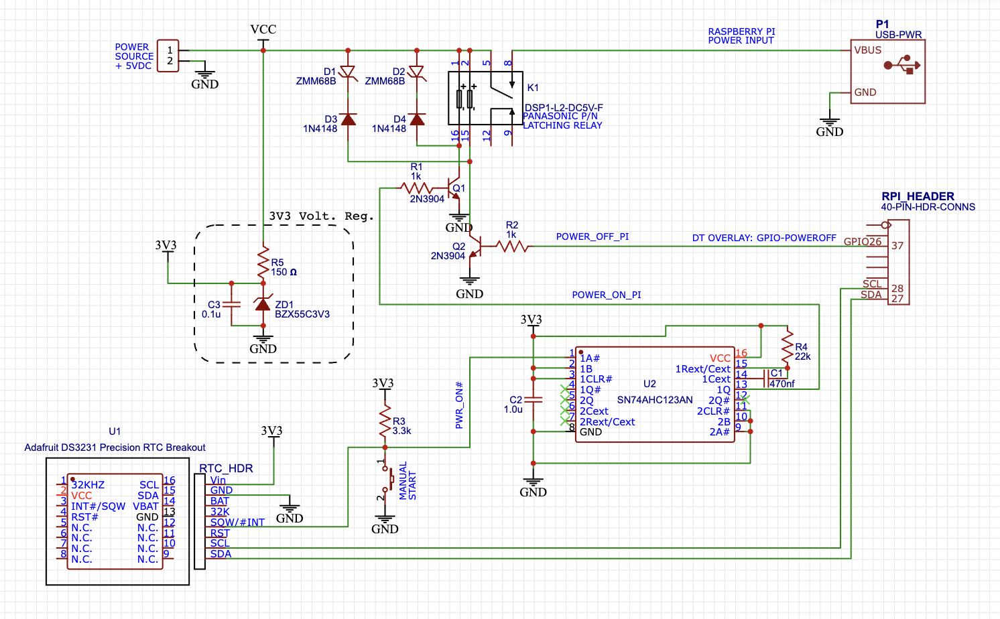

# Add a Real-Time Clock to Raspberry Pi

---

## Motivation

My *motivation* for adding a RTC boils down to this: I wanted to use my RPi in an off-grid application powered by a small solar cell and a battery. After working up a power budget, I realized there was ***no way*** to accomplish this without a RTC. The RPi uses too much power - [even in *low-power mode*](https://github.com/seamusdemora/PiFormulae/blob/master/RPi4bSleep.md) - to make it a practical component in a battery-powered system. 

You might be wondering: *"What does a RTC have to do with the RPi's power consumption?"* That's a good question - and there's a good answer: To *minimize* the RPi's *energy consumption* (power consumption over time) requires that it be powered off whenever it's not needed. If you've owned a RPi for more than 5 minutes, you're aware that there is no power switch; you may also be aware that the RPi has no in-built RTC (RPi 5 being the sole exception). The only way to remove power from the RPi is to disconnect the USB cable from the RPi's connector - fairly inconvenient for an off-grid application. We can insert a switch (relay) in the power line to remove power from the RPI, but once the switch removes power... how do we restore power so that useful work may be resumed? This is the RTC function: to restore power to the RPi after some time has passed.  

So the RTC alone does not, by itself, enable off-grid operation. The "system" must maintain cognizance of its energy burden on its energy sources (e.g. solar cell & battery), and power the system so as to sustain the sources. By keeping *accurate* time the RTC can maintain a schedule for powering the RPi that ensures it draws zero power when it is not needed, and full power when it is. Other sensors in the system may be employed to monitor (for example) battery voltage, thereby enabling the system to override the RTC schedule when necessary. Note that this recipe deals only with the selection and integration of an appropriate RTC, leaving the design and configuration of these other sensors for another time. Finally, a working, tested example, including hardware schematic, is provided for illustration.


## Select a RTC

After a brief market survey, I selected a DS3231 real time clock (RTC) module found on **eBay**. At this point I really knew next-to-nothing, but the [DS3231](https://www.maximintegrated.com/en/products/analog/real-time-clocks/DS3231.html) seemed to be in wide use, it seemed to have greater flexibility and accuracy than many of the alternatives. And a DS3231 module was available on eBay for about $3. It actually worked - at least partly. I subsequently learned that my eBay RTC was made with a counterfeit DS3231 - a *word to the wise*. My next RTC module was purchased from [Adafruit](https://www.adafruit.com/product/3013), and that is the one used in this recipe. 

The balance of this recipe is divided in two parts: **RTC Integration**, and **RTC Power Control**. The first part covers general usage of the RTC including RTC configuration for general timekeeping, and configuration of the I2C interface between the RPi and the RTC module. The second part includes a working example for using the RTC for energy conservation - as in an off-grid application where power consumption must be managed. 

## RTC Integration  
This is fairly detailed - I wrote this as I did it. I've included some steps that are peripheral, and some that may seem trivial. If you know what you're doing, feel free to skim through.

1. Power down your RPi before making the necessary wiring connections to the RTC. 

2. I am (now) using the [Adafruit DS3231 Precision RTC Breakout](https://www.adafruit.com/product/3013). Four (4) connections are required initially:  
   * Connect Vcc and GND on the Breakout to [+5v power and Ground on the RPi](https://pinout.xyz/#), respectively. 
   * Connect SDA and SCL on the RTC Breakout to GPIO2 & GPIO3 (a.k.a. physical pins 3 & 5; a.k.a. `i2c1`), respectively. 
   
3. Apply/connect power to boot the RPi, and then run **`sudo raspi-config`** from the terminal. In the `raspi-config`  interface, select **`3 Interface Options`**, then  select **`P5 I2C`** and turn it on. This enables the I2C support in the Linux kernel. ***Alternatively***, and more easily than using `raspi-config`, edit `/boot/config.txt`, and remove the comment from the following line: `dtparam=i2c_arm=on`.  

4. Reboot the RPi from the terminal (`sudo reboot`).

5.  Use `apt` to `update` and `upgrade` the RPi in preparation for installing the new software:

   ```bash
   $ sudo apt-get update
   ...
   $ sudo apt-get full-upgrade
   ...
   $
   ```

6. Install the `i2c-tools` package: 

      ```bash
      $ sudo apt-get install i2c-tools 
      ...
      $ 
      ```

7. *The `i2c-tools` package is not well documented!* There is no system manual for `i2c-tools`. Its component software modules do have `man pages`, but these components are not listed or defined! This is a rare, but quite useful [document that explains some of the things that can be done with the `i2c-tools` collection](https://www.waveshare.com/wiki/Raspberry_Pi_Tutorial_Series:_I2C). 

   | Command     | Description                         |
   | ----------- | --------------------------------------------------- |
   | i2cdetect   | Detect I2C chips connected to the bus               |
   | i2cdump     | Examine and read I2C registers on a connected device|
   | i2cget      | Read from I2C/SMBus chip registers on a connected device     |
   | i2cset      | Set I2C registers on a connected device with new data or values |
   | i2ctransfer | Send user defined I2C messages in one transfer to a connected device |
   
8. Run `i2cdetect` to verify the wiring connections in Step 2 were done correctly; i.e. `0x68` will appear for the following RTC chips: DS1307, PCF8523 or DS3231 (and perhaps others).

   ```bash
   $ sudo i2cdetect -y 1 
        0  1  2  3  4  5  6  7  8  9  a  b  c  d  e  f
   00:          -- -- -- -- -- -- -- -- -- -- -- -- --
   10: -- -- -- -- -- -- -- -- -- -- -- -- -- -- -- --
   20: -- -- -- -- -- -- -- -- -- -- -- -- -- -- -- --
   30: -- -- -- -- -- -- -- -- -- -- -- -- -- -- -- --
   40: -- -- -- -- -- -- -- -- -- -- -- -- -- -- -- --
   50: -- -- -- -- -- -- -- -- -- -- -- -- -- -- -- --
   60: -- -- -- -- -- -- -- -- 68 -- -- -- -- -- -- --
   70: -- -- -- -- -- -- -- --
   ```

9. Before we can set the time on the DS3231 RTC, we must configure the *device tree overlay*. Edit `/boot/config.txt` by adding the following line, and then `reboot`: 

      >dtoverlay=i2c-rtc,ds3231 

      ```bash
      $ sudo reboot
      ```

    There are several other parameters that may be specified; see [the README documentation](https://github.com/raspberrypi/firmware/blob/master/boot/overlays/README) for details. We shall see below that a key parameter for using the RTC to control power to the RPi is `wakeup-source`; these details will show one way to use the RTC to apply power to the RPi, causing it to boot from an OFF state. For now, we'll continue the steps required to configure the RTC for general timekeeping. 

10. Verify the driver is now in control of the RTC: `0x68` is replaced by `UU`: 

      ```bash
      $ sudo i2cdetect -y 1
           0  1  2  3  4  5  6  7  8  9  a  b  c  d  e  f
      00:          -- -- -- -- -- -- -- -- -- -- -- -- --
      10: -- -- -- -- -- -- -- -- -- -- -- -- -- -- -- --
      20: -- -- -- -- -- -- -- -- -- -- -- -- -- -- -- --
      30: -- -- -- -- -- -- -- -- -- -- -- -- -- -- -- --
      40: -- -- -- -- -- -- -- -- -- -- -- -- -- -- -- --
      50: -- -- -- -- -- -- -- -- -- -- -- -- -- -- -- --
      60: -- -- -- -- -- -- -- -- UU -- -- -- -- -- -- --
      70: -- -- -- -- -- -- -- --
      ```
    
11.  ***NOTE - This has happened to me on more than one occasion:*** After setting everything up as detailed above, you may get an **ERROR**:

      ```bash
      $ sudo i2cdetect -y 1
      Error: Could not open file `/dev/i2c-1' or `/dev/i2c/1': No such file or directory
      ```
      The solution that has worked each time is to run **`sudo raspi-config`**, as outlined in ***Step 3*** above. 
      I do not know why, or what causes this, nor have I seen it mentioned anywhere else. 

12. Disable the `fake-hwclock` service running under `systemd`:  (***N.B. This is no longer required for more current systems***)
    ```bash
    $ sudo systemctl mask fake-hwclock.service
    ```

13. Edit & comment out the following 3 lines in `/lib/udev/hwclock-set`:  (***N.B. This is no longer required for more current systems***)

      ```
      #if [ -e /run/systemd/system ] ; then
      #exit 0
      #fi
      ```

14. With access to a reliable & accurate clock, check the time on your RPi from the terminal: 

      ```bash
      $ date +"%Y-%m-%d %T.%6N"; sudo hwclock -r
      ```
      The two times should be very "close".

15. If your RPi has network connectivity, the `hwclock` time may have already been adjusted by the time you check it. If not, you may manually update the hwclock as follows: 

         ```bash
         $ sudo hwclock -w
         # --OR--
         $ sudo hwclock --systohc			# meaning "system to hardware clock"
         ```

16. Check the status of the RTC: 

   ```
   $ timedatectl
   # you may see something similar to the following:
             Local time: Fri 2023-08-25 22:21:59 UTC
         Universal time: Fri 2023-08-25 22:21:59 UTC
               RTC time: Fri 2023-08-25 22:22:00
              Time zone: Etc/UTC (UTC, +0000) 
System clock synchronized: yes 
            NTP service: active 
        RTC in local TZ: no
   ```

17. That concludes the basic configuration of the realtime clock. It will work silently for the most part. If you wish to verify this, disconnect the RPi from the network, or disable the RPi's timekeeping daemon.

18. ***OPTIONAL:*** Move your RTC from **I2C channel 1** to **I2C channel 0** - [here's how](https://github.com/seamusdemora/PiFormulae/blob/master/MoveRTCfromI2C1-to-I2C0.md). The following section on RTC usage for Power Control assumes that **I2C0** is being used, but if you prefer/need to use **I2C1** you may alter the next step instead. 


## RTC for Power Control 

As mentioned previously (in Step 9 above), one of the key parameters of the `i2c-rtc` overlay when the RTC is being used as a *wake-up source* is the `wakeup-source` parameter. Adding the `wakeup-source` parameter has the effect of adding a file to the `sysfs`: `/sys/class/rtc/rtc0/wakealarm`. Writing to this file allows one to specify the time at which the RTC's `ALARM` (at pin `SQW/#INT`) is triggered, and this pin may be used to drive an external hardware switch which will apply power to the RPi. 

This procedure is best illustrated by an example. Let's first take a look at a hardware schematic shown below for power control; then we'll discuss the configuration and software steps. The RPi's initial state is powered OFF; the schematic illustrates circuitry that will apply power, causing the RPi to boot, when the DS3231 RTC is *"triggered"* at the time specified in software. In other words, this circuitry acts as an "alarm clock" to "wake" the RPi.



The salient feature of this schematic is the `SQW/#INT` pin on the DS3231 RTC. We use software to trigger the "WAKE UP ALARM" on this pin by writing a time to the file `/sys/class/rtc/rtc0/wakealarm`. This ALARM/INTERRUPT is actually a HIGH-to-LOW state change on the `SQW/#INT` pin. This state change causes power to be connected to the RPi via the K1 relay. The one-shot (U2) and transistor (Q1) are simply used for *conditioning* the `SQW/#INT` alarm/interrupt signal. Note also that the relay at K1 is a *"latching relay"*, meaning that once its state has been set (contacts OPEN or CLOSED), it will remain in this state even if power is removed from the circuit. 

We now cover the software and configuration settings used in this example. Again, please note that we use the I2C0 channel (instead of I2C1) for this example. I2C0 was chosen for this example as an expedient to accomodate another experiment; any I2C channel should work. See [this recipe](https://github.com/seamusdemora/PiFormulae/blob/master/MoveRTCfromI2C1-to-I2C0.md) for details on configuring I2C0. The following should be added to `/boot/config.txt`: 

  ```
  # 3231 RTC; SDA on GPIO 0 @ pin 27; SCL on GPIO 1 @ pin 28; pullups: 1.8K to 3V3
  dtparam=i2c_vc=on
  dtoverlay=i2c-rtc,ds3231,i2c0,wakeup-source
  # gpio-poweroff used to automate removal of power using GPIO 26/see schematic
  dtoverlay=gpio-poweroff
  ```

The example here is a simple schedule for powering the RPi: The RPi will alternate between 10 minutes of "POWER ON" time, and 10 minutes of "POWER OFF" time; i.e. a 20 minute cycle. This is arranged with 2 entries in the `root crontab`, and a small `bash` script: 

  In the `root crontab`: 


    # shutdown & power off schedule
    */20 * * * * /home/pi/setalarm.sh >> /home/pi/setalarm.log 2>&1 
    
    # clear the current alarm @reboot
    @reboot sleep 10; /bin/echo "0" | tee /sys/class/rtc/rtc0/wakealarm; /bin/echo "boot time: $(/bin/date '+%D %X' -d '- 10 seconds') set wakealarm to 0" >> home/pi/setalarm.log 2>&1


  Create the `setalarm.sh` script: 


    #!/usr/bin/env bash
    
    # clear the current alarm
    echo "0" | tee /sys/class/rtc/rtc0/wakealarm
    echo "THE TIME IS: $(date '+%D %X')"
    
    # calculate the next wakeup and then halt:
    /bin/date '+%s' -d '+ 10 minutes' | tee /sys/class/rtc/rtc0/wakealarm
    /bin/sleep 5
    /sbin/halt


After making these changes, issue a `reboot` to update the changes to `/boot/config.txt`, and your RPi should begin power-cycling itself at 10 minute intervals.

---

## REFERENCES: 

1. [Raspberry Pi Tutorial Series: I2C](https://www.waveshare.com/wiki/Raspberry_Pi_Tutorial_Series:_I2C) - A very worthwhile read; stuff that's hard to find! 
2. [The Rust community’s crate registry](https://crates.io/) brings us their [rpi_embedded i2c module](https://docs.rs/rpi_embedded/0.1.0/rpi_embedded/i2c/index.html). 
3. [I2C Serial Communication Bus in Raspberry pi](https://www.electroniclinic.com/i2c-serial-communication-bus-in-raspberry-pi/) - includes some examples using `i2ctools`. 
4. [Creating Multiple I2C Ports on a Raspberry PI](https://medium.com/cemac/creating-multiple-i2c-ports-on-a-raspberry-pi-e31ce72a3eb2) - an article from [Medium](https://medium.com) - beware the *paywall*. 
5. [How to Work with I2C Communication in Raspberry Pi](https://radiostud.io/howto-i2c-communication-rpi/) - example using i2c as Rpi-to-Arduino interface. 
6. [Is there a package or library for controlling the DS3231 on the Raspberry Pi?](https://raspberrypi.stackexchange.com/questions/123872/is-there-a-package-or-library-for-controlling-the-ds3231-on-the-raspberry-pi) 
7. [RPi Python Programming 25 – Synchronous serial communication in Raspberry Pi using I2C protocol](https://www.engineersgarage.com/articles-raspberry-pi-i2c-bus-pins-smbus-smbus2-python/) 
8. [Using the second (I2C 0) port on a Raspberry Pi 3B](https://www.youtube.com/watch?v=FUAiELC76aw) - a YouTube "how-to" for the RPi 3B.
9. [The `raspi-gpio` tool GitHub repo](https://github.com/RPi-Distro/raspi-gpio) - not necessarily useful for I2C, but for GPIO; incl [Pi4 support?](https://github.com/RPi-Distro/raspi-gpio/commit/80fa7d04eafb3ea34fc6f2d32de5f1873b5fb369) 
10. [Enabling and checking I2C on the Raspberry Pi using the command line for your own scripts](https://pi3g.com/2021/05/20/enabling-and-checking-i2c-on-the-raspberry-pi-using-the-command-line-for-your-own-scripts/); Useful!


<!--- 

You can hide shit in here  :)   LOL 

and added it to my **RPi 3b**. It seems to work as far as keeping time, but I wanted _more_.

I'd like to be able to set alarms to trigger the INT/SQW pin on the chip (while retaining the basic timekeeping function I currently have), but I've been unable to find any way to do that with the _toolset_ in RPi. I've installed `python-smbus` and `i2c-tools` as part of the RTC configuration. Have I overlooked something? - how should I go about reading & writing the DS3231's internal registers to set up the alarm function on my **RPi 3b**?

---

It took a while for me to discover this, but the `i2ctools` package that was installed as the first step in installing the DS3231 RTC is apparently only a "cover" for the actual tools - the packages that actually do something: 


| Command     | Description                                                  |
| ----------- | ------------------------------------------------------------ |
| i2cdetect   | Detect I2C chips connected to the bus                        |
| i2cdump     | Examine and read I2C registers on a connected device         |
| i2cget      | Read from I2C/SMBus chip registers on a connected device     |
| i2cset      | Set I2C registers on a connected device with new data or values |
| i2ctransfer | Send user defined I2C messages in one transfer to a connected device |

Each of these commands has an associated `man` page explaining its function, and the arguments. Oddly, `man i2ctools` does not exist. Further, there seems to be a dearth of examples/how-tos/tutorials on configuring the the DS3231 alarm function using these `i2ctools`. I found [one that was brief, and far from extensive](https://www.waveshare.com/wiki/Raspberry_Pi_Tutorial_Series:_I2C).          

As an observation, My Internet searches suggest there are many more examples/how-tos/tutorials for the Arduino platform. Absent an easy method to convert Arduino sketches to RPi-executable code, this leaves me at least with perhaps a fairly steep learning curve. 

---


1. We'll need the alarm feature for the next installment, so we'may be added with a simple addition of the `wakeup-source` parameter to the dtoverlay: 

     ```bash
   dtoverlay=i2c-rtc,ds3231,wakeup-source
   ```

## Change from channel  I2C1 to I2C0:

If you need/want to use an I2C *channel* other than `i2c1` (the default), this is possible using the configuration steps shown below. One reason for using a *non-default* I2C channel is that the clock signal for `i2c1` (`SCL1)`) uses GPIO 3 (pin 5). In this recipe, I'll use `i2c0`. Yes - there are warnings re use of `i2c0`, but the current `dtoverlay=i2c-rtc`  provides only one parameter option for I2C: `i2c0 `; it does not provide parameter options for `i2c3` - `i2c6` or for the  `dtoverlay=i2c-rtc-gpio` option. Note the latter is in software/"bit-banging" instead of hardware.  See `/boot/overlays/README` for details.

   * **Remove Power and Change Wiring Connections for Using I2C0**

| 3231 RTC | `i2c0` GPIO |    `i2c0` pin #     |
| :------: | :---------: | :-----------------: |
|   SDA    |   GPIO 0    | pin 27 (from pin 3) |
|   SCL    |   GPIO 1    | pin 28 (from pin 5) |

   > **NOTE:** Verify your RTC has *pullups* (2K𝛀 is reasonable) on SDA & SCL lines - otherwise, you will need to add them to pins 27 & 28.

* **Apply Power and Re-configure the device tree in `/boot/config.txt`:** 

| param/overlay |                  FROM                  |                     TO                      | CMT                  |
| :-----------: | :------------------------------------: | :-----------------------------------------: | :------------------- |
|    dtparam    |           dtparam=i2c_arm=on           |             #dtparam=i2c_arm=on             | disables (#) i2c1    |
|    dtparam    |                                        |              dtparam=i2c_vc=on              | enables i2c0 (Pi 4)  |
|   dtoverlay   | dtoverlay=i2c-rtc,ds3231,wakeup-source | dtoverlay=i2c-rtc,ds3231,wakeup-source,i2c0 | connect RTC via i2c0 |

> **NOTE:**  Some of the settings above are *hardware-dependent* (RPi version). Consult `/boot/overlays/README` for details. 

* **Verification:** 

  ```bash
  $ sudo i2cdetect -y 0
       0  1  2  3  4  5  6  7  8  9  a  b  c  d  e  f
  00:          -- -- -- -- -- -- -- -- -- -- -- -- --
  10: -- -- -- -- -- -- -- -- -- -- -- -- -- -- -- --
  20: -- -- -- -- -- -- -- -- -- -- -- -- -- -- -- --
  30: -- -- -- -- -- -- -- -- -- -- -- -- -- -- -- --
  40: -- -- -- -- -- -- -- -- -- -- -- -- -- -- -- --
  50: -- -- -- -- -- -- -- -- -- -- -- -- -- -- -- --
  60: -- -- -- -- -- -- -- -- UU -- -- -- -- -- -- --
  70: -- -- -- -- -- -- -- --
  ```

  ```bash
  $ timedatectl
                 Local time: Sat 2021-06-19 20:17:08 CDT
             Universal time: Sun 2021-06-20 01:17:08 UTC
                   RTC time: Sun 2021-06-20 01:17:09
                  Time zone: America/Chicago (CDT, -0500)
  System clock synchronized: yes
                NTP service: active
            RTC in local TZ: no
  ```

  ```bash
  ls /dev/*i2c*
  /dev/i2c-0  /dev/i2c-10  /dev/i2c-11 
  
  # NOTE: This is likely an errant result of the RPi4's I2C Multiplexer*
  # Follow-up required.
  ```

  > \*\ [Re: dtoverlay i2c0 - kernel troubles 5.4.59-v7l+](https://www.raspberrypi.org/forums/viewtopic.php?t=284036#p1720835)


### Communicate & Control the RTC From the RPi

The first choice to make here is whether to control the RTC directly, or delegate that to the [driver](https://github.com/raspberrypi/linux/blob/rpi-6.1.y/drivers/rtc/rtc-ds1307.c). There isn't much of a hardware interface to the RTC; e.g. an alarm interrupt cannot be cleared in hardware; that requires a write to the Alarm Flag in register 0x0F to clear the Alarm & return the INT/SQW pin to its "pulled-up" state. 

Electing to use the RTC driver in favor of direct control isn't an *irrevocable* choice. Exceptions that arise - i.e. performing a function the driver does not support - may be handed off to a direct control function or app after releasing the driver using `modprobe`. 


—>
