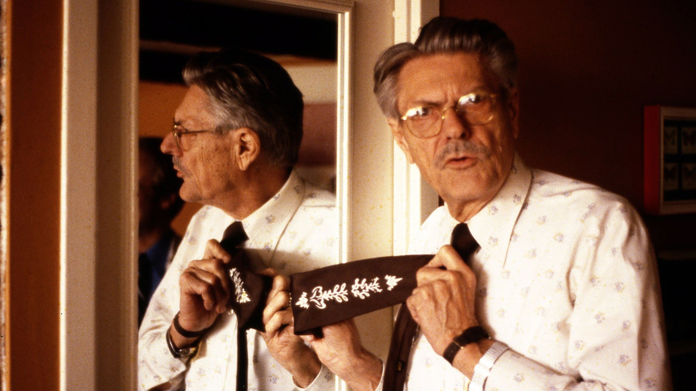

## Bluetooth & Audio on Raspberry Pi - Myths Dispelled


I continue to attempt a few "advancements" in my Raspberry Pi-based sound system. Along the way, I've encountered some "myths".  Oh - that word - "myth" is a bit disingenuous I suppose... I should be more forthcoming - like the legendary [Paul Klipsch](https://en.wikipedia.org/wiki/Paul_Wilbur_Klipsch). One of the things that Klipsch did best was [debunking](https://en.wikipedia.org/wiki/Paul_Wilbur_Klipsch#Eccentricities) the outlandish claims made by "audio charlatans" promoting their products. He had little patience with such fools, and had a pin-on button made up... the button had the word "BULLSHIT" printed on it. He often wore one behind the lapel of his coat, and flashed it from time to time :)  And there's the tie... look carefully. 

|  |  |
| ------------------------------------------------------------ | ------------------------------------------------------------ |

Paul Klipsch is no longer with us, but the "audio charlatans" are. They continue to thrive, and make profits from BULLSHIT claims for their technology. Let's examine two of these claims: 

#### False claim # 1: Bluetooth Stereo/A2DP/etc/etc.

I came to this conclusion slowly - and hesitantly. It certainly ***seemed*** a reasonable premise that Bluetooth would be capable of transmitting two channels of audio in a single RF channel. The Sonos system (which I previously owned) had been doing this for years over a WiFi link. 

When I initially got a single channel of audio over a BT link using `pipewire` I had been quite happy with that!  Shortly thereafter I tried adding a second BT speaker in an effort to realize Bluetooth's claimed "stereo" mode (the A2DP *'Profile'*)... that is when I began to suspect that there was something "off". No matter how I tried, I was unable to get sound to two speakers - not even *monaural* sound - much less stereo! 

Now granted, WiFi has more bandwidth than Bluetooth, but even reasonably high quality audio does not require huge amounts of bandwidth. The [Bluetooth Consortium claims a maximum data rate of 2 MBits/sec for BT 5, and 1 Mbit/sec for Bluetooth 4](https://www.bluetooth.com/blog/exploring-bluetooth-5-how-fast-can-it-be/).  Audio data rates depend on how the sound is encoded, but for example [the highest quality MP3 bit rate is 320 kbps at 16 bits](https://primesound.org/audio-bitrate/). The math is not complicated... even the Bluetooth 4 bandwidth of 1 Mbit/sec ***should*** be more than adequate to carry the highest quality MP3 recording. ***However***, as Robert Lacoste points out [here](https://circuitcellar.com/research-design-hub/basics-of-design/no-blues-with-bluetooth-part-2/), the **management/overhead requirements for Bluetooth are quite demanding!** : 

>  AFH is a nice example of the complexity of Bluetooth. Imagine what’s  needed to specify and code such a feature. First, you must detect which  channels could be used. Then, you must inform all remotes that there  will soon be a change in the hopping sequence. You must double-check  that all remotes got this information before the change, as otherwise  remotes will be lost. And all this must be done concurrently with the  actual data traffic. Not so small a task, is it?

Nevertheless, all the *hype* claimed it was *do-able*! So why was I having so much difficulty? ... after days of trying, and numerous failed attempts - why could I not connect and play sound through 2 speakers via Bluetooth? 

Getting reliable information online has proven to be *difficult-to-impossible*. Search engines are clogged with vapid, brain-dead "explanations" by hundreds of technical charlatans. It seems the only purpose of most of these posts is to obfuscate and deceive. [This post is an example of such drivel](https://easytechsolver.com/what-is-the-use-of-a2dp/); it simply parrots the Bluetooth marketing messages without even a weak attempt to explain how it actually works! [Who is this "Ronald Cooper"](https://duckduckgo.com/?t=ffab&q=ronald+cooper+technical+author&ia=web) - the "author" of this tripe? Who paid him to write this gibberish, and how did it come to be ranked in one of the top spots for the search term [***"bluetooth A2DP fundamentals"***](https://duckduckgo.com/?q=bluetooth+A2DP+fundamentals&t=ffab&ia=web)?  Has "Ronald Cooper" really written nearly [31,560 articles](https://easytechsolver.com/page/3156/) since 2023? **Of course not**; this is complete and total **deceit !** 

And then there is [Joe Cohen](https://duckduckgo.com/?t=ffab&q=Joe+Cohen+technical+author&ia=web), the supposed author of this article: ["Methods To Connect Multiple Bluetooth Speakers to One Device"](https://computercity.com/smart-devices/smart-speakers/connect-multiple-bluetooth-speakers-to-one-device). What a load of *poppycock*! There is *zero intelligence* in this article. I could go on, and on and on...

And I still wonder who's paying for this brain-dead claptrap? The Nixon-era cliche [***"follow the money"***](https://idioms.thefreedictionary.com/follow+the+money) seems appropriate - or just figure who benefits from the publication of such junk. The bottom line is this: **There is far too much mis-information disseminated on the Internet!!** 

Nevertheless, I have found a few sources that seem credible to me - see the [References](#references) below. Based mostly on these References, following is a summary of the **"Bluetooth Stereo Myth"**: 

1. In general, it does not seem possible to play music through two speakers/devices from a single Bluetooth "Controller"; a controller is defined here in the context of the `bluetoothctl` tool. In fact, I have noticed that it is not even possible for a single "Controller" to connect to more than one of some models of BT speakers. 

2. When I say play "music", I mean "music files" that *provably* contain 2 audio channels *à la* `ffmpeg`: 

      ```bash
      $ ffprobe -i YourMusicFile.mp3 -show_streams -select_streams a:0
      ```

3. ***Using current Linux Bluetooth software (`bluetoothctl`) and audio software (`pipewire`, `wireplumber`) it is not generally possible to directly connect and play a two-channel audio file through two speakers from a single Bluetooth controller.*** If you think you have managed to do this, I would really like to hear the ***specifics*** from you!! 

4. **NOTE:** For some "*A2DP-qualified* (?)" speakers, it is possible to connect to one speaker, and then, through the additional services of an "app", or a button-pushing sequence on the speakers (or both), it may be possible to get something claimed to be "stereo sound". *Apparently this is accomplished by the manufacturer's addition of a second Bluetooth transmitter/controller embedded in the speakers themselves! The two channels are "split" in one of the speakers. One channel is sent to the speaker; the other is re-transmitted to the second speaker.* AIUI, this feature is not part of any Bluetooth specification - it's a manufacturer hack to get something they can claim as "Stereo". But know this: These hacks are not "True Wireless Stereo (TWS)"!

After posting several questions in online forums, etc, I have found no one who claims they have played a sound file through Linux Bluetooth over two speakers without additional apps and/or button-pushing. *One respondent did claim he could do this on his headphones, but declined to provide any details.* Most choose to believe the BS "Ronald Cooper" is peddling. 

Fortunately, there are some that prefer to stick to the [facts WRT "Bluetooth stereo/A2DP"](https://blog.nordicsemi.com/getconnected/the-evolution-of-bluetooth-audio) : 

>  ... the profile *[A2DP]* **doesn’t handle true wireless stereo** (TWS). A2DP sends the stream to one device, which then splits the channels via a wire. *[for headphones; for speakers there is a second transmission from the "Master" sink to the "Slave" sink]* TWS also requires two separate devices to receive the audio stream and emit each channel in perfect synchronization. 


#### False claim # 2: The 3.5mm "audio jack" on all Raspberry Pis (until RPi5)

From the Raspberry Pi forum, [posted on Mon Oct 02, 2023 7:46 AM by Raspberry Pi Engineer & Forum Moderator known as jdb](https://forums.raspberrypi.com/viewtopic.php?p=2140444&sid=e6163f092397819aecb25153cfdb58ce#p2140444) says (among other things): 

>  The 3.5mm audio output was always a kludge from day 1 - not line level,  headphone drive was hit and miss, needed a discrete LDO output, and the  required processing to not sound crap was 20% of a vpu scalar core and  10% vector. So it was hard to justify keeping it, especially when you  couldn't use a headset mic.

Despite this, there are innumerable "posts" that can be found touting the 3.5mm audio jack as a way to get sound from the RPi; [some go overboard](https://minipctech.com/analog-sound-on-raspberry-pi): 

>  ... understanding how to optimize the 3.5mm jack’s performance can transform your listening experience from merely functional to impressively rich. 

There ***may be*** some way to get decent sound from the 3.5mm audio jack; I cannot say for certain. What I can say is that between the vagaries and lack of documentation in the alsa software, and the ever-changing options under `raspi-config` this is a [crapshoot](https://idioms.thefreedictionary.com/crapshoot) at best. I've tried several different recipes - some with recent posting dates - all have failed. 

#### To summarize: In general, audio seems to be a weak point in the Linux portfolio.


## REFERENCES: 

1.  [A rare moment of candor from one of "The Raspberries"](https://forums.raspberrypi.com/viewtopic.php?p=2140444&sid=e6163f092397819aecb25153cfdb58ce#p2140444) 
2.  A very good series of articles on Bluetooth by Robert Lacoste: [Part 1](https://circuitcellar.com/cc-blog/no-blues-with-bluetooth/), [Part 2](https://circuitcellar.com/research-design-hub/basics-of-design/no-blues-with-bluetooth-part-2/), [Part 3](https://circuitcellar.com/research-design-hub/basics-of-design/no-blues-with-bluetooth-part-3/) 
3.  [Streaming_Audio_with_Bluetooth_A_Deep_Dive_into_A2DP](https://www.researchgate.net/publication/390246620_Streaming_Audio_with_Bluetooth_A_Deep_Dive_into_A2DP_and_LE_Audio) 
4.  [The evolution of Bluetooth audio, by John Leonard of Nordic Semiconductor](https://blog.nordicsemi.com/getconnected/the-evolution-of-bluetooth-audio) 
5.  [Why can't I get sound from BOTH bluetooth speakers? - an Issue raised in wireplumber's Gitlab site](https://gitlab.freedesktop.org/pipewire/wireplumber/-/issues/798) 
6.  [Q&A: Number of channels in audio file](https://stackoverflow.com/a/47905308/22595851) 
