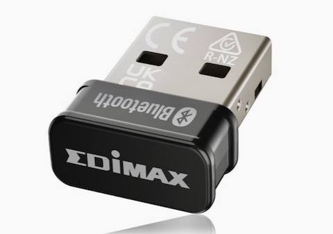

## Upgrade RPi Bluetooth Hardware to Improve Reliability

It's no secret that the Raspberry Pi was designed - first and foremost - to be [cheap](https://dictionary.cambridge.org/dictionary/english/cheap). In general, I favor that approach; it gives more people an accessible price point, and *more people = better support* (in general). But as it is with many things, *"cheap"* is a relative term; "cheap" is not the same price point for everyone. And in making the myriad tradeoffs in the design of a device such as Raspberry Pi, some of us might choose to allocate better resources in some places vs. others. 

Uh - this is awkward... all I'm really trying to say here is that *in my humble opinion*, I feel the *tradeoffs* made wrt design of the Bluetooth hardware were *not especially well-considered*. For example: Being an Electrical Engineer by training and trade, using a single antenna for both Bluetooth and WiFi is something I **would not** have done. To be sure, [MIMO antennas](https://resources.system-analysis.cadence.com/blog/fundamentals-of-mimo-communication-in-wireless-systems) are a real thing...  but the RPi implementation is not a MIMO antenna! And the antenna is only one of the tradeoffs. Using Broadcomm hardware for Bluetooth was probably *inexpensive* - but is it *any good*? It's proprietary hardware & firmware, and so difficult to say definitively - but ask yourself, *"How many computers are being manufactured today with Broadcomm BT hardware?"* 

I add all of the above to my own ***personal experience*** with RPi's BT hardware which is: ***Not So Great!*** I find that BT audio playback using the RPi BT hardware suffers from: 

* random, but *too-frequent* drop outs that typically necessitate a `reboot`  to restore audio
* occasionally suffers from intermittent interruptions and artifacts (popping, background noise)

I have found that disabling WiFi (via `nmcli radio wifi off` or [similar](https://www.baeldung.com/linux/disable-wireless-network)) reduces these symptoms, but does not eliminate them. And of course disabling WiFi *limits* what you can do on your RPi! 

### What's the solution for upgrading BT hardware on my RPi?

For me, the solution was to buy a Bluetooth USB "dongle" - specifically I bought a [BT-8500 device from Edimax](https://www.edimax.com/edimax/merchandise/merchandise_detail/data/edimax/global/bluetooth/bt-8500/) - about $12 from Amazon. I did some investigation, and found that Edimax uses chips made by [Realtek](https://en.wikipedia.org/wiki/Realtek). Realtek is a Chinese company, but offsetting that is the fact that their chips seem to be well-supported in Linux. 

I plugged the dongle into the lone USB port on my [RPi 3A+](https://datasheets.raspberrypi.com/rpi3/raspberry-pi-3-a-plus-product-brief.pdf). This system runs this [*"Lite"* version of the 'bookworm' RPi OS](https://downloads.raspberrypi.com/raspios_lite_armhf/images/raspios_lite_armhf-2024-07-04/); it also runs `pipewire` version '0.3.65' (*compiled with libpipewire 0.3.65*) - installed with `apt` in the "standard way". The [setup and installation of `pipewire` on this RPi 3A+ is covered here.](https://github.com/seamusdemora/PiFormulae/blob/master/Bluetooth-AudioForBookwormLite.md) 




### How to configure the RPi to use "external" BT hardware

#### 1. Disable the in-built BT hardware:

There may be alternatives, but the simplest effective solution I found was to set the `disable-bt` overlay (Raspberry Pi's *device tree* makes this easy):

   a. Open the file `/boot/firmware/config.txt` in your editor:

   ```bash
       $ sudo nano /boot/firmware/config.txt 
       # --  OR --
       $ sudo vim /boot/firmware/config.txt
   ```

   b. Add this one line: 

   ```
       dtoverlay=disable-bt
   ```

   c. Reboot:
   ```
      $ sudo reboot
   ```

#### 2. Do the `bluetoothctl` [nutroll](https://www.urbandictionary.com/define.php?term=nutroll): 

The only thing I've found that makes this process any simpler is to do it ***as quickly as possible***. 

   a. As a *precaution*, check `rfkill` to make sure `bluetooth` is not being blocked:  

   ```bash
      $ rfkill list
      0: hci0: Bluetooth
	Soft blocked: yes     # WTF !!
	Hard blocked: no
      ...
      $ rfkill unblock bluetooth
      $
   ```

   b. Let's verify that Step 1 actually left us with only one controller (*it did!*) & then give it an alias: 

   ```bash
      $ bluetoothctl
      [bluetooth]# list
      Controller 08:BE:AC:2D:99:85 [default]
      [bluetooth]# system-alias edimax 
      Changing edimax succeeded
      [bluetooth]# list
      Controller 08:BE:AC:2D:99:85 edimax [default]
      [bluetooth]#
   ```

   c. We'll need to *recapture* our BT audio sink (i.e. speaker/headphones). So ***quickly*** power on your speaker, press its "pair" button, and then:  

   ```bash
   [bluetooth]# scan on 
   Discovery started
   [CHG] Controller 08:BE:AC:2D:99:85 Discovering: yes
   [NEW] Device B8:F6:53:9B:1A:97 JBL Flip 5 
   ...
==>[bluetooth]# trust B8:F6:53:9B:1A:97
   [CHG] Device B8:F6:53:9B:1A:97 Trusted: yes
   Changing B8:F6:53:9B:1A:97 trust succeeded
==>[bluetooth]# pair B8:F6:53:9B:1A:97
   Attempting to pair with B8:F6:53:9B:1A:97
   [CHG] Device B8:F6:53:9B:1A:97 Connected: yes
   [CHG] Device B8:F6:53:9B:1A:97 Bonded: yes
   [CHG] Device B8:F6:53:9B:1A:97 UUIDs: 00001101-0000-1000-8000-00805f9b34fb
   [CHG] Device B8:F6:53:9B:1A:97 UUIDs: 0000110b-0000-1000-8000-00805f9b34fb
   [CHG] Device B8:F6:53:9B:1A:97 UUIDs: 0000110c-0000-1000-8000-00805f9b34fb
   [CHG] Device B8:F6:53:9B:1A:97 UUIDs: 0000110e-0000-1000-8000-00805f9b34fb
   [CHG] Device B8:F6:53:9B:1A:97 ServicesResolved: yes
   [CHG] Device B8:F6:53:9B:1A:97 Paired: yes
   Pairing successful
   [CHG] Device B8:F6:53:9B:1A:97 ServicesResolved: no
   [CHG] Device B8:F6:53:9B:1A:97 Connected: no 
   ...
==>[bluetooth]# scan off
   Discovery stopped 
   ...
==>[bluetooth]# info B8:F6:53:9B:1A:97
   Device B8:F6:53:9B:1A:97 (public)
	         Name: JBL Flip 5
	         Alias: JBL Flip 5
	         Class: 0x00240414
	         Icon: audio-card
	         Paired: yes
	         Bonded: yes
	         Trusted: yes
	         Blocked: no
	         Connected: no
	         LegacyPairing: no
	         UUID: Serial Port               (00001101-0000-1000-8000-00805f9b34fb)
	         UUID: Audio Sink                (0000110b-0000-1000-8000-00805f9b34fb)
	         UUID: A/V Remote Control Target (0000110c-0000-1000-8000-00805f9b34fb)
	         UUID: A/V Remote Control        (0000110e-0000-1000-8000-00805f9b34fb) 
   ...
==>[bluetooth]# connect B8:F6:53:9B:1A:97
   Attempting to connect to B8:F6:53:9B:1A:97
   [CHG] Device B8:F6:53:9B:1A:97 Connected: yes
   [NEW] Endpoint /org/bluez/hci0/dev_B8_F6_53_9B_1A_97/sep1
   [NEW] Endpoint /org/bluez/hci0/dev_B8_F6_53_9B_1A_97/sep2
   [NEW] Transport /org/bluez/hci0/dev_B8_F6_53_9B_1A_97/sep1/fd0
   Connection successful
   [NEW] Player /org/bluez/hci0/dev_B8_F6_53_9B_1A_97/player0 [default]
   [CHG] Device B8:F6:53:9B:1A:97 ServicesResolved: yes
   [CHG] Transport /org/bluez/hci0/dev_B8_F6_53_9B_1A_97/sep1/fd0 Volume: 0x003c (60)
   [CHG] Transport /org/bluez/hci0/dev_B8_F6_53_9B_1A_97/sep1/fd0 State: active
   [CHG] Transport /org/bluez/hci0/dev_B8_F6_53_9B_1A_97/sep1/fd0 Volume: 0x0034 (52)
==>[JBL Flip 5]# quit 
   $ 
   ```

#### 3. Check the `bluetooth.service` status to make sure `systemd` is still "happy" 

   ```bash
   $ systemctl status bluetooth.service
   ● bluetooth.service - Bluetooth service
        Loaded: loaded (/lib/systemd/system/bluetooth.service; enabled; preset: enabled)
        Active: active (running) since Mon 2024-07-29 04:00:35 UTC; 3h 6min ago
          Docs: man:bluetoothd(8)
      Main PID: 604 (bluetoothd)
        Status: "Running"
         Tasks: 1 (limit: 174)
           CPU: 222ms
        CGroup: /system.slice/bluetooth.service
                └─604 /usr/libexec/bluetooth/bluetoothd
   
   Jul 29 06:25:10 rpi3a bluetoothd[604]: Endpoint unregistered: sender=:1.34 path=/MediaEndpoint/A2DPSource/aptx_ll_1
   Jul 29 06:25:10 rpi3a bluetoothd[604]: Endpoint unregistered: sender=:1.34 path=/MediaEndpoint/A2DPSource/aptx_ll_0
   Jul 29 06:25:10 rpi3a bluetoothd[604]: Endpoint unregistered: sender=:1.34 path=/MediaEndpoint/A2DPSource/aptx_ll_duplex_1
   Jul 29 06:25:10 rpi3a bluetoothd[604]: Endpoint unregistered: sender=:1.34 path=/MediaEndpoint/A2DPSource/aptx_ll_duplex_0
   Jul 29 06:25:10 rpi3a bluetoothd[604]: Endpoint unregistered: sender=:1.34 path=/MediaEndpoint/A2DPSource/faststream
   Jul 29 06:25:10 rpi3a bluetoothd[604]: Endpoint unregistered: sender=:1.34 path=/MediaEndpoint/A2DPSource/faststream_duplex
   Jul 29 06:25:10 rpi3a bluetoothd[604]: Endpoint unregistered: sender=:1.34 path=/MediaEndpoint/A2DPSink/opus_05
   Jul 29 06:25:10 rpi3a bluetoothd[604]: Endpoint unregistered: sender=:1.34 path=/MediaEndpoint/A2DPSource/opus_05
   Jul 29 06:25:10 rpi3a bluetoothd[604]: Endpoint unregistered: sender=:1.34 path=/MediaEndpoint/A2DPSink/opus_05_duplex
   Jul 29 06:25:10 rpi3a bluetoothd[604]: Endpoint unregistered: sender=:1.34 path=/MediaEndpoint/A2DPSource/opus_05_duplex
   ```

This all looks good, and in fact it was. I was able to begin playing music immediately. A fairly straightforward hardware upgrade. And how's it working? So far, so good... I'll post any revelations as follow-ups to this recipe. 

