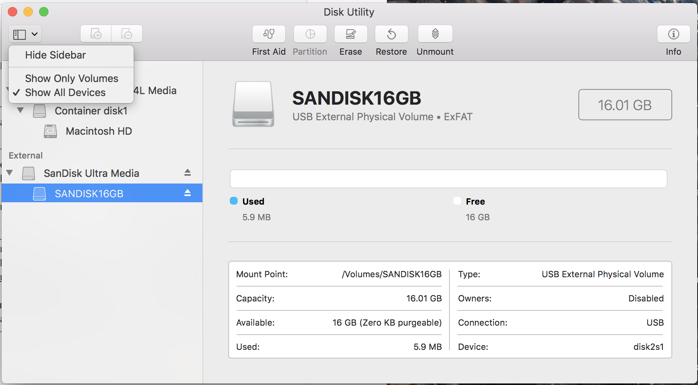
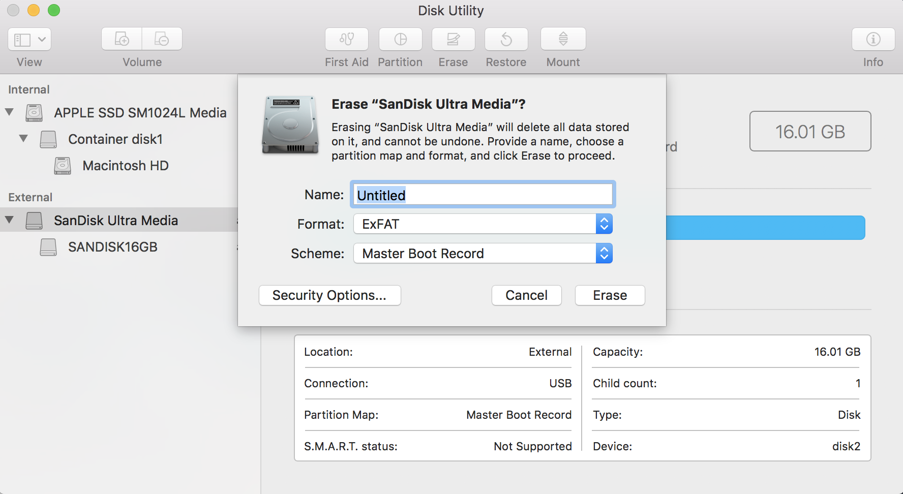

# How To Connect an External Drive to Raspberry Pi?  

> NOTE: The current reciped here fails to consider potential impacts and differences due to that adoption of `systemd`. As `systemd` has now become "mainstream", the recipe must be revised accordingly. Until that happens, ***most*** of the following remains accurate and pertinent. 

### Objectives:  
Following is a procedure to mount an external drive on a Raspberry Pi. I've added some background and context, rather than simply listing the steps in rote fashion. My aim here is to *explain* the steps required to execute this task under Raspbian. Another aim is to highlight stark differences between Mac OS and Linux, using Raspbian as a proxy for Linux. My hope is that this will be more useful than yet another "copy and paste tutorial" (*yacapat* ? :) that invites copying command lines from a blog into a terminal window without thinking about what they mean. And if you don't care about the explanations, ignore them; follow the steps inside the code blocks. 

### Why would I want to do connect an external drive?
1. The Raspberry Pi 3B+ has 4 USB 2.0 ports, and 
2. external drives can be useful for all sorts of things:
    - local backup of RPi files, or a 'disk image' of the entire SD card
    - file sharing with your Mac, PC or another RPi 
    - reduce wear on your SD card 
3. [USB 2.0 thumb drives](https://en.wikipedia.org/wiki/USB_flash_drive) are cheap

### But all of these instructions! Why is this so complicated? On my Mac, I plug the drive in, and it just works. I can read from it, and write to it immediately! 
That's a good question. Unfortunately, the answer may not be straightforward, and will not satisfy all parties. The answer comes down to ["cultural differences"](http://www.analytictech.com/mb021/cultural.htm) between the ["Unix way"](http://wiki.c2.com/?UnixWay), and the ["Mac way"](https://developer.apple.com/macos/human-interface-guidelines/overview/themes/) of getting things done on a computer. The process for mounting a drive in [Unix/Linux/\*nix](https://en.wikipedia.org/wiki/Unix-like) systems is a [cultural artifact](https://en.wikipedia.org/wiki/Cultural_artifact), and it highlights the differences between two different philosophies for interacting with the user of the system. As a cultural practice, perhaps there is not one __right way__ to do something, and the __best way__ depends on your cultural orientation. For example, I recently learned that [as a dinner guest in France, bringing a bottle of wine may be considered offensive](https://theculturetrip.com/europe/france/articles/10-customs-only-the-french-can-understand/). Who knew?

If that doesn't satisfy you, try this: It's self-evident that the drive-mounting process for many __\*nix__ systems (including Raspbian) is more complicated, and therefore time- & labor-intensive than it is for a Mac (or PC). Compared against the simpler mounting process for a Mac, we are hard-pressed to identify any real, compelling advantage that would induce a rational, unbiased person of average intelligence or better to use the more complicated process when given the choice. It comes down to this: If things are "better" in some way as a result of taking a more challenging path to our objective, the rational person may be inclined to take on that extra effort. But if there are no gains or advantages to "pay for" that extra investment of time and effort then one might question that approach. However, [cultural sensitivity](https://redshoemovement.com/what-is-cultural-sensitivity/) demands awareness and a non-judgmental attitude. Be aware that there are people from the \*nix culture who [feel quite strongly that their way is the correct way](https://unix.stackexchange.com/questions/178077/why-do-we-need-to-mount-on-linux?utm_medium=organic&utm_source=google_rich_qa&utm_campaign=google_rich_qa), and will argue their point vehemently. That said, a more user-centric approach seems to be gaining some traction in the \*nix culture; there are now Linux "desktop systems" that mount external drives when plugged into the system - same as with the Mac. But many, including Raspbian Lite, still require a "manual" mount process. Yet none of this changes one simple fact: If you want to experiment with and use a Raspberry Pi, you'll need to adapt to this "Unix culture". And here's a carrot: learning is good, and it will clearly improve your skills in your Mac (maybe even PC) environment.

### Getting to the job at hand (finally)
Since I deploy my RPi's in headless mode, and I'm a Mac user, the approach on this page reflects my choices. Another decision I've made is to use the [`exFAT`, or `exfat`](https://en.wikipedia.org/wiki/ExFAT) file system on external drives connected to the RPi. I've chosen `exFAT` for the simple reasons that: a) it's supported by Linux, MacOS and Windows, and b) it doesn't have the limits on file size that `FAT` & `FAT32` do ([`exFAT` details](https://events.static.linuxfound.org/images/stories/pdf/lceu11_munegowda_s.pdf)). If you want to use another file system, [@wjglenn](https://twitter.com/wjglenn) has written a [good article on the "How-To Geek" website reviewing the tradeoffs between the most widely-used file systems](https://www.howtogeek.com/73178/what-file-system-should-i-use-for-my-usb-drive/). He recommends, with sound rationale, using `FAT32`. You're free to choose whatever suits you of course, but there may be minor differences from what's documented here. In any case, if you're on board with all of this, let's get into the details: 

## 1. Determine what drives are currently connected to the RPi

Before we plug our external drive into the RPi, let's check to learn what drives are already connected; we know there's (probably) at least one. Having a list of connected drives will provide a reliable baseline for comparison in the next step. 

    pi@raspberrypi3b:~ $ sudo fdisk --list

Your output may resemble mine (trimmed for brevity); you might see 16 "RAM Disks" (discussed below) listed in the output:    
    
    Disk /dev/ram0: 4 MiB, 4194304 bytes, 8192 sectors
    Units: sectors of 1 * 512 = 512 bytes
    Sector size (logical/physical): 512 bytes / 4096 bytes
    I/O size (minimum/optimal): 4096 bytes / 4096 bytes
      
    Disk /dev/ram1: 4 MiB, 4194304 bytes, 8192 sectors
    Units: sectors of 1 * 512 = 512 bytes
    Sector size (logical/physical): 512 bytes / 4096 bytes
    I/O size (minimum/optimal): 4096 bytes / 4096 bytes
    
    ...  for /dev/ram2 -> /dev/ram15

If your RPi has an SD card, the listing continues as shown below. It will include at least one more device named `/dev/mmcblk0`. We should cover some semantics: A device name refers to the entire  disk; in this case `/dev/mmcblk0` is the entire SD card. Device names are usually cryptic abbreviations such as: `/dev/sda`, `/dev/sdb`, or in this case `/dev/mmcblk0`. The `/dev` identifies it as a device, and is followed by a name. The "mmc" part of the device name refers to "multi media card". As we shall see shortly, another common type of device is named "sd", which refers to "SCSI driver" - __not__ [Secure Digital](https://en.wikipedia.org/wiki/Secure_Digital). Oddly perhaps, `sd` device names are also used for USB drives; this, owing perhaps to culturally-biased decisions, or perhaps [this explanation is more accurate](https://en.wikipedia.org/wiki/SCSI_command). Following is the `fdisk` report on the SD card used in my RPi:

    Disk /dev/mmcblk0: 14.9 GiB, 15931539456 bytes, 31116288 sectors
    Units: sectors of 1 * 512 = 512 bytes
    Sector size (logical/physical): 512 bytes / 512 bytes
    I/O size (minimum/optimal): 512 bytes / 512 bytes
    Disklabel type: dos
    Disk identifier: 0xbb8517b1

And immediately following in this same listing, you'll likely also see the two partitions of the SD card (\*p1 and \*p2):

    Device         Boot Start      End  Sectors  Size Id Type
    /dev/mmcblk0p1       8192    93802    85611 41.8M  c W95 FAT32 (LBA)
    /dev/mmcblk0p2      98304 31116287 31017984 14.8G 83 Linux

If you have other Devices or Disks connected, they will also be listed in the `fdisk --list` output. 

Now that we have seen the output `fdisk --list` produces, we shall not use it again here as [`fdisk`](https://www.tecmint.com/fdisk-commands-to-manage-linux-disk-partitions/) is primarily a tool for formatting and partitioning block devices. That's not what we're after here. And as we've seen, `fdisk` produces a lot of output that we just don't need now. Nevertheless, it's instructive to see what it does. Next, we will compare its output to another tool that gives us what we need for the task of provisioning an external drive that the RPi can use: `lsblk` excludes RAM Disks as they are a special class (contrived actually) of block devices.  There are numerous optional arguments for `lsblk` (`man lsblk` is your friend), and we'll use the `--fs` (file system) option:

    pi@raspberrypi3b:~ $ lsblk --fs

Which yields the following:    
    
    NAME        FSTYPE LABEL  UUID                                 MOUNTPOINT
    mmcblk0                                                        
    ├─mmcblk0p1 vfat   boot   5DB0-971B                            /boot
    └─mmcblk0p2 ext4   rootfs 060b57a8-62bd-4d48-a471-0d28466d1fbb /

A nice, concise presentation in "tree" format! Here we see again the SD card (mmc), and its two partitions `/` and `/boot`. And we note that `/boot` is reported as formatted in [`vfat`](http://wiki.linuxquestions.org/wiki/VFAT) (a [variant on FAT](https://stackoverflow.com/questions/11928982/what-is-the-difference-between-vfat-and-fat32-file-systems)), which we know to be true. Having established our baseline, we'll move on to the next step. 

Oh - one thing before we move on: There are several tools that show block devices connected to our RPi; e.g. `blkid`, `ls -laF /dev/disk/by-uuid/`, `df -h`, etc. We must choose our tool wisely; always read the `man` page before using a tool whose output we will depend on in a subsequent step. I literally spent hours puzzling over why the output of `blkid` was different than `lsblk --fs`. Had I read `man blkid` first, I would have known immediately that: 
    
    Note  that  blkid  reads  information  directly  from devices and for non-root users it returns cached
    unverified information.  It is better to use lsblk --fs to get a user-friendly overview of filesystems
    and  devices.   lsblk(8) is also easy to use in scripts.  blkid is mostly designed for system services
    and to test libblkid functionality. 

In other words, use `sudo blkid`, or don't use it at all! 

## 2. Plug a USB drive into a USB connector on the Raspberry Pi

After the SanDisk 16GB USB drive is plugged in to the RPi, run `lsblk` again at the RPi command line:

    pi@raspberrypi3b:~ $ lsblk --fs
    NAME        FSTYPE LABEL       UUID                                 MOUNTPOINT
    sda                                                                 
    ├─sda1      vfat   EFI         67E3-17ED                            
    └─sda2      vfat   SANDISK16GB 7366-16EF                            
    mmcblk0                                                             
    ├─mmcblk0p1 vfat   boot        5DB0-971B                            /boot
    └─mmcblk0p2 ext4   rootfs      060b57a8-62bd-4d48-a471-0d28466d1fbb /

Which tells us that the Disk listed as `sda` must be the SanDisk 16GB thumb drive because it wasn't listed when we ran `lsblk` previously! And this result is further interesting as it raises at least 3 questions:

1. Why `vfat`? I had just formatted this USB drive in my Mac as `FAT32` (`VFAT` wasn't even an option), 
2. I did not intentionally request two device partitions, yet two partitions were created: `sda1` and `sda2`... Why?, 
3. the `MOUNTPOINT` column is empty for `sda` and its two partitions... Why wasn't it `mount`ed?

We will press on for the answers to these questions. 

### 2.a File systems and formats
[Jack Sprat](https://en.wikipedia.org/wiki/Jack_Sprat) could eat no [`FAT`](https://en.wikipedia.org/wiki/File_Allocation_Table). If one thinks of "fat" as having to do with wealth or abundance, then the "File Allocation Table" certainly fits in well with that thinking. There are numerous types, extensions and derivatives of this file system, some with only subtle differences. [Design of the FAT file system is fluid](https://en.wikipedia.org/wiki/Design_of_the_FAT_file_system); so much so that the boundaries between the different flavors has blurred. And that seems to be what has happened with Apple's implementation of `FAT32`... they have become like Jack Sprat, and will eat no more `FAT`! The good news is that for most practical purposes, Apple's implementation (`FAT32`) works with the Linux (and therefore Raspbian) implementation (`vfat`). We'll not worry this point further, but the linked references have further details for those who are interested.

### 2.b Partitions and their uses
What's with the "extra" partition for `sda` labeled `EFI`? [Disk partitioning serves several useful purposes,](https://www.computerhope.com/jargon/p/partitio.htm) but it is typically done deliberately. So why has the Mac's [__Disk Utility__ app](https://www.howtogeek.com/212836/how-to-use-your-macs-disk-utility-to-partition-wipe-repair-restore-and-copy-drives/) created this `EFI` partition `sda1`? I didn't (intentionally) ask for this! To answer, we'll use `EFI` as our clue: Briefly, `EFI` stands for ["Extensible Firmware Interface"](https://en.wikipedia.org/wiki/EFI_system_partition). Its existence and its original design is a product of [Intel's laboratories](https://firmware.intel.com/learn/uefi/about-uefi). Since then, the __UEFI__ (now "Unified" :) specification has come under the control of the __UEFI Forum__ - a group of the computer industry's "heavy hitters", which includes Apple. 

The hyperlinks here will provide hours of reading pleasure, but the answer to the question is found in the __Disk Utility__ interface: When the default __View__ option of __Show Only Volumes__ is selected, the __GUID Partition Map__ Scheme is also selected. [GUID Partition Table `GPT`](https://en.wikipedia.org/wiki/GUID_Partition_Table) is a subset of the UEFI specifications, and so, in the interest of sanity I suppose, Apple has tied the selection of __Show Only Volumes__ to selection of the __GUID Partition Map__ Scheme by default, although the specifications for `GPT` don't strictly prohibit `MBR`. Once the __Show All Devices__ option is selected, a __Scheme__ for `MBR` may be selected (see __Disk Utility__ screenshots below). And since `MBR` does not include an EFI partition, we should be able to lose that partition by selecting the __Master Boot Record__ Scheme.  

| 1. Select "Show All Devices" | 2. Select MBR as Scheme option |
| -------------------------- | -------------------------- |
| 

Let's re-format the USB drive using __Disk Utility__ with the settings shown above, plug it back into the RPi and see if that holds up: 

    pi@raspberrypi3b:~ $ lsblk --fs
    NAME        FSTYPE LABEL       UUID                                 MOUNTPOINT
    sda                                                                 
    └─sda1      exfat  SANDISK16GB 5AFA-59C4                            
    mmcblk0                                                             
    ├─mmcblk0p1 vfat   boot        5DB0-971B                            /boot
    └─mmcblk0p2 ext4   rootfs      060b57a8-62bd-4d48-a471-0d28466d1fbb /

That looks like what was wanted: a single `exFAT` partition. But now that the `EFI` partition is gone, one could wonder, "What are we missing out on by not having this more modern scheme?" For this particular usage, the answer is, "Since I don't need to boot from this drive (nor do I have any boot files to write), I miss out on nothing." Additionally, in some older versions of Raspbian (e.g. "wheezy"), there have been reported [issues wherein Raspbian was unable to read GPT](http://www.zayblog.com/computer-and-it/2013/07/22/mounting-gpt-partitions-on-raspberry-pi/) drives.

And finally, as a good __nerd trivia__ question we might ask, "As currently formatted and partitioned, has this device now become non-compliant with the __UEFI__ specifications?" What do you think the answer is? 

### 2.c Mounting the drive
We've seen that Raspbian (indeed virtually all \*nix systems) will report details of an external drive when it is plugged into a USB port. Unfortunately (depending upon your cultural orientation), that is not sufficient to be able to read from or write to this external drive. The device must be `mount`ed before we can use it. 

We have a choice to make here, and the right choice depends upon whether or not our needs for the external drive are for  'routine use', or for 'one-time use' (or very seldom). Regardless of our need, we'll need a [mount point](http://www.linfo.org/mount_point.html) in the RPi's file system, so let's do that first.  I like to have mount points in my `$HOME` directory, `/home/pi`. This may not be the best choice for a multi-user system, and others will counsel creating the mount point under `/media` or `/mnt`. You can do as you wish, but here's mine: 

    pi@raspberrypi3b:~ $ mkdir /home/pi/mntThumbDrv 

That done, let's consider our usage question above. Many will elect the 'routine usage' option for mounting the external drive. That suggests an entry in the file `/etc/fstab` be made to expedite routine usage. However, we'll cover the 'one-time' option first as it's illustrative: 

    pi@raspberrypi3b:~ $ lsblk --fs
    NAME        FSTYPE LABEL       UUID                                 MOUNTPOINT
    sda                                                                 
    └─sda1      exfat  SANDISK16GB 5AFA-59C4                            
    mmcblk0                                                             
    ├─mmcblk0p1 vfat   boot        5DB0-971B                            /boot
    └─mmcblk0p2 ext4   rootfs      060b57a8-62bd-4d48-a471-0d28466d1fbb /
    
    pi@raspberrypi3b:~ $ sudo mount /dev/sda1 /home/pi/mntThumbDrv
    mount: unknown filesystem type 'exfat'

Uh-oh... wtfo? We've encountered an `unknown filesystem` error. Looks like Raspbian 'stretch' is telling us there's no support for the `exfat` file system. It seems we must take a detour on the \*nix information superhighway :)  But surely there's support for `exfat` in a modern system like this one. Let's search the `apt` repository to check: 

    pi@raspberrypi3b:~ $ apt-cache search exfat
    exfat-fuse - read and write exFAT driver for FUSE
    exfat-utils - utilities to create, check, label and dump exFAT filesystem
    ... (& other stuff we don't need now)

And we're in luck! Two relevant packages were found. Let's install them both following the [Package Maintenance recipe](https://github.com/seamusdemora/PiFormulae/blob/master/PackageMaintenance.md):

    pi@raspberrypi3b:~ $ sudo apt-get update 
    ... (ok)
    pi@raspberrypi3b:~ $ df -h 
    ... (ok)
    pi@raspberrypi3b:~ $ sudo apt-get upgrade
    ... (ok)
    pi@raspberrypi3b:~ $ sudo apt-get clean
    pi@raspberrypi3b:~ $ sudo apt-get install exfat-fuse exfat-utils
    ... (ok)

Let's try the `mount` again:

    pi@raspberrypi3b:~ $ sudo mount /dev/sda1 /home/pi/mntThumbDrv 
    FUSE exfat 1.2.5
    fuse: device not found, try 'modprobe fuse' first

Still no joy! [Googling the error yields this bad news](https://www.raspberrypi.org/forums/viewtopic.php?t=201452). Which sucks pretty bad, but you see how this goes - you're getting the full cultural experience of working with a \*nix system in this blog post :) At least we can be thankful if our need to mount this external drive is not urgent! What if lives depended on this? After some head scratching, sifting through the output from the `apt-get upgrade`, it seems a kernel revision was part of the `upgrade`. That issue was fixed with a `sudo reboot`, but it was not at all obvious (to someone not steeped in the culture) that this was needed! In retrospect, perhaps the smart move move here would have been use `FAT32` iaw [@wjglenn's recommendation](https://twitter.com/wjglenn). I'll research this further, and update this recipe based on the findings. For now, let's continue: 

    pi@raspberrypi3b:~ $ sudo reboot
    ... (system reboots & user pi login)
    pi@raspberrypi3b:~ $ sudo mount /dev/sda1 /home/pi/mntThumbDrv
    FUSE exfat 1.2.5

Which [smells like nirvana](https://www.youtube.com/watch?v=FklUAoZ6KxY)! We have just mounted our external USB drive, so persistence does pay off. Before we move forward, let's verify we've got what we think we have. We also need some additional information to add this drive to the `/etc/fstab` file: 

    pi@raspberrypi3b:~ $ touch testfile.txt
    pi@raspberrypi3b:~ $ echo "this is a test" > testfile.txt
    pi@raspberrypi3b:~ $ mv testfile.txt ~/mntThumbDrv
    mv: preserving times for '/home/pi/mntThumbDrv/testfile.txt': Operation not permitted
    mv: preserving permissions for ‘/home/pi/mntThumbDrv/testfile.txt’: Operation not permitted
    pi@raspberrypi3b:~ $ ls -l ~/mntThumbDrv
    total 64
    -rwxrwxrwx 1 root root    15 May 19 16:33 testfile.txt 
    pi@raspberrypi3b:~ $ cat ~/mntThumbDrv/testfile.txt
    this is a test

We've written to, and read from, the `mount`ed drive, so it seems we've got it! Note that we received a couple of warnings (`Operation not permitted`); those are due to differences in the RPi's native file system `ext4` and the `exFAT` file system, and for our purposes here, we need not worry about them ([REF](https://superuser.com/questions/468291/chmoding-file-on-exfat)). 

We're nearly ready to modify the `/etc/fstab` file. In perusing `man fstab`, some of the [documentation](https://help.ubuntu.com/community/Fstab) available online and [advice](https://www.raspberrypi.org/forums/viewtopic.php?t=205016) on `fstab` that's published, we soon recognize there are some decisions to be made - options to be selected. There are six (6) fields in a `fstab` entry. Let's do them in order: 

1. `fs_spec`  This is the most critical field. The oft-used specifications here are device node (e.g. `/dev/sda1`), `LABEL` and `UUID`. There are several other specs, but these 3 are sufficient for now. [Some advocate](https://www.raspberrypi.org/forums/viewtopic.php?t=205016) using the `UUID` spec and point out that it is more unique and therefore safer than the device node. But we're going to use the `LABEL` specification, and here's why: __We can set it; we have control over the value of `LABEL`, whereas we have no control over the so-called `UUID`.__ In fact, for all types of `FAT` partitions, they do not have a true `UUID`. The identifier shown as `UUID` by `lsblk --fs` isn't actually a `UUID` at all! This is indeed a very murky back alley. Understand though that while we've been drawn into this back alley because of the \*nix culture, this [arcanery](https://www.rd.com/culture/words-that-arent-words/) isn't unique to \*nix systems. Apple's Mac OS designers also had to deal with this complexity to make our lives easier. 
2. `fs_file`  This is mount point we used earlier; in our case: `/home/pi/mntThumbDrv`
3. `fs_vfstype`  This is the file system type of the drive (or partition) to be `mount`ed: `exfat` 
4. `fs_mntops`  A comma-separated list of options. We'll use: `rw,user,nofail` (no spaces) which will tell the OS that the drive is read & write, users may mount the drive, and no error will be flagged if the device is not present at boot time (and stop the boot process!).
5. `fs_freq`  A flag that determines if the file system will be `dump`ed; `0` for our case
6. `fs_passno`  A flag that determines if the file system will be checked by `fsck`, and the order it's to be checked; `0` for our case

After working our way through all the fields, our `fstab` entry looks like this: 

    LABEL=SANDISK16GB /home/pi/mntThumbDrv exfat rw,user,nofail 0 0 

Use the `nano` editor to add this `fstab` entry:

    pi@raspberrypi3b:~ $ sudo nano /etc/fstab
    (STEP1: save the existing `fstab` file as `/etc/fstab.bak`)
    (STEP2: add the new `fstab` entry from above at the end of the file; for example: )
        proc            /proc           proc    defaults          0       0
        PARTUUID=bb8517b1-01  /boot           vfat    defaults          0       2
        PARTUUID=bb8517b1-02  /               ext4    defaults,noatime  0       1
        # a swapfile is not a swap partition, no line here
        #   use  dphys-swapfile swap[on|off]  for that
        LABEL=SANDISK16GB /home/pi/mntThumbDrv exfat rw,user,nofail 0 0
    (STEP3: save the modified file as `/etc/fstab`)

Test the new `/etc/fstab` file using `mount -av` (mount with all & verbose options) : 

    pi@raspberrypi3b:~ $ sudo mount -av
    /proc                    : already mounted
    /boot                    : already mounted
    /                        : ignored
    FUSE exfat 1.2.5
    /home/pi/mntThumbDrv     : successfully mounted

We verify that the thumb drive was mounted as we see our chosen mount point listed for the `sda1` partition: `/home/pi/mntThumbDrv`. You may read and write to this drive now.   

    pi@raspberrypi3b:~ $ lsblk --fs
    NAME        FSTYPE LABEL       UUID                                 MOUNTPOINT
    sda                                                                 
    └─sda1      exfat  SANDISK16GB 5B00-9E5C                            /home/pi/mntThumbDrv
    mmcblk0                                                             
    ├─mmcblk0p1 vfat   boot        5DB0-971B                            /boot
    └─mmcblk0p2 ext4   rootfs      060b57a8-62bd-4d48-a471-0d28466d1fbb /

Out of an abundance of caution, we'll test the new `fstab` file in an effort to ward off any unpleasant surprises. As a minimum, we should check to see that we don't get a boot-stopping error if the drive is not inserted in the RPi. We can do this easily using `mount` as before. But! Before we remove the USB drive, it must be "un-mounted" using `umount` (no 'n' after the 'u'!):

    pi@raspberrypi3b:~ $ sudo umount ~/mntThumbDrv
    (assuming no error is returned, it is safe now to remove the thumb drive)
    (once removed, use lsblk & note that /dev/sda1 is absent) 
    pi@raspberrypi3b:~ $ lsblk --fs
    NAME        FSTYPE LABEL  UUID                                 MOUNTPOINT
    mmcblk0                                                        
    ├─mmcblk0p1 vfat   boot   5DB0-971B                            /boot
    └─mmcblk0p2 ext4   rootfs 060b57a8-62bd-4d48-a471-0d28466d1fbb /
    (issue the mount command)
    pi@raspberrypi3b:~ $ sudo mount -av
    /proc                    : already mounted
    /boot                    : already mounted
    /                        : ignored 
    (SUCCESS! no mount error with USB thumb drive removed from RPi)

We have now seen that the `nofail` option in the `fstab` entry we crafted has done its job. We have one final test to wrap things up: re-insert the USB thumb drive into one of the RPi's USB ports, and then: 

    pi@raspberrypi3b:~ $ lsblk --fs
    NAME        FSTYPE LABEL       UUID                                 MOUNTPOINT
    sda                                                                 
    └─sda1      exfat  SANDISK16GB 5B00-9E5C                            /home/pi/mntThumbDrv
    mmcblk0                                                             
    ├─mmcblk0p1 vfat   boot        5DB0-971B                            /boot
    └─mmcblk0p2 ext4   rootfs      060b57a8-62bd-4d48-a471-0d28466d1fbb /

We have now seen that when we re-insert this USB thumb drive into our RPi, it will be "automatically" mounted. This new behavior will persist until we remove the `fstab` entry we created from `/etc/fstab`, or we change the `LABEL` on the USB drive. That's it, we've completed the procedure and mounted a USB flash drive on a RPi. Congratulations!  

If you wish to share files on this external drive with your Mac, [follow this recipe to mount this same external drive from your Mac.](FileShare.md)

FINAL NOTE: If you see an error in this "recipe", or you've got an idea to improve it, please fork this repository to your GitHub account, and once it's in your account, submit a "Pull Request" for the corrections or improvements you'd like to see. [Tom Hombergs has created a very good tutorial on how to do this](https://reflectoring.io/github-fork-and-pull/)

