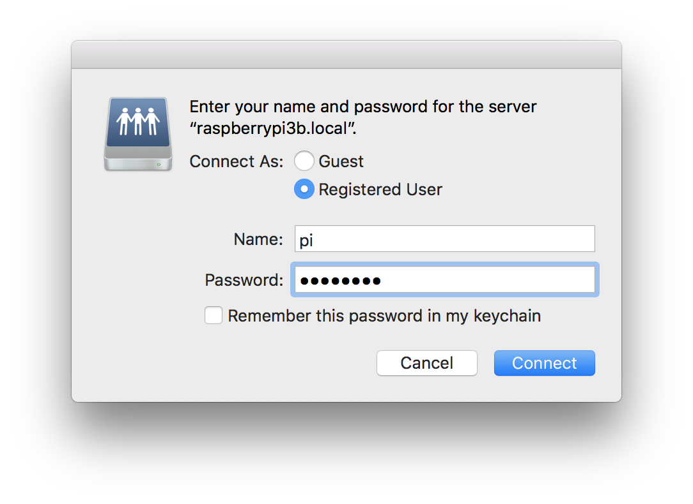

## Use Samba to Share Files on Raspberry Pi

### Objective

This "recipe" provides a method for sharing files that are on your Raspberry Pi over a local area network. Specifically, this recipe addresses configuring a **Raspberry Pi** (RPi) as a *file server* to **share a USB thumb drive**. Since I also use a Mac, we'll illustrate sharing with a **Mac** **client**. Note however the process for sharing with a **Windows** or **Linux** client is very similar. 

***We will begin with a USB thumb drive that is physically plugged into a USB port on a RPi, AND mounted.***  

If you're unfamiliar with mounting an external drive on RPi, please [review this recipe before proceeding](https://github.com/seamusdemora/PiFormulae/blob/master/ExternalDrives.md).  For this example the thumb drive has only a single *partition* formatted as an `exFAT` file system.  

This recipe shows installation and configuration steps that should yield an operational [Samba](https://www.samba.org/) server on your RPi. At the conclusion, you should be able to **access** the shared  **USB thumb drive** plugged into your RPi **over a network connection** to a Mac (or Windows or Linux).

### Question: Why Do This At All?

Answer: __Convenience__. One could simply unmount the USB thumb drive on the RPi, remove it, and plug it into a USB port on the client. If your RPi is on the other side of your desk, perhaps that's not much convenience. If it's upstairs, or in the garage, or in another country ([cautions](https://serverfault.com/questions/875055/is-there-any-reason-to-allow-smb-over-the-internet)), the convenience is more substantial. Another potential advantage is that Samba effectively ***translates*** the thumb drive's native file system format to [*CIFS*](https://en.wikipedia.org/wiki/Server_Message_Block) - a near-universal standard. For example: if the thumb drive were formatted as [*ext4*](https://en.wikipedia.org/wiki/Ext4), it would be *difficult-to-impossible* for a Mac or Windows client to read or write the thumb drive. 

As you'll see, Samba presents a [**distributed file system**](https://www.geeksforgeeks.org/network-file-system-nfs/) to its clients. Samba's distributed file system is called SMB (aka CIFS); but there are also other distributed file systems. You can [refer to this article for more details](https://www.varonis.com/blog/cifs-vs-smb) on these distributed file systems, but [*''in a nutshell''*](https://idioms.thefreedictionary.com/in+a+nutshell), the ***distributed file system*** allows disparate systems with vastly different ***native file systems*** to share files across system boundaries. 

## Create a Samba "distributed file system server"

Here's how to do it: 

### 1. Verify `fstab` entry for the external drive

Check that you have a valid *mount point* for the external drive you're going to share.  You may do this by entering the `lsblk` command at the command line prompt as follows: 

```bash
$ lsblk --fs
NAME        FSTYPE FSVER LABEL       UUID                                 FSAVAIL FSUSE% MOUNTPOINTS
mmcblk0
├─mmcblk0p1 vfat   FAT32 bootfs      4EF5-6F55                             453.3M    11% /boot/firmware
└─mmcblk0p2 ext4   1.0   rootfs      ce208fd3-38a8-424a-87a2-cd44114eb820   52.3G     5% /
# the external drive to be shared ↓↓↓↓↓↓↓↓↓↓↓↓↓↓↓↓↓↓↓↓↓↓↓↓↓↓↓↓↓↓↓↓↓↓↓↓↓↓↓↓↓↓↓↓↓↓↓↓↓↓↓↓↓↓↓↓
sda
└─sda1      exfat  1.0   SANDISK16GB 67EB-734A                              12.2G    18% /mnt/usb 
# 
sdb
└─sdb1      f2fs   1.15              97bd5811-e1b6-4582-8bbf-862b4a957b10  925.6G     1% /mnt/bluessd
```

We see that our thumb drive (LABEL: `SANDISK16GB`; aka `sda1`) is mounted at MOUNTPOINT: `/mnt/usb`. We are *"good to go".* 

The entry in `etc/fstab` that yielded this happy result was similar to this: 

```
LABEL=SANDISK16GB /mnt/usb exfat defaults,nofail,noatime 0 0
```

### 2. Install Samba:

Before installing Samba, you could check to make sure it's not already installed: 

```bash
$ apt-mark showmanual | grep samba

```

Assuming you don't have the `samba` package installed, proceed as follows: 

```bash
$ sudo apt update
...

$ sudo apt install samba 
...
```

This should complete without error.  

### 3. Configure Samba:

#### 3.a Edit the Samba Configuration file

Samba configuration is done through the file `/etc/samba/smb.conf`. Make a backup copy of `smb.conf`, and then use your favorite editor to modify this file as follows: 

```bash
$ sudo cp /etc/samba/smb.conf /etc/samba/smb.conf.bkup
$ sudo nano /etc/samba/smb.conf
```

Add the following lines to the tail of `smb.conf`:

    [thumbdrive]              # the share name
    Comment = Shared Folder
    Path = /mnt/usb
    Browseable = yes
    Writeable = yes
    only guest = no
    create mask = 0700
    directory mask = 0700
    force user = pi           # if you are not user pi, change this to your user name

Note that the `smb.conf` file being modified here is the one that was installed by `apt` in Step 2 on a standard 'bookworm Lite' distro obtained from the raspberrypi.com website.  I mention this to call attention to the fact that there are [***many*** possible settings for `smb.conf` files](https://www.samba.org/samba/docs/current/man-html/smb.conf.5.html). If you need to do something *"more elaborate"*, you may wish to peruse this link.  If not, suggest you refer to the Samba project's configuration guide: [Setting up Samba as a Standalone Server](https://wiki.samba.org/index.php/Setting_up_Samba_as_a_Standalone_Server).  

One other item to note from the `smb.conf` file: the `[homes]` directive under the `Share Definitions` section implements a feature that you may find useful. __If left enabled (i.e. the default), `/home/pi` is exported as a 'read-only' Samba share!__  If you don't want this, you may delete or comment the lines in the `[homes]` directive.  

#### 3.b Add user `pi` to Samba's password database file

When we mount the exported Samba share, we'll authenticate as user `pi`. Samba knows nothing of `pi`'s password under RPi OS, so we'll need to create a password using `smbpasswd`. You can use a different user/password if you like; I use `pi` with the same password because that's easiest for me. Adding `pi`'s Samba password proceeds as follows: 

    $ sudo smbpasswd -a pi
    New SMB password:
    Retype new SMB password:
    Added user pi.

And of course if you **do not** use the username `pi`, replace `pi` with whatever username you do use. 

#### 3.c Restart Samba to read the revised `smb.conf` file

Use the `systemctl` utility to restart the `smbd` service, and reload the revised `/etc/samba/smb.conf` file:   

>  NOTE: Do not worry re the `samba` service; it includes the **un-needed** **Domain Controller** functions.

```
$ sudo systemctl reload smbd
$ systemctl status smbd
● smbd.service - Samba SMB Daemon
     Loaded: loaded (/lib/systemd/system/smbd.service; enabled; preset: enabled)
     Active: active (running) since Thu 2025-04-03 01:18:16 UTC; 9min ago
       Docs: man:smbd(8)
             man:samba(7)
             man:smb.conf(5)
    Process: 649 ExecCondition=/usr/share/samba/is-configured smb (code=exited, status=0/SUCCESS)
    Process: 651 ExecStartPre=/usr/share/samba/update-apparmor-samba-profile (code=exited, status=0/SUCCESS)
    Process: 711 ExecReload=/bin/kill -HUP $MAINPID (code=exited, status=0/SUCCESS)
   Main PID: 652 (smbd)
     Status: "smbd: ready to serve connections..."
      Tasks: 3 (limit: 766)
        CPU: 481ms
     CGroup: /system.slice/smbd.service
             ├─652 /usr/sbin/smbd --foreground --no-process-group
             ├─654 /usr/sbin/smbd --foreground --no-process-group
             └─655 /usr/sbin/smbd --foreground --no-process-group

Apr 03 01:18:15 rpi3b1 systemd[1]: Starting smbd.service - Samba SMB Daemon...
Apr 03 01:18:16 rpi3b1 systemd[1]: Started smbd.service - Samba SMB Daemon.
Apr 03 01:27:44 rpi3b1 systemd[1]: Reloading smbd.service - Samba SMB Daemon...
Apr 03 01:27:44 rpi3b1 systemd[1]: Reloaded smbd.service - Samba SMB Daemon.

```

And that's it... your Samba server is running, and ready for you to connect from Mac/Windows/Linux! ***If you need more help with Samba configuration***, perhaps the [Samba wiki is a good place to start](https://wiki.samba.org/index.php/Setting_up_Samba_as_a_Standalone_Server). 

### 4. Connecting to the Samba share from a Mac or Linux client:

- On a Mac: open a `Finder` window (or use one that's already open) 
   - From keyboard, enter `command-k`, or click `Go, Connect to Server...`
   - In the `Server Address` field enter the URL of your RPi; e.g. `smb://raspberrypi3b.local` 
   - Authenticate as user `pi` and password from `3.b` above, click `Connect` 




*  To mount the Samba share from another Raspberry Pi (or any Linux client) using the CLI:

     ```bash
      $ sudo mount.cifs //raspberrypi3b/thumbdrive /home/pi/mymusic -o user=pi,password=XXXXXXX,rw
     ```

     
