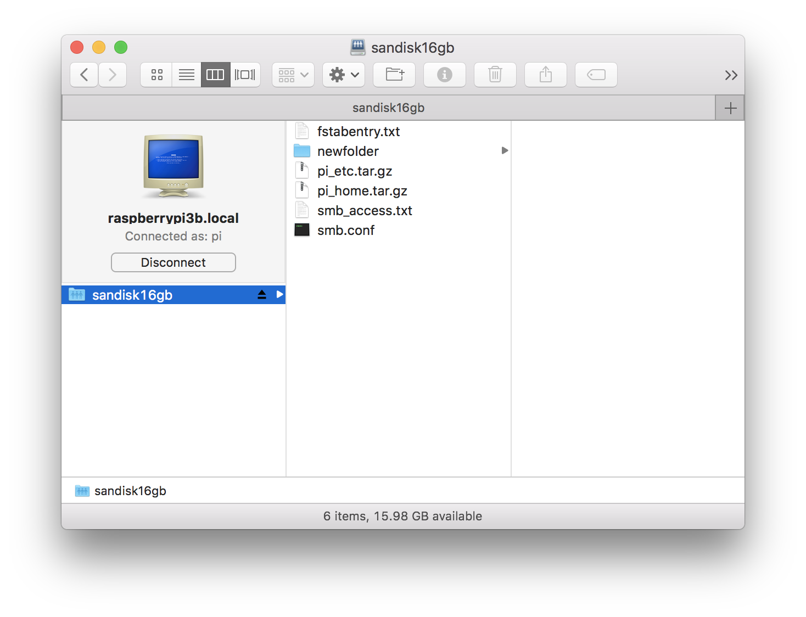

## Sharing Files on Raspberry Pi Over a Network

### Objective

This "recipe" provides a method for sharing files over a local area network between a RPi and a Mac. It assumes that the files (and folders) to be shared are all on an `exFAT`-formatted partition on an external drive that is mounted on the RPi ([see recipe for mounting drive](ExternalDrives.md)). I use [Samba](https://www.samba.org/) for the file server here because I feel it's the best option for sharing non-native file system partitions (exFAT, ext4, etc) with a Mac. Some may disagree. You should do your research, and choose the approach that works for you. 

### Q&A: Why Would I Do This?

Answer: __convenience__. You could unmount the USB flash drive mounted on your RPi, remove it, and plug it into your Mac or Windows PC. If your RPi is on the other side of your desk, perhaps that's not much convenience. If it's upstairs, or in the garage, or in another country, the convenience is more substantial. And it's not difficult to export a share using Samba. If you're ready, we'll get started: 

### 1. Check the `fstab` entry for the external drive

Check that you have a mount point at `/home/pi/mntThumbDrv`, and `etc/fstab` contains an entry similar to this: 

`LABEL=SANDISK16GB /home/pi/mntThumbDrv exfat rw,user,nofail 0 0` 

You can change this of course; these entries simply follow on the previous recipe for mounting an external drive. You do want the external drive auto-mounted if you're using Samba to serve it over the network. Auto-mount is accomplished through the `fstab` entry. 

### 2. Install Samba:

Before installing Samba, check to make sure it's not already installed: 

    pi@raspberrypi3b:~ $ apt-mark showmanual | grep samba
    samba
    samba-common-bin

If you don't have both of these packages (`samba` and `samba-common-bin`) installed, install them as follows: 

    pi@raspberrypi3b:~ $ sudo apt-get update
    ...
    pi@raspberrypi3b:~ $ sudo apt-get upgrade
    ...
    pi@raspberrypi3b:~ $ sudo apt-get install samba samba-common-bin 
    ...

This should complete without error. The output may contain certain messages about Samba's Domain Controller (DC) feature being "masked". We don't need the DC, so these messages can be safely ignored. 

### 3. Configure Samba:

#### 3.a Edit the Samba Configuration file

Samba configuration is done through the file `etc/samba/smb.conf`. Make a backup copy of `smb.conf`, and use your favorite editor to modify this file as follows: 

    pi@raspberrypi3b:~ $ sudo cp /etc/samba/smb.conf /etc/samba/smb.conf.bkup
    pi@raspberrypi3b:~ $ sudo pico /etc/samba/smb.conf

Add the following lines to the tail of `smb.conf`:

    [sandisk16gb]
    Comment = Shared Folder
    Path = /home/pi/mntThumbDrv
    Browseable = yes
    Writeable = yes
    only guest = no
    create mask = 0700
    directory mask = 0700
    force user = pi

The default `smb.conf` provided with Raspbian contains a number of settings that, frankly, I don't understand. Some of these settings are due to Samba's heritage as a Windows file server; some are due to other mysteries that I have not investigated (likely I never will). Rather than wade through that bog here, I'll recommend two alternatives:

1. I've prepared and tested [a minimal `smb.conf` file that you can download here](seamus_smb.conf) for use on your system. All I can promise is that it works on my RPi and Mac as of when this was written. Note that the `Domains` and `Misc` sections in this file are completely "commented out". I considered removing these sections, but left them in after considering the fact that some Windows users might follow this recipe  :0    
2. The Samba project has a current configuration guide to [Setting up Samba as a Standalone Server](https://wiki.samba.org/index.php/Setting_up_Samba_as_a_Standalone_Server). You should consult this guide if you want to work through the configuration in a proper way. 

I will mention one other item from the configuration file: the `[homes]` directive under the `Share Definitions` section implements a feature that you may find useful. __If enabled, `/home/pi` is exported as a Samba share!__ Of course this only works if you log in as the `pi` user (as we do here). I've not enabled it as I'm not sure of the security implications, and wouldn't use it often. You may enable it by uncommenting the appropriate lines in `smb.conf`, beginning with the `[homes]` directive. 

Complete any edits you wish to make in `smb.conf`, verify that the backup file you created earlier is still in place, and save the edited file to `etc/samba/smb.conf`

#### 3.b Add the user `pi` to Samba's password database file

When we mount the exported Samba share, we'll authenticate as user `pi`. Samba knows nothing of `pi`'s password under Raspbian, so we'll need to create a password using `smbpasswd`. I'd recommend you use the same password in Samba that you use in Raspbian, but that's not required. Add `pi`'s Samba password as follows: 

    pi@raspberrypi3b:~ $ sudo smbpasswd -a pi 
    New SMB password:
    Retype new SMB password:

#### 3.c Restart Samba to read the revised Samba Configuration file

(Re)Start the Samba daemons to read the new `smb.conf` file: 

    pi@raspberrypi3b:~ $ sudo /etc/init.d/samba restart 
    [ ok ] Restarting nmbd (via systemctl): nmbd.service. 
    [ ok ] Restarting smbd (via systemctl): smbd.service. 

### 4. Connect to the Samba share:

- Open a Finder window (or use one that's already open) 
- From keyboard, enter `command-k`, or click `Go, Connect to Server...`
- In the `Server Address` field enter the URL of your RPi; e.g. `cifs://raspberrypi3b.local` 
- Authenticate as user `pi` and password from `3.b` above, click `Connect` 

- View exported share `sandisk16gb` in Finder 

