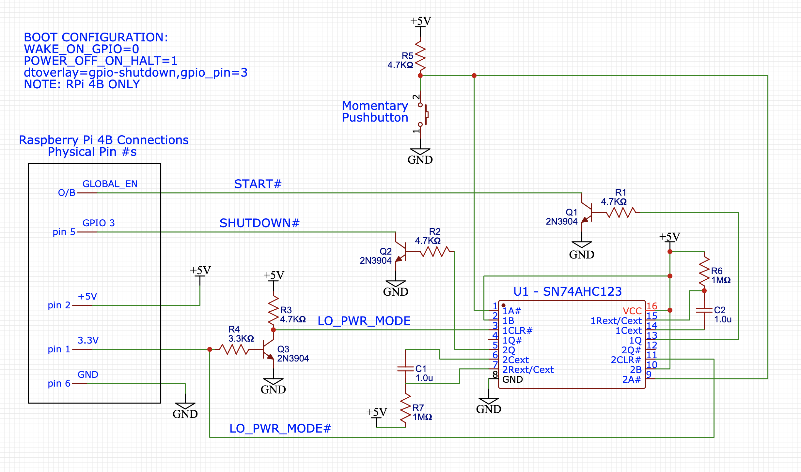

## A Low Power Startup/Shutdown Button for RPi 4B


The *"one-button-startup-shutdown"* (**OBSS**) feature for Raspberry Pi has been around for a while, and works on almost all RPi hardware versions. This nifty innovation is the result of Matthijs Kooijman's development of the `dtoverlay` for `gpio-shutdown`. His [blog post: "Raspberry pi powerdown and powerup button"](https://www.stderr.nl/Blog/Hardware/RaspberryPi/PowerButton.html) discusses his motivation, and remains active as of this writing. I do not comprehend the [code implementing the gpio-shutdown overlay](https://github.com/raspberrypi/linux/pull/2103/commits/6cb4827afd84587011fe16e8d6dee87081faa8e6), but as a user, was impressed by the simplicity of this feature. I implemented it immediately on my Raspberry Pi 4B:

   1. Add the following `dtoverlay` in `/boot/config.txt`: 

   ```
   dtoverlay=gpio-shutdown,gpio_pin=3
   ```

2. 1 push-button and 2 wires: Connect the push-button between GPIO 3 and GND.

As Matthijs pointed out in his blog, the OBSS doesn't remove power, and so the RPi continues to draw power (at a lower level) after being shutdown. This is the same as all RPis do after receiving a `halt`,  `shutdown` or  `poweroff` command from the terminal. In my case, the RPi 4B draws approximately 270mA using the [default set of bootloader configuration properties](https://www.raspberrypi.org/documentation/hardware/raspberrypi/bcm2711_bootloader_config.md), or approximately 1.35 watts of power. This same RPi 4B draws approximately 470mA / 2.35 watts when it is running. From my reading, this seems fairly *typical* . Consequently, the energy savings incentive for using the OBSS is not huge. Despite the convenience of OBSS, `shutdown` is **not** a [*"sleep mode"*](https://en.wikipedia.org/wiki/Sleep_mode). 

One of the features introduced in the RPi 4B is a [*"Low Power Mode" (**LPM**)*](https://www.raspberrypi.org/documentation/hardware/raspberrypi/bcm2711_bootloader_config.md): 

> If [POWER_OFF_ON_HALT=] `1` and `WAKE_ON_GPIO=0` then `sudo halt` will switch off all PMIC outputs. This is lowest possible power state for halt but may cause problems with some HATs because 5V will still be on. `GLOBAL_EN` must be shorted to ground to boot.

And so LPM is set up by changing two default values in the bootloader configuration: `WAKE_ON_GPIO` and `POWER_OFF_ON_HALT`. According to [my experiment](https://github.com/seamusdemora/PiFormulae/blob/master/RPi4bSleep.md), doing so reduces power consumption in `shutdown` to approximately 0.2 watts - a current draw of about 40mA. AFAIK, this is the lowest achievable power consumption for the RPi 4B without "pulling the plug".  

Unfortunately, as mentioned above, this shutdown state is not a sleep mode, and a reboot is required to return the system to an operational state. The necessary reboot from LPM `shutdown` is only possible by either: **1.** pulling down the `GLOBAL_EN` node, or **2.** "pulling and re-inserting the plug". `GLOBAL_EN` is **not** a GPIO, nor can it (*at least currently*) be assigned to a GPIO.  This *likely* due to the fact that the 3V3 bus is turned off in LPM - thus disabling all GPIO. Regardless of the cause, the net effect is this: ***OBSS,  as currently implemented, does not work when the RPi 4B is configured for Low Power Mode.*** 

One *work-around* to this is shown in the following schematic. The concept is simple: We connect the pushbutton to the trigger inputs on a pair of *"one-shots"*. We take advantage of the fact that the RPi 4B's `3V3` bus is powered down during LPM, and wire the `3V3` line to enable only one of the one-shot's outputs.  One of these outputs is wired to GPIO 3 for shutdown, the other is wired to `GLOBAL_EN`  for startup. The present design has the *drawback* that the RPi ***must be*** in LPM - it does not work in the bootloader default configuration for`halt`/`shutdown` mode. This could be addressed by an improvement to the hardware design below, but a better solution - if possible - might be available in another `dtoverlay`? 



