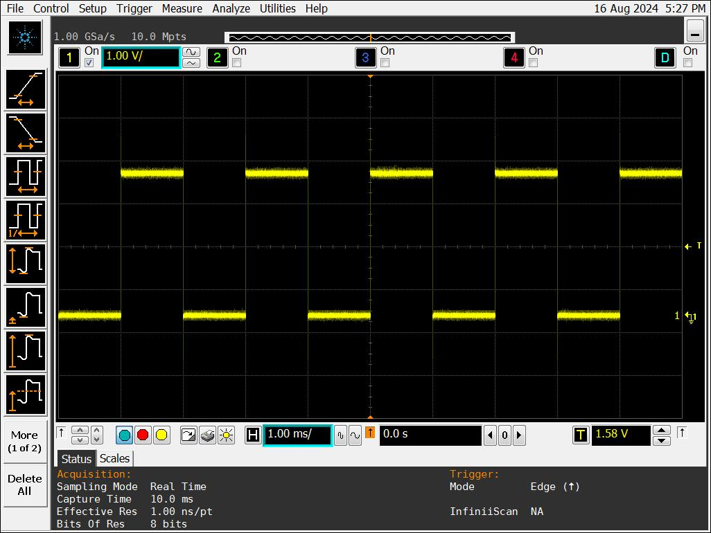
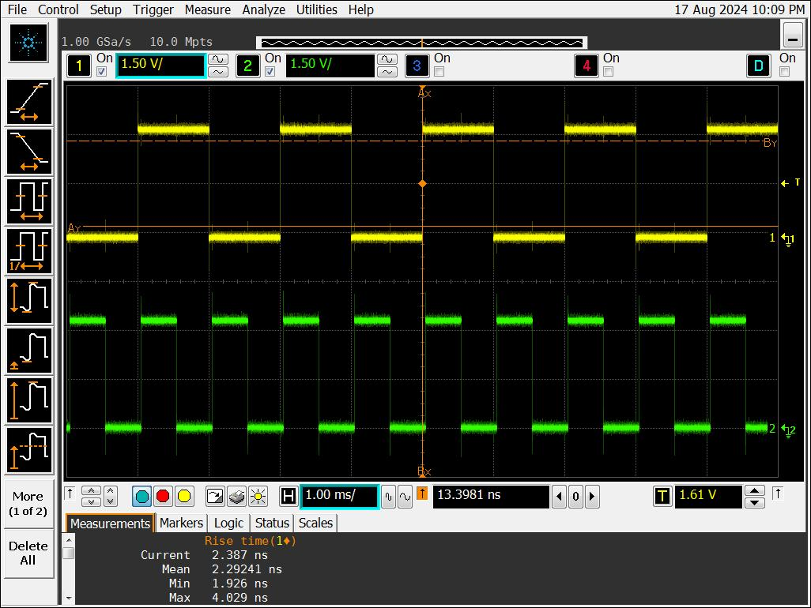

## PWM on a Raspberry Pi 5

There have been reports that PWM on RPi5 is ***difficult***: [1](https://forums.raspberrypi.com/viewtopic.php?t=362319), [2](https://forums.raspberrypi.com/viewtopic.php?t=366795) and [others listed in this search](https://duckduckgo.com/?q=pwm+on+raspberry+pi+5&t=ffab&ia=web). The issues *seem* to have to do with the various programming languages and libraries that worked with earlier RPi models (prior to RPi 5) - but are now failing on RPi 5. Outlined below is an approach that avoids these failures. This recipe is a *follow-up* to a couple of Q&A on SE ([1](https://raspberrypi.stackexchange.com/questions/148769/troubleshooting-pwm-via-sysfs), [2](https://raspberrypi.stackexchange.com/questions/148795/only-1-pwm-pin-working-when-controlling-via-sysfs)). 

Before getting into the details, there are a couple of things I feel that I should mention. First, I've not provided much documentation with this recipe. There are two reasons for this; **first**, I developed this recipe by [*"following my nose"*](https://idioms.thefreedictionary.com/follow+your+nose) and reading bits here and there, and **second**... *there really is no documentation!*  I don't know what's going on in **The RPi Organization**, but it seems to me there's been a noticeable decrease in the documentation published on the RPi 5.  ***For example:***   There is no [PDF datasheet](https://datasheets.raspberrypi.com/) for the [BCM2712](https://www.raspberrypi.com/documentation/computers/processors.html#bcm2712) - the RPi 5 processor.  I'd encourage anyone who reads this to consider making a comment through the [RPi Forums](https://forums.raspberrypi.com), or on their [GitHub site](https://github.com/raspberrypi/documentation).  

All of that said, here are some instructions for setting up and controlling the PWM on RPi 5 using `config.txt`, `sysfs` and a tiny bit of `bash`: 

### Table of Contents

* [Single PWM channel](#single-pwm-channel)
* [Dual PWM channels](#dual-pwm-channels) 
* [A simple `bash` script for basic setup (2 or 3 lines of code!)](#a-trivial-bash-script-for-basic-setup) 


### Single PWM channel

#### 1. Load the single channel PWM overlay; i.e. edit `config.txt` & `reboot`:

   ```bash
      $ sudo nano /boot/firmware/config.txt 
      # add 1 line to the file: 
      dtoverlay=pwm
      # use defaults for 'pin' & 'func' parameters: 18,2
      # save the file, close it, and then re-boot 
      $ sudo reboot
   ```

#### 2. Review the kernel driver documentation on PWM (*Warning: x-arcane*) 

   You can find it [here](https://www.kernel.org/doc/html/v5.10/driver-api/pwm.html#using-pwms-with-the-sysfs-interface).  

#### 3. "Explore" the `/sys/class/pwm` folder: 

```bash
   $ ls /sys/class/pwm
   pwmchip0  pwmchip2  pwmchip6 
   
   # on RPi 5 the PWM controller is pwmchip2 
   
   $ cd /sys/class/pwm/pwmchip2 && ls -l
   lrwxrwxrwx 1 root gpio     0 Aug 15 00:25 device -> ../../../1f00098000.pwm
   --w--w---- 1 root gpio 16384 Aug 15 00:25 export
   -r--r--r-- 1 root gpio 16384 Aug 15 00:25 npwm
   drwxrwxr-x 2 root gpio     0 Aug 15 00:25 power
   lrwxrwxrwx 1 root gpio     0 Aug 15 00:25 subsystem -> ../../../../../../../class/pwm
   -rw-rw-r-- 1 root gpio 16384 Aug 15 00:25 uevent
   --w--w---- 1 root gpio 16384 Aug 15 00:25 unexport 
```

#### 4. "Export" channel 2 & Verify that worked properly:

```bash
   $ echo 2 > export 
   $ pwd
   /sys/class/pwm/pwmchip2 
   $ ls -l
   lrwxrwxrwx 1 root gpio     0 Aug 15 00:25 device -> ../../../1f00098000.pwm
   --w--w---- 1 root gpio 16384 Aug 15 00:34 export
   -r--r--r-- 1 root gpio 16384 Aug 15 00:25 npwm
   drwxrwxr-x 2 root gpio     0 Aug 15 00:25 power
   drwxrwxr-x 3 root gpio     0 Aug 15 00:34 pwm2   ### <== NOTE NEW FOLDER !!!
   lrwxrwxrwx 1 root gpio     0 Aug 15 00:25 subsystem -> ../../../../../../../class/pwm
   -rw-rw-r-- 1 root gpio 16384 Aug 15 00:25 uevent
   --w--w---- 1 root gpio 16384 Aug 15 00:25 unexport
   
   # Note the addition of the new folder 'pwm2' 
   # "Explore" new folder 'pwm2': 
   
   $ ls -l pwm2
   total 0
   -r--r--r-- 1 root gpio 16384 Aug 15 00:34 capture
   -rw-rw-r-- 1 root gpio 16384 Aug 15 00:36 duty_cycle
   -rw-rw-r-- 1 root gpio 16384 Aug 15 00:36 enable
   -rw-rw-r-- 1 root gpio 16384 Aug 15 00:35 period
   -rw-rw-r-- 1 root gpio 16384 Aug 15 00:34 polarity
   drwxrwxr-x 2 root gpio     0 Aug 15 00:34 power
   -rw-rw-r-- 1 root gpio 16384 Aug 15 00:34 uevent 
   
   # Which "look appropriate" for a PWM control channel
```

#### 5. "Set" the PWM parameters:

```bash
   $ cd /sys/class/pwm/pwmchip2/pwm2
   $ echo 2000000 > period 
   $ echo 1000000 > duty_cycle 
   $ echo 1 > enable
```

#### 6. Verify the PWM output:

   If you've got some lab equipment (freq counter, oscilloscope, etc), connect that to **GPIO 18** (*header pin 12*), and observe the output. If you don't, you can connect a DC voltmeter - or even an LED+Resistor - across GPIO 18 & GND & observe. A DC voltmeter should read about 1.65V with the period & duty-cycle settings from above. 

   The following is a screen-shot made using my old Agilent MSO9104A. The PWM waveform being measured was extremely stable - as one would expect from a *hardware-based* PWM output. 





### Dual PWM channels

As you would expect, the dual-channel version of this recipe closely follows the single-channel version above. We'll try to note all the differences below: 

#### 1. Load the 2-channel PWM overlay; i.e. edit `config.txt` & `reboot`:

   ```bash
   $ sudo nano /boot/firmware/config.txt 
   # add 1 line to the file: 
   dtoverlay=pwm-2chan 
   
   # REMOVE 'dtoverlay=pwm' if it's in there 
   # save & close config.txt, and then reboot: 

   $ sudo reboot
   ```

#### 4."Export" channel 2 and channel 3; then verify that worked properly: 

```bash
   $ cd /sys/class/pwm/pwmchip2
   $ echo 2 > export && echo 3 > export
   
   # NOTE the creation of folders 'pwm2' & 'pwm3' 
```

#### 5."Set" the PWM parameters for each channel: 

```bash
   # Create two different PWM waveforms for 'pwm2' & 'pwm3'
   
   $ cd /sys/class/pwm/pwmchip2/pwm2
   $ echo 2000000 > period && echo 1000000 > duty_cycle && echo 1 > enable
   $ cd /sys/class/pwm/pwmchip2/pwm3
   $ echo 1000000 > period && echo 500000 > duty_cycle && echo 1 > enable
```

#### 6. Verify : 

   The following screen-shot was made on an Agilent MSO9104A. As expected, the `pwm3` trace is running at twice the frequency of `pwm2` (b/c the 'period' is halved), both are extremely stable, and `pwm3` appears on **GPIO 19** (the default from `config.txt`).  





### A trivial `bash` script for basic setup:

We spent a lot of words describing this setup, but for routine usage this can be handled by a script. Assuming the `/boot/firmware/config.txt` file has been setup (*dynamic device tree* loading does not seem to work with PWM), the bash coding boils down to a few very simple `echo` statements: 

```bash 
#!/usr/bin/env bash

cd /sys/class/pwm/pwmchip2
echo 2 > export
sleep 1

cd ./pwm2
echo 2000000 > period && echo 1000000 > duty_cycle && echo 1 > enable 

```

I'll leave *parameterizing* the `period` and `duty_cycle` up to the reader - it's basic `bash` coding. 

