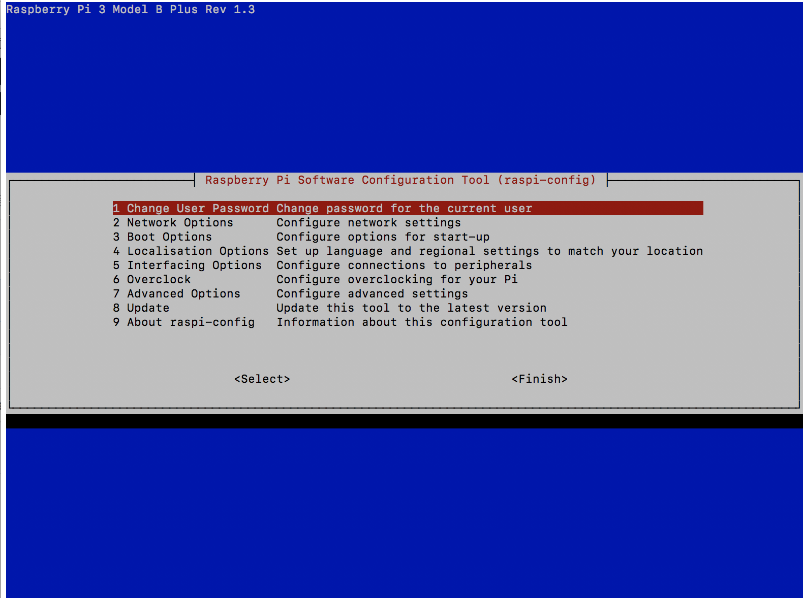

# Setup Raspberry Pi for Headless Operation

It seems that a lot of people follow instructions to set up their microSD card (Raspberry Pi's 'hard drive'), but don't give much thought to what comes afterwards. That's understandable, and it's generally not that big a deal if you're connecting a keyboard, mouse and TV/monitor. In the "GUI" environment, you can issue commands to your RPi, and there are tools and tips and cues to point you toward connecting to your network, and other basic tasks that users typically perform. 

However, some users don't want to (or aren't able to) connect keyboards, mice and monitors. This is how I usually do it; I run my RPi's ["headless"](https://en.wikipedia.org/wiki/Headless_computer)... I have one "head" on my MacBook, and I don't want any more heads to deal with :)  I personally feel that's "how it should be", but after living with the Raspberry Pi 3B+ & 4B for a while, I can easily see that it's not inconceivable that either could serve as a general purpose PC for some users; surfing the Internet, email, etc. All that power for £32! 

But I digress. Here, for what it's worth, is how I do things: 

## Download the Raspbian Image, and Burn It to the microSD Card 

1. Download the [latest Raspbian image file from the Raspberry Pi website](https://www.raspberrypi.com/software/operating-systems/). Unzip the downloaded *`.zip`* file to reveal a *`.img`* file. The  *`.img`* file is the one that will be *burned* or *flashed* to the microSD card.

2. Choose your weapon: There are several methods & tools that may be used to copy the Raspbian image file to your uSD card:
  * you can [do it manually in Mac, Windows or Linux/Unix](https://www.wikihow.com/Make-a-USB-Bootable)
  * you can use [rufus](https://rufus.akeo.ie/) on your Windows PC 
  * you can use [Etcher](https://etcher.io/) on Mac or Windows

3. "Burn" the Raspbian image file to the media you're going to boot from. Typically, this will be an 16 GB or larger [microSD](https://simple.wikipedia.org/wiki/MicroSD) memory card.

## Modify files in `/boot` on the micro SD card

After you've *flashed* your downloaded image file to the uSD card, you will need to make some changes to it. Before you can make these changes, the `/boot` partition must be *mounted*. You can `mount` the `/boot` drive using the `Finder` app on mac OS, or its equivalent in Linux or Windows. N.B. that `/boot` is a FAT32 partition, and therefore may be read or written to by virtually any system on the planet. Unless you're certain you know what you're doing, you should leave the `root` partition (`/`) alone. It is formatted as an `ext4` filesystem, and can only be read & written by certain Linux OS-based distros. 

Having mounted `/boot` on the *just-flashed* uSD card, make these changes:  

1. create an empty file named `ssh` in `/boot`; e.g. using the mac OS terminal app: 

     ```
     % cd /Volumes/boot
     % touch ssh
     %
     ```

2. If you plan to connect your RPi using WiFi, you must also add a file named `wpa_supplicant.conf`. In a text editor (one that uses standard Linux/Unix line endings), copy and paste the following, then save it in the `/boot` partition as `wpa_supplicant.conf`. Use your country code (US, UK, FR, etc), and your WiFi SSID & password instead of these 'dummy' values.

```
ctrl_interface=DIR=/var/run/wpa_supplicant GROUP=netdev
update_config=1
country=US

network={
 ssid=MyWiFi_SSID
 psk=MyWiFiPassword
}
```

Once you've made these changes, `eject/umount` the microSD card. 

3. If you plan to connect your RPi using Ethernet, nothing additional need be done. The `/etc/dhcpcd.conf` file contains the appropriate configuration to connect to your LAN & communicate with your DHCP server.

## Insert the microSD card into your RPi & apply power

Having completed the above steps, your RPi should boot successfully upon application of a suitable power source, and connect itself to your WiFi or LAN (once you've connected the RPi to a router or switch using a standard Ethernet patch cable). 

In either case, before you initiate an SSH connection to your new RPi, you may need to know its IP address on the network. If you're on a "zero configuration" network, things may "just work", and your first login is as simple as `ssh pi@raspberrypi.local`. Try that; if it works, [go to the next step](https://github.com/seamusdemora/PiFormulae/blob/master/ReadMeFirst.md#login-to-your-RPi-using-SSH). If not, no worries as there are numerous ways to find the IP address of your RPi: 

  * `dns-sd -q raspberrypi.local` (OS X only)

  * `arp -a |grep -E --ignore-case 'b8:27:eb|dc:a6:32'` 

    >  NOTE: As of this writing: The [**OUI**](https://en.wikipedia.org/wiki/Organizationally_unique_identifier) portion of the MAC address is as follows: 
    >
    > * RPi ver 3B+ and earlier have MAC addresses beginning with `b8:27:eb`; 
    > * RPi ver 4B has MAC address beginning with `dc:a6:32`

  * `arp raspberrypi.local`

  * if you have access to it, look through the DHCP server's log of active leases 

  * I've developed this ["recipe" for IP address discovery](https://github.com/seamusdemora/PiFormulae/blob/master/FindMyPi.md) 

Note: Using a [simple `arp` will be "hit-or-miss"; here's why](https://github.com/seamusdemora/PiFormulae/blob/master/ThinkingAboutARP.md) that's so. If you've reached the end of the list, and you still don't have your Pi's IP address, then something may be broken or misconfigured. Try [one of the forums](https://raspberrypi.stackexchange.com/) for support, and as always, please try to be as specific as you can in describing your problem.  

## Login to your RPi using SSH to complete the setup:

There are several things you should tend to soon after the installation. We'll use the terminal for all this, but an alternative approach is to use `raspi-config`. What follows is a reasonably complete transcript of the entire *post-install* process. The terminal output can get verbose, and in consequence the actual **commands** may get lost in this transcript. In an effort to avoid obscuring the required command sequence, each command prompt is designated by the following character string:  

#### **'==>'**

1. Change the default password for user pi: 

   ```bash
   ==> pi@raspberrypi:~ $ passwd
   Changing password for pi.
   Current password:
   New password:
   Retype new password:
   passwd: password updated successfully
   ==> pi@raspberrypi:~ $
   ```

2. Change the RPi `hostname` to something meaningful & login using changed hostname: 

   ```bash
   ==> pi@raspberrypi:~ $ hostnamectl   # verify hostname & details
      Static hostname: raspberrypi
            Icon name: computer
           Machine ID: 6add6f07727f4a44d249ce70609f281a
              Boot ID: d31c9d0a692d4ecfa17becd144f59328
     Operating System: Raspbian GNU/Linux 11 (bullseye)
               Kernel: Linux 5.10.92+
         Architecture: arm
   ==> pi@raspberrypi:~ $ sudo hostnamectl set-hostname raspberrypi0w  # change hostname 
   ==> pi@raspberrypi:~ $ hostname   # verify
   raspberrypi0w 
   ==> pi@raspberrypi:~ $ sudo nano /etc/hosts    # edit hosts file
   #
   # change from:  '127.0.1.1               raspberrypi'
   # Change to:    '127.0.1.1               raspberrypi0w'
   # save file, exit editor
   #
   sudo: unable to resolve host raspberrypi0w: Name or service not known  # not to worry!
   ==> pi@raspberrypi:~ $ sudo reboot 
   ...                    
   # login from macos using new hostname:
   ==> seamus@Dung-Pro ~ % ssh pi@raspberrypi0w.local 
   ... # ignore warnings,,, we should see the new name in the prompt (and we do!)
   ==> pi@raspberrypi0w:~ $   # note new hostname in shell prompt
   ```

3. Copy your **public RSA key** from your client (Mac, Windows, etc) to your Raspberry Pi: 

   ```bash
   ==> pi@raspberrypi0w:~ $ logout
   Connection to raspberrypi0w.local closed.
   ==> seamus@Dung-Pro ~ % ssh-copy-id pi@raspberrypi0w.local
   /usr/bin/ssh-copy-id: INFO: attempting to log in with the new key(s), to filter out any that are already installed
   /usr/bin/ssh-copy-id: INFO: 1 key(s) remain to be installed -- if you are prompted now it is to install the new keys
   pi@raspberrypi0w.local's password:
   
   Number of key(s) added:        1
   
   Now try logging into the machine, with:   "ssh 'pi@raspberrypi0w.local'"
   and check to make sure that only the key(s) you wanted were added.
   ==> seamus@Dung-Pro ~ % ssh pi@raspberrypi0w.local 
   ...
   ==> pi@raspberrypi0w:~ $   # SUCCESS! 
   ```

4. Perform an update & upgrade to bring your system's software to a current level 

   ```bash
   ==> pi@raspberrypi0w:~ $ sudo apt update
   ...
   18 packages can be upgraded. ...
   ==> pi@raspberrypi0w:~ $ sudo apt upgrade 
   ...
   ==> Do you want to continue? [Y/n] Y 
   ...
   ==> pi@raspberrypi0w:~ $ sudo reboot
   ```

5. Reboot & login - your new system is current & ready to go.


<!---


DEPRECATED FOR NOW; MAY BE RESURRECTED LATER?

1. Open a terminal on your PC, and initiate a connection to your RPi using SSH: 

`ssh pi@raspberrypi.local` or, use the RPi's IP address: `ssh pi@192.168.1.77` (for example) if that's handy

2. Enter the default password at the prompt: `raspberry` 

3. Start raspi-config:  `sudo raspi-config`  and you'll see something like this: 

 


    NOTE: Before beginning, you may wish to try updating raspi-config by selecting the Update option (8). If you do so, this will temporarily close the raspi-config window, check for an update, and then automatically return you to raspi-config. 


4. The "arrow keys" will move you through the menu items, the "Tab" key will move you between screens. Go to `Interfacing Options`You'll want to make the following "stops": 

    a. Change the default password 
    
    b. Set up WiFi networking if you want; you'll need to know the WiFi `SSID` and `password`
    
    c. Go to `Boot Options` -> `Desktop CLI -> `Console`; tab to `OK`, then `Return`
    
    d. Go to `Localisation Options`, and select the appropriate values from the lists provided
    
    e. Go to `Interfacing Options` -> `SSH`, and select `YES`, There are a lot of options on this page; you can set them now, or return to them later. 
    
    f. Go to `Advanced Options` -> `Expand Filesystem. You may wish to expand the file system to use all available storage on the microSD card. This is probably a good idea for most users. Note the other choices here, and you may return later to change them. 
    
    g. Tab to the `Finish` option at the bottom of the page and return to the command prompt. 
    
    
    
5. Don't forget to secure your RPi! You could and should do two things immediately: 
  
    1. Change the default password if you haven't already done so. 
    2. Copy your **public RSA key** from your Mac/Windows/Linux host to your Raspberry Pi: 
    ```bash
    $ ssh-copy-id pi@raspberrypi.local
    ```
    
    This assumes that you have generated an **RSA key pair** on your Mac/Windows/Linux host, 
    
    you have retained the default userid `pi`, and that your RPi hostname is `raspberrypi.local`.
    
    - If you don't know how to generate an RSA key pair, [Digital Ocean has a good tutorial](https://www.digitalocean.com/community/tutorials/how-to-set-up-ssh-keys-on-ubuntu-1604) 
    - To change the hostname of your RPi, use either `raspi-config`, or edit `/etc/hostname`
    
    Congratulations, we're done here! 


—>
