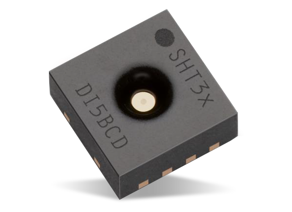
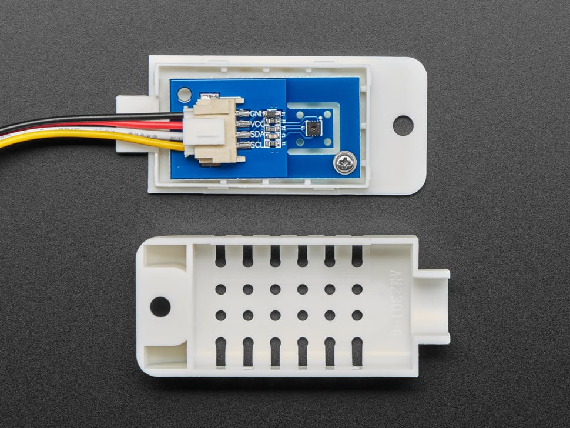
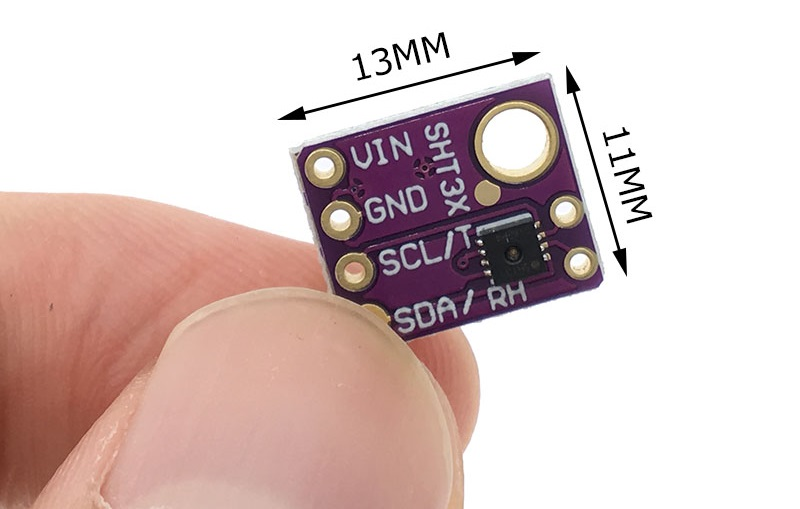
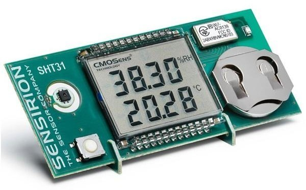

## Using Sensiron's SHT3X Temp/Humidity Sensors

This recipe outlines (what I feel is) the *simplest*, and most *straightforward* use of Sensiron's ubiquitous temperature and humidity sensors. This recipe was developed on a RPi 3A+ running an *up-to-date* 64-bit version of the RPi OS 'bookworm'. Here we use a *shell script* to **set** control parameters, and **get** temperature & humidity readings from `sysfs`. 

|      |    |
| --------------------------------------- | --------------------------------------------- |
|  |  |

For those wondering *WTFIGO* wrt use of `sysfs`, I'm afraid I have no explanation. Like everyone else, I heard that the Linux kernel maintainers had finally pushed `sysfs` usage into oblivion - some 6 years after they elected to deprecate it. Yet, here it is - and looking none the worse for wear! In fact, the *key piece* of documentation that enables this recipe was found in the [kernel documentation](https://www.kernel.org/doc/html/latest/hwmon/sht3x.html)! Clearly, there is a lot I don't know about `sysfs`. And while the kernel documentation made perfectly clear ***how*** the SHT3X interface was implemented, it was completely silent on ***where*** to find the proper folder. For that, I had to resort to *digging around* (more on that below).   

Let's get into the recipe; we'll provide a **Summary** first, followed by a **detailed step-by-step**: 

## I. Summary

   A. Make the wiring connections iaw Step 1 below.

   B. Using `i2c0`; declare required overlays in `config.txt` and `reboot`: 

   ```bash
      # for bullseye & earlier
      $ sudo nano /boot/config.txt 
      # add lines, save & exit: 
      dtparam=i2c_vc=on
      dtoverlay=i2c-sensor,i2c0,sht3x
      #
      # for bookworm:
      $ sudo nano /boot/firmware/config.txt
      # add lines, save & exit
      dtoverlay=i2c0
      dtoverlay=i2c-sensor,i2c0,sht3x 
      ...
      $ sudo reboot
   ```

   C. Install required `bc` utility, `udev` rule & script - and verify correct operation: 

   ```bash
      $ sudo apt update
      $ sudo apt install bc
      $ sudo install --mode=644  ./80-local.rules /etc/udev/rules.d
      $ sudo install ./th.sh /usr/local/bin 
      # verify correct operation:
      $ th.sh
      2024-08-28 @ 20:33:09; Temperature: 23.3 deg C,  73.9 deg F	Humidity: 59.8 % relative humidity
      $
   ```


## II. Detailed Step-by-Step Procedure: 

### 1. The first step is to connect the sensor to the RPi:

**Remove power from your RPi before making any wiring connections!** The schematic is simple: 2 wires for power, and two wires for I2C. **PLEASE NOTE** that I am using `i2c0` for this SHT3X connection; this due to the fact that the default `i2c1` was not in use/not available on this particular RPi 3A+. You may use any `i2cX` channel available for your RPi; simply watch out for commands including a specific reference to `i2c0`, and adjust accordingly.  
<!-- Begin schematic: In order to preserve an editable schematic, please
     don't edit this section directly.
     Click the "edit" link below the image in the preview instead. -->


<!-- End schematic -->

### 2. The second step is to declare an `overlay`:  

Run `raspi-config`; in the `Interfaces` section, ensure that the I2C interface is enabled. Open file `/boot/firmware/config.txt` (for RPi OS 'bookworm', or `/boot/config.txt` in prior versions of the OS)   in your editor, and add the following lines. You will need to `reboot` after making these changes:

```bash
dtoverlay=i2c0 

dtoverlay=i2c-sensor,i2c0,sht3x
```

### 3. Consult the documentation for details:

Sensiron's website is a great source for documentation on the SHT3X. You will find [application & driver software](https://sensirion.com/products/catalog/SHT30-DIS-F) here, but we will not require that for this example. 

Instead, we will use documentation for the Linux kernel; specifically: [the driver documentation for the SHT3x](https://www.kernel.org/doc/html/latest/hwmon/sht3x.html) (prepared by Sensiron staff). This document contains the `sysfs` interface documentation, and is **the key** for using the sensor. It **does not** explain exactly ***where*** in `/sys` these interface files are found, but a bit of *digging around* on my RPi 3A+, with some help from `grep` & `find`, revealed its location: 

```bash
$ grep -s sht3x /sys/class/hwmon/*/*
/sys/class/hwmon/hwmon2/name:sht3x
/sys/class/hwmon/hwmon2/uevent:OF_NAME=sht3x
/sys/class/hwmon/hwmon2/uevent:OF_FULLNAME=/soc/i2c@7e205000/sht3x@44
/sys/class/hwmon/hwmon2/uevent:OF_COMPATIBLE_0=sensirion,sht3x

$ cd /sys/class/hwmon/hwmon2
$ ls -l 
total 0
lrwxrwxrwx 1 root root    0 Jun  2 21:55 device -> ../../../0-0044
-rw-r--r-- 1 root root 4096 Jun  2 21:55 heater_enable
-r--r--r-- 1 root root 4096 Jun  2 21:55 humidity1_alarm
-r--r--r-- 1 root root 4096 Jun  2 21:55 humidity1_input
-rw-r--r-- 1 root root 4096 Jun  2 21:55 humidity1_max
-rw-r--r-- 1 root root 4096 Jun  2 21:55 humidity1_max_hyst
-rw-r--r-- 1 root root 4096 Jun  2 21:55 humidity1_min
-rw-r--r-- 1 root root 4096 Jun  2 21:55 humidity1_min_hyst
-r--r--r-- 1 root root 4096 Jun  2 21:55 name
lrwxrwxrwx 1 root root    0 Jun  2 21:55 of_node -> ../../../../../../../../firmware/devicetree/base/soc/i2c@7e205000/sht3x@44
drwxr-xr-x 2 root root    0 Jun  2 21:55 power
-rw-r--r-- 1 root root 4096 Jun  2 21:55 repeatability
lrwxrwxrwx 1 root root    0 Jun  2 21:55 subsystem -> ../../../../../../../../class/hwmon
-r--r--r-- 1 root root 4096 Jun  2 21:55 temp1_alarm
-r--r--r-- 1 root root 4096 Jun  2 21:55 temp1_input
-rw-r--r-- 1 root root 4096 Jun  2 21:55 temp1_max
-rw-r--r-- 1 root root 4096 Jun  2 21:55 temp1_max_hyst
-rw-r--r-- 1 root root 4096 Jun  2 21:55 temp1_min
-rw-r--r-- 1 root root 4096 Jun  2 21:55 temp1_min_hyst
-rw-r--r-- 1 root root 4096 Jun  2 21:52 uevent
-rw-r--r-- 1 root root 4096 Jun  2 21:55 update_interval
```

Which we see matches the [kernel documentation for the SHT3X](https://www.kernel.org/doc/html/latest/hwmon/sht3x.html). *This must be the place!*  

### 4. A "one-shot" script to see some T&H readings

The availability of the [driver documentation](https://www.kernel.org/doc/html/latest/hwmon/sht3x.html) and `sysfs` interface description provide for a very **straightforward** method to control the sensor, and take readings from it. This may perhaps be done most simply using a shell script to read/write the `sysfs` files. 

**The [shell script `th.sh` is found here](source/th.sh); the listing below will hopefully match the source file, but please do not depend on that.** Also note this script depends upon a  `udev` script to keep up with the location of the `sysfs` driver file - [see this recipe for details](https://github.com/seamusdemora/PiFormulae/blob/master/Is_udev_brain-damaged.md). 

```bash
#!/usr/bin/bash

# An issue w/ this script was the sysfs location of the correct folder containing
# the "data files" for the sht3x sensor. The "sysfs" name/location of the folder
# could change following a reboot, or if other "hwmon" sensors were added/removed.
# This issue was addressed with a "udev" rule; the rule created a symbolic link at
# "/dev/hwmon_sht3x" to the correct folder in "sysfs".
# The "udev" rule is located at "/etc/udev/rules.d/80-local.rules", and is:
#
# ACTION=="add", SUBSYSTEM=="hwmon", ATTR{name}=="sht3x", KERNELS=="0-0044", \
# SUBSYSTEMS=="i2c", RUN+="/bin/sh -c 'ln -s /sys$devpath /dev/hwmon_sht3x'"
#
# Consequently, the data used in this script is read from "/dev/hwmon_sht3x"
# instead of "/sys/devices/platform/soc/3f205000.i2c/i2c-0/0-0044/hwmon/hwmonX"

dev_fldr="/dev/hwmon_sht3x"

# check that $dev_fldr exists, that the file 'name' exists in it, and that the file contains 'sht3X'
if [ -d "$dev_fldr" ] && [ -f "$dev_fldr/name" ] && [ $(< "$dev_fldr/name") = "sht3x" ]; then
    dev_nm="sht3x"
else
    echo "ERROR fm $0: The folder: $dev_fldr - appears to be incorrect or missing."
    echo "Verify the sht3x sensor is wired correctly, and configured in config.txt"
    exit 1
fi

# Fahrenheit = (Celsius * 1.8) + 32
# read sht3x sensor's temperature & humidity data
denominator=1000
temp_c=$(< "$dev_fldr/temp1_input")
t_c=$(echo "scale=1; $temp_c / $denominator" | bc)
t_f=$(echo "scale=1; ($t_c * 1.8) + 32" | bc)
# echo -e "$t_c deg C\t$t_f deg F"

humid_r=$(< "$dev_fldr/humidity1_input")
h_r=$(echo "scale=1; $humid_r / $denominator" | bc)
# echo "$h_r per cent"

printf "$(date +%Y-%m-%d\ @\ %H:%M:%S); Temperature: %4.1f deg C, %5.1f deg F\tHumidity: %4.1f %% relative humidity\n" $t_c $t_f $h_r

```

This script reads temperature and humidity measured by the sensor; each run yields one measurement each for temperature & humidity. 

Note the use of [`bc` (basic calculator)](https://www.gnu.org/software/bc/manual/html_mono/bc.html) in the script; it's here because `bash` doesn't do *floating point numbers* - only integers. The somewhat *odd syntax* here is due to the fact that `bc` is actually an *interactive* calculator. You may need to install `bc` (using `apt`) as it's not included in all distros. If you prefer *reverse Polish notation* (a former H-P calculator user?), you may opt for [`dc`](https://www.gnu.org/software/bc/manual/dc-1.05/html_mono/dc.html).  If you want *floating point* calculations in your shell script by another means, I'd suggest [this excellent article](https://www.baeldung.com/linux/shell-round-floating-point-numbers), or [this one](https://www.howtogeek.com/floating-point-math-in-linux-bash/) for alternatives to `bc` and `dc`. 

Once again, the script above is for *one-shot* readings. If you prefer to monitor & update periodically, you may prefer a *daemon*-style script that runs in the background; perhaps writing its results to a log, or driving a small display. For a daemon, you may want to use several of the other parameter files; for example, `update_interval` and/or `repeatability`. You can also set high and low alarms for temperature and humidity - even supply hysteresis settings. We'll leave those for another day :) 

