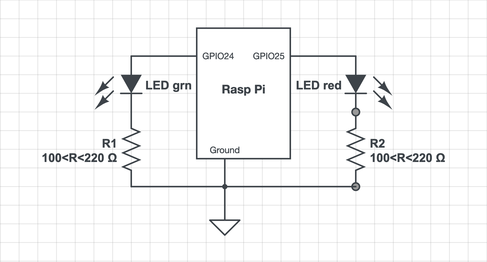

## Testing 'libgpiod ver 2.1' on a *bullseye* system

Jungle drums say that the long-deprecated `sysfs` access to GPIO is definitely ending soon. The drums also say that the "character-based interface" (??) aka `libgpiod` is [***the only game in town***](https://idioms.thefreedictionary.com/the+only+game+in+town) for interfacing with GPIO once the ver 6.6 kernel is released. `bookworm` is the current distribution, but as is typical some are *holding out* - sticking with their `bullseye` systems (aka old-stable) - until most of the kinks are worked out of `bookworm`. I am one of the [*hold-outs*](https://idioms.thefreedictionary.com/holdout).  

### Limits of 'libgpiod': 

In the research for this recipe, two (2) limits or qualifications on `libgpiod` usage have been found:

1. `libgpiod` is not intended for use in specific or specialized usage of GPIO pins

	For example, `libgpiod` is not designed or intended to support (for example) an **I2C** interface, or an **SPI** interface. These specialized/specific interfaces are generally realized in custom drivers, or in the hardware itself, and "pinned out" to GPIO pins. Refer to kernel documentation for [I2C](https://docs.kernel.org/i2c/index.html#), [PWM](https://docs.kernel.org/driver-api/pwm.html), [1-wire](https://docs.kernel.org/w1/w1-generic.html), [SPI](https://docs.kernel.org/spi/spidev.html), etc. for these specific interfaces. This "limitation" of `libgpiod` will be obvious to some, but not-so-obvious to others; e.g. those that started out using a GPIO library such as [WiringPi](https://github.com/WiringPi/WiringPi). 

1. `libgpiod` is not intended for use in ***"production systems"*** 

	This one was a bit of a surprise; learned from reading [this passage](https://www.kernel.org/doc/html/latest/driver-api/gpio/using-gpio.html) which is part of the [Linux Kernel documentation](https://www.kernel.org/doc/html/latest/index.html):  

	>Do not under any circumstances abuse the GPIO userspace ABI to cut corners in any product development projects. If you use it for prototyping, then do not productify the prototype: rewrite it using proper kernel drivers. Do not under any circumstances deploy any uniform products using GPIO from userspace.

	I would characterize this limitation as a ***recommendations**, but as it comes from the Linux Kernel development *organization/team (?)*, deserves our consideration. 

### Popular opinion of 'libgpiod':

Some [reviews of `libgpiod`](https://raspberrypi.stackexchange.com/a/136484/83790) have been quite negative. I tried it myself back in 1Q 2022, and found it *confusing*.  But those were *early days*. Approximately two years of `libgpiod` development have taken place since then, and a **hard deadline** is just around the corner.  It is said that the release of Linux 6.6 marks the end of the old `sysfs` interface (i.e. it will no longer work). Surely things have improved?

An early criticism of libgpiod was its lack of persistence; i.e. switch a GPIO line to HIGH (e.g. to drive an LED), and it **appeared** that nothing happened. The `man gpioset` document explained it like this: 

>Note:  the  state  of a GPIO line controlled over the character device reverts to default when the last process referencing the file descriptor representing the device file exits.  This means that it's wrong to run gpioset, have it exit and expect the line to continue being driven high or low. It may happen if given pin is floating but it must be interpreted as undefined behavior. 

Apparently what is meant by this *indistinct* explanation is that `libgpiod` is designed to leave the persistence issue up to the platform-dependent GPIO driver. Apparently this took some time to get resolved due to insufficient communication between the kernel-based libgpiod team and the Raspberry Pi-based driver team. It was eventually addressed in 1Q 2023 by the RPi team in a [change to their `pinctrl` code](https://github.com/raspberrypi/linux/commit/022689f0973d87956b2e5e8aaa0c29803cdb2a71).  

Another issue that has dogged libgpiod is the fact that in 2024, the Debian/RPi current ('bookworm') version of the library is nearly 3 years old. This is likely a case of unfortunate timing as the `libgpiod ver 2` release just missed the cutoff for 'bookworm'. That's all I can say - I'm not familiar with Debian/RPi policies re upgrades. 

## A few simple tests on libgpiod ver 2.1

### Step1: Getting the latest version of 'libgpiod' on `bullseye`:

As it turns out, the current version of `libgpiod` on `bookworm` is **ver 1.6.3**, and the current version of `libgpiod` on `bullseye` is **ver 1.6.2**. However, the [Linux kernel `git` repository](https://git.kernel.org/pub/scm/libs/libgpiod/libgpiod.git/?h=v2.1.x) has **ver 2.1**. We don't know when (or if) the RPi organization will release ver 2.1 for RPi OS, but *given the depth of changes in ver 2.1* it seems that any worthwhile testing should be done against the latest version (**ver 2.1**). 

I've [built the ver 2.1 `libgpiod` - and documented the steps I followed - in this recipe](https://github.com/seamusdemora/PiFormulae/blob/master/libgpiod-ver2.1-build.md). **N.B.:** I am **not** a developer, so I'd appreciate hearing from anyone with better ideas or shortcuts for this recipe. Otherwise, you can follow my *build recipe* if you want to build this yourself, and run your own tests. 

One other note: The ver 2.1 libgpiod tarball contains a lengthy script for testing the results of the build; it's located at `~/libgpiod-2.1/tools/gpio-tools-test.bash`. I did not run this test b/c I couldn't figure out exactly ***how*** to run it! 

### Step 2: Simple 'libgpiod' testing using an LED:

It should be said first that the testing here is not on `libgpiod` *per se*, but on the "tools" included in the distribution. These tools were written by the `libgpiod` dev team, and In that sense **the "tools" are used here as proxies for `libgpiod ver 2.1` testing :** 

<html>
<head>
</head>
<body>
<table class="minimalistBlack">
  
<tr>
  <th></th>
  <th>tools</th>
  <th></th>
</tr> 
  
<tbody>
  
<tr>
  <td width="30%"> <b>gpioget</b> </td>
  <td width="30%"> <b>gpiomon</b> </td>
  <td width="30%"> <b>gpioinfo</b> </td>
</tr>
<tr>
  <td> <b>gpioset</b> </td>
  <td> <b>gpionotify</b> </td>
  <td> <b>gpiodetect</b> </td>
</tr>
  
</tbody> 
  
</table>
  
</body>

| tool       |            |
| ---------- | ---------- |
| gpioget    | gpiomon    |
| gpioset    | gpionotify |
| gpioinfo   | gpiodetect |

The circuit used for this part of the test is shown below, and as you can see it is *simple*. R1 & R2 are sized to current limit to something in the range of 10mA when the GPIO line is HIGH/1 (3V3), but bright enough to see clearly. 





Let's begin testing. We'll do this testing on an RPi 3A+ using the command line tools (`gpiodetect`, `gpioget`, `gpioinfo`, `gpiomon`, `gpionotify`, `gpioset`) from the terminal/`pty`. 

#### 2.1 Run `gpiodetect` and `gpioinfo` to learn how our *resources* are identified:

```bash
$ gpiodetect --version
gpiodetect (libgpiod) v2.1
Copyright (C) 2017-2023 Bartosz Golaszewski
License: GPL-2.0-or-later
This is free software: you are free to change and redistribute it.
There is NO WARRANTY, to the extent permitted by law.
$ gpiodetect
gpiochip0 [pinctrl-bcm2835] (54 lines)
gpiochip1 [raspberrypi-exp-gpio] (8 lines)

$ gpioinfo --version
gpioinfo (libgpiod) v2.1
# ... blah, blah, blah

$ gpioinfo
gpiochip0 - 54 lines:
	line   0:	"ID_SDA"        	input
	line   1:	"ID_SCL"        	input
	line   2:	"SDA1"          	input
	line   3:	"SCL1"          	input
	line   4:	"GPIO_GCLK"     	input
	line   5:	"GPIO5"         	input
	line   6:	"GPIO6"         	input
	line   7:	"SPI_CE1_N"     	input
	line   8:	"SPI_CE0_N"     	input
	line   9:	"SPI_MISO"      	input
	line  10:	"SPI_MOSI"      	input
	line  11:	"SPI_SCLK"      	input
	line  12:	"GPIO12"        	input
	line  13:	"GPIO13"        	input
	line  14:	"TXD0"          	input
	line  15:	"RXD0"          	input
	line  16:	"GPIO16"        	input
	line  17:	"GPIO17"        	input
	line  18:	"GPIO18"        	input
	line  19:	"GPIO19"        	input
	line  20:	"GPIO20"        	input
	line  21:	"GPIO21"        	input
	line  22:	"GPIO22"        	input
	line  23:	"GPIO23"        	input
	line  24:	"GPIO24"        	input
	line  25:	"GPIO25"        	input
	line  26:	"GPIO26"        	input
	line  27:	"GPIO27"        	input
	line  28:	"SDA0"          	input active-low consumer="hpd"
	line  29:	"SCL0"          	output consumer="ACT"
	line  30:	"NC"            	input
	line  31:	"LAN_RUN"       	input
	line  32:	"CAM_GPIO1"     	input
	line  33:	"NC"            	input
	line  34:	"NC"            	input
	line  35:	"PWR_LOW_N"     	input
	line  36:	"NC"            	input
	line  37:	"NC"            	input
	line  38:	"USB_LIMIT"     	input
	line  39:	"NC"            	input
	line  40:	"PWM0_OUT"      	input
	line  41:	"CAM_GPIO0"     	input
	line  42:	"NC"            	input
	line  43:	"NC"            	input
	line  44:	"ETH_CLK"       	input
	line  45:	"PWM1_OUT"      	input
	line  46:	"HDMI_HPD_N"    	input
	line  47:	"STATUS_LED"    	output
	line  48:	"SD_CLK_R"      	input
	line  49:	"SD_CMD_R"      	input
	line  50:	"SD_DATA0_R"    	input
	line  51:	"SD_DATA1_R"    	input
	line  52:	"SD_DATA2_R"    	input
	line  53:	"SD_DATA3_R"    	input
gpiochip1 - 8 lines:
	line   0:	"BT_ON"         	output
	line   1:	"WL_ON"         	output
	line   2:	"PWR_LED_R"     	output consumer="PWR"
	line   3:	"LAN_RUN"       	input
	line   4:	"NC"            	input
	line   5:	"CAM_GPIO0"     	output consumer="cam1_regulator"
	line   6:	"CAM_GPIO1"     	output
	line   7:	"NC"            	input
```

We can see that our chosen GPIO lines `GPIO24, GPIO25` (from the schematic above) is identified as follows:

```
line  24:	"GPIO24"     input
line  25:	"GPIO25"     input
```


#### 2.2 Let's try `gpioget` on `GPIO24`: 

```bash
$ gpioget 24
gpioget: cannot find line '24'
$ gpioget 0 24
gpioget: cannot find line '0'
gpioget: cannot find line '24'
$ gpioget gpiochip0 24
gpioget: cannot find line 'gpiochip0'
gpioget: cannot find line '24'
$ gpioget -c 0 24
"24"=inactive        # BINGO!! 
$ gpioget GPIO24
"GPIO24"=inactive    # BINGO!!
```

Interesting... It seems the `gpioget` man page is *misleading*.  The "SYNOPSIS" in the `man` page is: 

```
gpioget [OPTIONS] <line>...
```

But `<line>` isn't well-defined (at least not in the `man`).  The`man` says: 

> Lines are specified by name, or optionally by offset if the chip option is provided

That only helps if you happen to know that the **name** is `GPIO24`. You might guess that from the output of `gpioinfo`, but then again you might not.  At any rate, we now know that `GPIO24` is a **line name**, and if you wish to refer to it as `24`, the `-c` option is required to specify the **chip number** - which may be `0`, or `gpiochip0` or `/dev/gpiochip0`.  

Another thing that strikes me as *oddly dysfunctional* about `gpioget` is that it is not *strictly* a *get*; i.e. it is **not** a *read-only* function; it actually sometimes behaves as if it were `gpioset`, and *changes the state* of the GPIO line under some circumstances. We'll see that in a moment.  

#### 2.3 Let's try `gpioset`, and some of its options/features on `GPIO24` & `GPIO25`

```bash
$ gpioset GPIO24=1 GPIO25=1
# both LEDs illuminated, but bash prompt does not return...???
# ^C restores the bash prompt, & LEDs remain illuminated (persistence - hooray!)
^C
$ gpioset GPIO24=0 
# the 24 LED Green is extinguished, and as before, the bash prompt does not return
^C
$ gpioset GPIO24=1    # LED illuminated, ^C to return prompt
^C 
# now try gpioget on GPIO24:
$ gpioget GPIO24      # LED Extinguishes; i.e. gpioget changed state of GPIO24
"GPIO24"=inactive     # Here, we see gpioget acting more like "gpioset",
                      # which strikes me as unconventional, but ... ???
```

##### 2.3.1 Try the `-z` / `daemonize` option of `gpioset`:

```bash
$ gpioset -z GPIO24=1 # The -z (-daemonize) option illuminates LED (persistently), and bash prompt returns
$ gpioset GPIO24=0
gpioset: unable to request lines on chip '/dev/gpiochip0': Device or resource busy 
$ gpioget GPIO24
gpioget: unable to request lines: Device or resource busy
# Hmm... seems a "ps hunt and kill drill" is required
$ ps -aux | grep 'gpioset'
pi        7386  0.0  0.0   2760   148 ?        Ss   08:50   0:00 gpioset -z GPIO24 1
$ kill 7386           # LED remains illuminated. :)
$ gpioget GPIO24
"GPIO24"=inactive     # LED extinguishes
# Let's try this:
$ gpioset GPIO24=1 &  # put job in background 
[1] 7439              # get the PID for "free"
$ $ gpioget GPIO24
gpioget: unable to request lines: Device or resource busy 
$ kill 7439           # no 'ps -aux | grep' required
$ gpioget GPIO24
"GPIO24"=inactive
[1]+  Terminated              gpioset GPIO24=1 
# Wonder what the '-z' option does that background doesn't?
```

##### 2.3.2 Try other options appropriate for LEDs:

```bash
# The '-t' / '--toggle' option is nice for a repetitive sequence
#
$ gpioset -t 100ms,500ms,200ms,500ms,300ms,500ms,400ms,500ms,500ms,500ms GPIO24=1 &
[1] 7471              # background (&) enables return prompt
$ gpioget GPIO24
gpioget: unable to request lines: Device or resource busy
$ kill 7471
$ gpioget GPIO24
"GPIO24"=inactive
[1]+  Terminated              gpioset -t        # gpioset -t for "toggle" 100ms,500ms,200ms,500ms,300ms,500ms,400ms,500ms,500ms,500ms GPIO24=1 


# moving on to the "--hold-period" option...
# the '-p' option is a mystery to me... I cannot explain it 
#
$ gpioset -p 10s GPIO24=1
^C                    # waited 20 secs, LED remained illuminated
$ gpioget GPIO24
"GPIO24"=inactive     # LED extinguished 
# man says "the minimum time period to hold lines at the requested values"; yes, it says 'minimum' 
$ gpioset -p 10s GPIO24=1
^C                    # I did not wait,
$ gpioget GPIO24      # I issued commands immediately (< 2 secs)
"GPIO24"=inactive     # LED extinguished as soon as 'gpioget' issued  ??? 

# moving on to the "--interactive" option
# note: this option only exists if the compiler flag is set (see building resipe)
# the '-i' / '--interactive' option is interesting
#
$ $ gpioset -i GPIO24=1    # LED illuminated
gpioset> toggle GPIO24     # LED extinguished
gpioset> toggle GPIO24     # LED illuminated
gpioset> get GPIO24
"GPIO24"=active
gpioset> set GPIO24=0      # LED extinguished
gpioset> set GPIO24=1      # LED illuminated
gpioset> sleep 30s         # 'gpioset>' prompt disappears for 30 sec, LED illuminated
gpioset> get GPIO24
"GPIO24"=active            # note: gpioget did not change state of GPIO24 in this case
gpioset> set GPIO24=0      # LED extinguished
gpioset> get GPIO24
"GPIO24"=inactive
gpioset> exit
# Wonder why the entire 'gpioset' app isn't run this way??

```


### 2.4 Summary - 'Step 2 Simple 'libgpiod' testing using an LED' :

As mentioned above, the testing in this step did not actually test `libgpiod ver 2.1` - it tested four (4) of the "tools" (command line apps) written by the authors of libgpiod as *proxie*s for libgpiod.  The ''tools'' tested above are: 

* gpiodetect
* gpioinfo
* gpioget
* gpioset

`gpiodetect` and `gpiodetect` seemed entirely serviceable (to me). The only suggestion I might make is to add a header line to `gpioinfo` to emphasize which column contains the line **name** and which contains the **offset**. 

`gpioget` - as mentioned in a couple of places in the test results still strikes me as [*out of kilter*](https://www.merriam-webster.com/dictionary/out%20of%20kilter) due to its usage in changing the state of a GPIO line. That behavior just doesn't seem copacetic to me, but YMMV. 

`gpioset` - I don't understand the need to ***not return*** the command line prompt following execution of (for example) `gpioset GPIO24=1`. If the `libgpiod ver 2.1` designers were "happy" to delegate *line persistence* to the GPIO driver, then why not do the same in this case? Similarly, I do not understand the `-z  --daemonize` option as it seems to have the same effect as running `gpioset` in the background. And **if** one adds a `--daemonize` option, it seems to me they should also add an option to kill the daemon without having to resort to `ps` and `kill`. 

I was unable to follow the point of the `-p  --hold-period` option; did not grok this option. 

I felt the `-i  --interactive` and the `-t  --toggle` options were both useful. In particular the `--interactive` option suggests interesting usages in scripting applications when `gpioset` is running in the background/`daemonized`. 

#### Comments and criticisms notwithstanding, I found the `libgpiod ver 2.1` tools usable, and comparable to (e.g.) the WiringPi `gpio` tools. 

---


### Step 3: Simple 'libgpiod' testing using a toggle switch:


### ... more to follow

