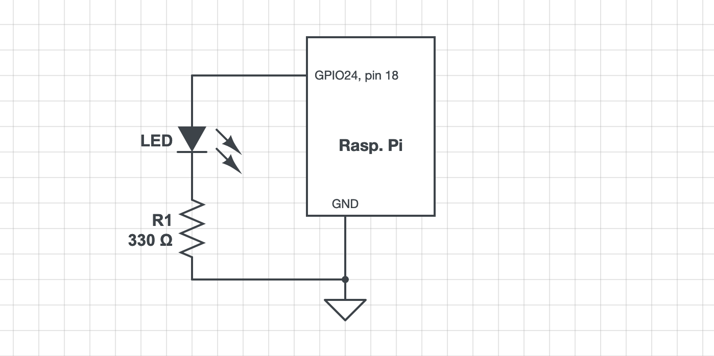

## Testing 'libgpiod ver 2.1' on a *bullseye* system

Jungle drums say that the long-deprecated `sysfs` access to GPIO is definitely ending soon. The drums also say that the "character-based interface" (??) aka `libgpiod` is [***the only game in town***](https://idioms.thefreedictionary.com/the+only+game+in+town) for interfacing with GPIO once the ver 6.6 kernel is released. `bookworm` is the current distribution, but as is typical some are *holding out* - sticking with their `bullseye` systems (aka old-stable) - until most of the kinks are worked out of `bookworm`. I am one of the [*hold-outs*](https://idioms.thefreedictionary.com/holdout).  

Some [reviews of `libgpiod`](https://raspberrypi.stackexchange.com/a/136484/83790) have been quite negative. I tried it myself back in 1Q 2022, and found it *quite confusing*.  But those were *early days*; after nearly two years of development, and a hard deadline just around the corner (Linux 6.6) surely things have improved. ***Let's run a few simple tests to find out.*** 

### Step1: Getting the latest version of 'libgpiod' on `bullseye`:

As it turns out, the current version of `libgpiod` on `bookworm` is **ver 1.6.3**, and the current version of `libgpiod` on `bullseye` is **ver 1.6.2**. However, the [Linux kernel `git` repository](https://git.kernel.org/pub/scm/libs/libgpiod/libgpiod.git/?h=v2.1.x) has **ver 2.1**. We don't know when the RPi organization will release ver 2.1 for RPi OS, but *given the depth of changes in ver 2.1* it seems to me that any worthwhile testing should be done against the latest version (**ver 2.1**). Ugh... that means some messy (for me) building the **ver 2.1** library & tools from source. 

I've tried [building the ver 2.1 `libgpiod` - and documented the steps I followed - in this recipe](https://github.com/seamusdemora/PiFormulae/blob/master/libgpiod-ver2.1-build.md). **N.B.:** I am **not** a developer, so I'd appreciate hearing from anyone with better ideas or shortcuts for this recipe. Otherwise, you can follow my *build recipe* if you want to try this yourself, and run your own tests. 

One other note: The ver 2.1 libgpiod tarball contains a lengthy script for testing the results of the build; it's located at `~/libgpiod-2.1/tools/gpio-tools-test.bash`. I did not run this test b/c I couldn't figure out exactly how to run it! 

### Step 2: A simple 'libgpiod' test using an LED:

The circuit used for this part of the test is shown below, and as you can see it is *quite simple*. R1 is sized to current limit to something substantially less than 10mA when GPIO24 is HIGH/1 (3V3), but bright enough to see clearly. 





Let's begin testing. We'll do all of our tests in this phase using the command line tools (`gpiodetect`, `gpioget`, `gpioinfo`, `gpiomon`, `gpionotify`, `gpioset`) from the terminal/`pty`. 

2.1 Run `gpiodetect` and `gpioinfo` to learn how our *resources* are identified:

```bash
$ gpiodetect --version
gpiodetect (libgpiod) v2.1
Copyright (C) 2017-2023 Bartosz Golaszewski
License: GPL-2.0-or-later
This is free software: you are free to change and redistribute it.
There is NO WARRANTY, to the extent permitted by law.
$ gpiodetect
gpiochip0 [pinctrl-bcm2835] (54 lines)
gpiochip1 [raspberrypi-exp-gpio] (8 lines)

$ gpioinfo --version
gpioinfo (libgpiod) v2.1
# ... blah, blah, blah

$ gpioinfo
gpiochip0 - 54 lines:
	line   0:	"ID_SDA"        	input
	line   1:	"ID_SCL"        	input
	line   2:	"SDA1"          	input
	line   3:	"SCL1"          	input
	line   4:	"GPIO_GCLK"     	input
	line   5:	"GPIO5"         	input
	line   6:	"GPIO6"         	input
	line   7:	"SPI_CE1_N"     	input
	line   8:	"SPI_CE0_N"     	input
	line   9:	"SPI_MISO"      	input
	line  10:	"SPI_MOSI"      	input
	line  11:	"SPI_SCLK"      	input
	line  12:	"GPIO12"        	input
	line  13:	"GPIO13"        	input
	line  14:	"TXD0"          	input
	line  15:	"RXD0"          	input
	line  16:	"GPIO16"        	input
	line  17:	"GPIO17"        	input
	line  18:	"GPIO18"        	input
	line  19:	"GPIO19"        	input
	line  20:	"GPIO20"        	input
	line  21:	"GPIO21"        	input
	line  22:	"GPIO22"        	input
	line  23:	"GPIO23"        	input
	line  24:	"GPIO24"        	input
	line  25:	"GPIO25"        	input
	line  26:	"GPIO26"        	input
	line  27:	"GPIO27"        	input
	line  28:	"SDA0"          	input active-low consumer="hpd"
	line  29:	"SCL0"          	output consumer="ACT"
	line  30:	"NC"            	input
	line  31:	"LAN_RUN"       	input
	line  32:	"CAM_GPIO1"     	input
	line  33:	"NC"            	input
	line  34:	"NC"            	input
	line  35:	"PWR_LOW_N"     	input
	line  36:	"NC"            	input
	line  37:	"NC"            	input
	line  38:	"USB_LIMIT"     	input
	line  39:	"NC"            	input
	line  40:	"PWM0_OUT"      	input
	line  41:	"CAM_GPIO0"     	input
	line  42:	"NC"            	input
	line  43:	"NC"            	input
	line  44:	"ETH_CLK"       	input
	line  45:	"PWM1_OUT"      	input
	line  46:	"HDMI_HPD_N"    	input
	line  47:	"STATUS_LED"    	output
	line  48:	"SD_CLK_R"      	input
	line  49:	"SD_CMD_R"      	input
	line  50:	"SD_DATA0_R"    	input
	line  51:	"SD_DATA1_R"    	input
	line  52:	"SD_DATA2_R"    	input
	line  53:	"SD_DATA3_R"    	input
gpiochip1 - 8 lines:
	line   0:	"BT_ON"         	output
	line   1:	"WL_ON"         	output
	line   2:	"PWR_LED_R"     	output consumer="PWR"
	line   3:	"LAN_RUN"       	input
	line   4:	"NC"            	input
	line   5:	"CAM_GPIO0"     	output consumer="cam1_regulator"
	line   6:	"CAM_GPIO1"     	output
	line   7:	"NC"            	input
```

We can see that our chosen GPIO line `GPIO24` is identified as follows:

```
line  24:	"GPIO24"        	input
```


2.2 Let's try a `gpioget` on `GPIO24`: 

```bash
$gpioget --version
gpioget (libgpiod) v2.1
# ... blah, blah, blah
$ gpioget 24
gpioget: cannot find line '24'
$ gpioget 0 24
gpioget: cannot find line '0'
gpioget: cannot find line '24'
$ gpioget gpiochip0 24
gpioget: cannot find line 'gpiochip0'
gpioget: cannot find line '24'
$ gpioget -c 0 24
"24"=inactive        # BINGO!! 
```

Interesting... It seems the `gpioget` man page is incorrect (it is certainly *misleading*); the `-c` "option" must be used, and it must specify the gpio chip # !! 


2.3 Let's try `gpioset` on `GPIO24`

```bash
$ gpioset --version
gpioset (libgpiod) v2.1
# ... blah, blah, blah
$ gpioset -c 0 24=1
# the LED illuminates, but the bash prompt does not return...???
# ^C restores the bash prompt, and the LED remains illuminated
^C
$ gpioset -c 0 24=0 
# the LED extinguishes, and as before the bash prompt does not return
^C
$ gpioset -c 0 -z 24=1 # LED illuminates (persistently), and bash prompt returns
$ gpioset -c 0 24=0
gpioset: unable to request lines on chip '/dev/gpiochip0': Device or resource busy 
$ gpioget -c 0 24
gpioget: unable to request lines: Device or resource busy
# Hmm... let's see what we can do about that:
$ ps -aux | grep 'gpioset'
pi        2192  0.0  0.0   1988    84 ?        Ss   07:14   0:00 gpioset -c 0 -z 24 1 
$ kill 2192
# LED remains illuminated. :)
$ gpioget -c 0 24
"24"=inactive
# LED extinguishes immediately :) 
```

This feels like ***too much*** persistence :) LOL...  The `-z` (`--daemonize`) option *felt* about right, but it seems awkward to have to hunt & kill a process to release GPIO24. In fact - it seems really strange. 

**One possible explanation:** [This change](https://github.com/raspberrypi/linux/commit/022689f0973d87956b2e5e8aaa0c29803cdb2a71) was committed in March, '23 for the `pinctrl` driver in kernel ver 6.1, with the following explanation: 

>Allowing GPIO state to persist allows the use of gpioset to control
>GPIO levels without having to use the --mode=wait feature.

This commit would have been made while ver 1.6 of `libgpiod` was current (and indeed it *remains* current!) as the `--mode` option does not exist in ver 2.1. So - it seems these changes to the `pinctrl` driver should be rescinded, as the `-z` option in `gpioset ver 2.1` takes care of the persistence issue. BUT that still doesn't (may not) account for the need to do a `ps-hunt-and-kill` operation to force `gpioset` to relinquish control of a GPIO line. 


### ... more to follow


