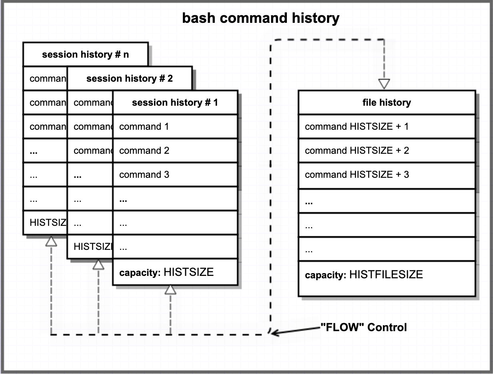

# Useful shell tricks:

### Table of contents

* [How do I tell my system to tell me about my system: OS, Kernel, Hardware, etc](#tell-me-about-my-system) 
* [Resolve Permission Issues When Using Redirection](#permission-Issues-when-using-redirection) 
* [Reload `bash` or `zsh` `.profile` without restarting shell:](#refresh-shell-configuration-without-restarting)
* [Clear the contents of a file without deleting the file:](#clear-the-contents-of-a-file-without-deleting-the-file) 
* [List all directories - not files, just directories:](#list-all-directories---not-files-just-directories) 
* [Pitfalls of parsing `ls`](#pitfalls-of-parsing-ls) 
* [Sequential shell command execution:](#sequential-shell-command-execution)
* [Get a date-time stamp for a log:](#get-a-date-time-stamp-for-a-log)
* [String manipulation with bash:](#string-manipulation-with-bash)
* [Testing things in bash:](#testing-things-in-bash)
* [The Shell Parameters of bash](#the-shell-parameters-of-bash) 
* [Assign shell command output to a variable in `bash`](#assign-shell-command-output-to-a-variable-in-bash); a.k.a. *command substitution* 
* [Know the Difference Between `NULL` and an Empty String](#the-difference-between-null-and-empty-strings) 
* [How do I see my *environment*?](#how-do-i-see-my-environment) 
* [Shell variables: UPPER case, lower case, or SoMeThInG_eLsE...?](#shell-variables-what-is-the-best-naming-convention) 
* [What do file and directory permissions mean?](#what-do-file-and-directory-permissions-mean) 
* [Using `which` to find commands](#using-which-to-find-commands) - *accurately!* 
* [Using your shell command history](#using-your-shell-command-history) 
* [Searching command history](#searching-command-history) 
* [Access compressed log files easily](#access-compressed-log-files-easily) 
* [Filename expansion; a.k.a. "globbing"](#filename-expansion-aka-globbing) 
* [Using the default editor `nano` effectively](#using-the-default-editor-nano-effectively) 
* [Some Options with `grep`](#some-options-with-grep) 
* [Filtering `grep` processes from `grep` output](#filtering-grep-processes-from-grep-output) 
* [Finding pattern matches: `grep` or `awk`?](#finding-pattern-matches-grep-or-awk) 
* [What version of `awk` is available on my Raspberry Pi?](#what-version-of-awk-is-available-on-my-raspberry-pi) 
* [Find what you need in that huge `man` page](#find-what-you-need-in-that-huge-man-page) 
* [Where did I put that file? - it's *somewhere* in my system](#that-file-is-somewhere-in-my-system)
* [A useful tool for GPIO hackers: `raspi-gpio`](#a-useful-tool-for-gpio-hackers-raspi-gpio) 
* [`raspi-config` from the command line?](#raspi-config-from-the-command-line)
* [Background, nohup, infinite loops, daemons](#background-nohup-infinite-loops-daemons)
* [Bluetooth](#bluetooth) 
* [Change the modification date/time of a file](#change-the-modification-date-of-a-file)
* [How to deal with *"Unix time"* when using `date`](#using-date-to-deal-with-unix-time) 
* [Process management using <kbd>ctrl</kbd>+<kbd>z</kbd>, `fg`, `bg` & `jobs`](#process-management-jobs-fg-bg-and-ctrl-z) 
* [Download a file from GitHub](#download-a-file-from-github) 
* [Verify a file system is mounted with `findmnt` - *before trying to use it*!](#verify-file-system-is-mounted) 
* [How to "roll back" an `apt upgrade`](#how-to-roll-back-an-apt-upgrade) 
* [REFERENCES:](#references) 


[**⋀**](#table-of-contents)
## Tell me about my system:

### Hardware model: 

Stored in `/proc/cpu` for single-CPU RPi:

```
$ cat /proc/cpuinfo 
processor	: 0
model name	: ARMv6-compatible processor rev 7 (v6l)
BogoMIPS	: 697.95
Features	: half thumb fastmult vfp edsp java tls
CPU implementer	: 0x41
CPU architecture: 7
CPU variant	: 0x0
CPU part	: 0xb76
CPU revision	: 7

Hardware	: BCM2835
Revision	: 0010
Serial		: 000000003e3ab978
Model		: Raspberry Pi Model B Plus Rev 1.2
```

#### OR, on a 4B: 

```
$ cat /proc/cpuinfo 
processor	: 0
model name	: ARMv7 Processor rev 3 (v7l)
BogoMIPS	: 108.00
Features	: half thumb fastmult vfp edsp neon vfpv3 tls vfpv4 idiva idivt vfpd32 lpae evtstrm crc32
CPU implementer	: 0x41
CPU architecture: 7
CPU variant	: 0x0
CPU part	: 0xd08
CPU revision	: 3

... repeat for processor	: 1, processor	: 2, processor	: 3

Hardware	: BCM2711
Revision	: b03111
Serial		: 100000006cce8fc1
Model		: Raspberry Pi 4 Model B Rev 1.1
```

#### OR, on a 5B:

```
$cat /proc/cpuinfo
processor       : 0
BogoMIPS        : 108.00
Features        : fp asimd evtstrm aes pmull sha1 sha2 crc32 atomics fphp asimdhp cpuid asimdrdm lrcpc dcpop asimddp
CPU implementer : 0x41
CPU architecture: 8
CPU variant     : 0x4
CPU part        : 0xd0b
CPU revision    : 1

... repeat for processors 1, 2 & 3

Hardware        : BCM2835
Revision        : c04170
Serial          : 6b71acd964ee2481
Model           : Raspberry Pi 5 Model B Rev 1.0
```

#### OR, an abbreviated report

```
$ cat /proc/cpuinfo | awk '/Model/' 
Model		: Raspberry Pi 4 Model B Rev 1.1
```

### Kernel version: 

```bash
$ man uname        # see options & other usage info

# RPi B+ (buster)
$ uname -a
Linux raspberrypi1bp 5.10.63+ #1496 Wed Dec 1 15:57:05 GMT 2021 armv6l GNU/Linux

# RPi 3B+ (bullseye)
$ uname -a
Linux raspberrypi3b 5.10.92-v7+ #1514 SMP Mon Jan 17 17:36:39 GMT 2022 armv7l GNU/Linux

# RPi 4B: (buster)
$ uname -a
Linux raspberrypi4b 5.10.63-v7l+ #1496 SMP Wed Dec 1 15:58:56 GMT 2021 armv7l GNU/Linux
```

### OS version:

This works on RPi OS, but may not work on distros that are not Debian derivates. But if it works, it's useful: 

```bash
$ man lsb_release   # print distribution-specific info; see manual for options, usage

$ lsb_release -a
No LSB modules are available. # note that lsb itself may not be installed by default
Distributor ID:	Raspbian
Description:	Raspbian GNU/Linux 11 (bullseye)
Release:	11
Codename:	bullseye
```

### hostnamectl:

```bash
$ hostnamectl     # p/o systemd, see man hostnamectl for options & usage info
   Static hostname: raspberrypi3b
         Icon name: computer
        Machine ID: be49a9402c954d689ba79ffd5f71ad67
           Boot ID: 986ab27386444b52bddae1316c5e1ee1
  Operating System: Raspbian GNU/Linux 11 (bullseye)
            Kernel: Linux 5.10.92-v7+
      Architecture: arm
```

### MAC address: 

```bash
ethtool --show-permaddr eth0    # for the Ethernet adapter 
ethtool --show-permaddr wlan0   # for the WiFi adapter 
```

### `vcgencmd` tool

The `vcgencmd` tool can report numerous details from the VideoCore GPU. See `man vcgencmd`, and the ["official documentation"](https://www.raspberrypi.com/documentation/computers/os.html#vcgencmd) for details. For a list of all available commands under `vcgencmd`, do `vcgencmd commands`:
   * set_logging,
   * bootloader_config,
   * bootloader_version,
   * cache_flush,
   * codec_enabled,
   * get_mem,
   * get_rsts,
   * measure_clock,
   * measure_temp,
   * measure_volts,
   * get_hvs_asserts,
   * get_config,
   * get_throttled,
   * pmicrd,
   * pmicwr,
   * read_ring_osc,
   * version,
   * readmr,
   * otp_dump (which has its own special [section in the docs](https://www.raspberrypi.com/documentation/computers/raspberry-pi.html#otp-register-and-bit-definitions)),
   * pmic_read_adc,
   * power_monitor

### Bluetooth info (maybe better off not knowing? see [Bluetooth](#Bluetooth))

```bash
$ hciconfig -a
hci0:	Type: Primary  Bus: UART
	BD Address: D8:3A:DD:A7:B2:00  ACL MTU: 1021:8  SCO MTU: 64:1
	UP RUNNING
	RX bytes:5014 acl:0 sco:0 events:438 errors:0
	TX bytes:66795 acl:0 sco:0 commands:438 errors:0
	Features: 0xbf 0xfe 0xcf 0xfe 0xdb 0xff 0x7b 0x87
	Packet type: DM1 DM3 DM5 DH1 DH3 DH5 HV1 HV2 HV3
	Link policy: RSWITCH SNIFF
	Link mode: PERIPHERAL ACCEPT
	Name: 'raspberrypi5'
	Class: 0x000000
	Service Classes: Unspecified
	Device Class: Miscellaneous,
	HCI Version: 5.0 (0x9)  Revision: 0x17e
	LMP Version: 5.0 (0x9)  Subversion: 0x6119
	Manufacturer: Cypress Semiconductor (305)
```

---
[**⋀**](#table-of-contents)
## Permission Issues When Using Redirection

The `redirection` operators (**`>`** and **`>>`**) are incredibly useful tools in the shell. But, when they are used to redirect output from a command to a file requiring `root` privileges, they can leave a user scratching his head. Consider this example: 

   ```bash
   $ sudo printf "Houston, we have a problem!" > /etc/issue.net
   -bash: /etc/issue.net: Permission denied
   ```

Most who encounter this for the first time are baffled... "WTF?! - why does this not work? I can open the file with an editor - I can edit and save... WTF?!"

The problem is obvious once it's explained, but the solutions may vary. The **problem** in the example above is that there are actually two commands being used: `printf` whis is propelled by `sudo`, and the redirect **`>`** which is **not** propelled by `sudo`.  And of course you don't actually need `sudo` to execute a `printf` command, but you do need `sudo` to write to `/etc/issue.net`. What to do? None of the answers are particularly *elegant* IMHO, but they do work: 

1. If you put the example command in a shell script, and run the script with `sudo`, you won't a problem. This due to the fact that every command in the script - including redirects - will run with `root` privileges. Another way to consider the issue is this: It's only an issue when using the command sequence from the shell prompt. Feel better? 

2. Similar to #1, you can spawn a new *sub-shell* using the `-c`option to process a command (ref `man sh`). This is best explained as follows: 

   ```bash
   $ sudo sh -c 'printf "Houston, we have a problem!" > /etc/issue.net'
   ```

   You will find this succeeds when executed from a shell prompt. 

3. The final option (for this recipe at least) is to use the `tee` command instead of the redirect: 

   ```bash
   $ printf "Houston, we have a problem!" | sudo tee /etc/issue.net
   # OR: If you don't want the output to print on your terminal: 
   $ printf "Houston, we have a problem!" | sudo tee /etc/issue.net > /dev/null
   ```

If you're interested, this [Q&A on SO](https://stackoverflow.com/questions/82256/how-do-i-use-sudo-to-redirect-output-to-a-location-i-dont-have-permission-to-wr) has much more on this subject. 
[**⋀**](#table-of-contents) 

## Refresh shell configuration without restarting:

There are two user-owned files that control many aspects of the `bash` shell's behavior - uh, *interactive shells, that is*: `~/.profile` & `~/.bashrc`. Likewise for `zsh`, the `~/.zprofile` & `~/.zshrc`. There will be occasions when changes to these files will need to be made in the current session - without exiting one shell session, and starting a new one. Examples of such changes are changes to the `PATH`, or addition of an `alias`. 


```zsh
$ source ~/.profile       # use this for bash 
$ source ~/.bashrc        #        "
% source ~/.zprofile      # use this for zsh 
% source ~/.zshrc         #        " 
# OR ALTERNATIVELY: 
$ . ~/.profile            # use for bash + see Notes below 
$ . ~/.bashrc             #        "
% . ~/.zprofile           # use for zsh + see Notes below 
% . ~/.zshrc              #        "
```

>> **Note 1:** The [dot operator](https://ss64.com/bash/source.html); `.` is a synonym for `source`. Also, it's POSIX-compliant (`source` is not).

>> **Note 2:** Additions and removals from `~/.bashrc` behave differently: If something is **removed** from `~/.bashrc`, this change will **not** take effect after *sourcing* `~/.bashrc` (i.e.  `. ~/.bashrc`).  
>
>> For example: Add a function to `~/.bashrc`: `function externalip () { curl http://ipecho.net/plain; echo; }`. Now *source* it with `. ~/.profile`. You should see that the function now works in this session. Now remove the function, and then *source* it again using `. ~/.profile`. The function is still available - only restarting (log out & in), or starting a new shell session will remove it. 
[**⋀**](#table-of-contents)
## Clear the contents of a file without deleting the file:

```bash
$ > somefile.xyz			# works in bash
# -OR-
% : > $LOGFILE				# works in zsh
# -OR-
$ truncate -s 0 test.txt		# any system w/ truncate
# -OR-
$ cp /dev/null somefile.xyz     	# any system
```
[**⋀**](#table-of-contents)
## List all directories - not files, just directories:

```bash
$ find . -type d   # list all dirs in pwd (.)
```

> > Note In this context the *'dot'* `.` means the `pwd` - not the [dot operator](https://ss64.com/bash/source.html) as in the [above example](#reload-bashs-profile-without-restarting-shell). 
[**⋀**](#table-of-contents)
## Pitfalls of parsing `ls`

In some cases, you can *get away with* parsing and/or filtering the output of `ls`, and in other cases you cannot. I've spent an inordinate amount of time trying to filter the output of `ls` to get only hidden files - or only hidden directories. `ls` seems very *squishy* and unreliable in some instances when trying to get a specific, filtered list... [ref Wooledge](http://mywiki.wooledge.org/ParsingLs). 

I try to keep discussion on the topics here *brief*, but don't always succeed. In a sincere effort to avoid verbosity here, I'll close with a few *bulleted* bits of guidance: 

* `find` is more reliable than `ls` for tailored lists of files & folders; learn to use it - esp. in scripting. 
* Much has been written ([e.g.](https://unix.stackexchange.com/questions/44754/listing-with-ls-and-regular-expression)) on using `bash` PATTERNs, and enabling various *extensions* through `shopt` to filter/parse `ls` output. AIUI, the "PATTERNs" are not *regular expressions*, but an [extended type of *file globbing*](https://www.linuxjournal.com/content/pattern-matching-bash). I've not found that reliably effective, but I've not put much time & effort into it. 
* `ls` has a *long form* (the `-l` option); the default being the *short form*. I generally favor the long form (***me*** - a *data junkie*?). To illustrate my *squishy* claim w.r.t. listing *only* hidden files, I've found these work: 
  * For the *short form*:  `ls -A | grep '^\.'`; Note the *caret* `^` operator; used to get the line beginning?
  * For the *short form*:  `ls -d1 -- \.*`; An example of *"glob patterns"* 
  * For the *long form*:  `ls -Al | grep " \."` ;   Note the *space* in the pattern; alternative: `\s` 
  [**⋀**](#table-of-contents)
## Sequential shell command execution:

Sometimes we want to execute a series of commands, but only if all previous commands execute successfully. In this case, we should use **`&&`** to join the commands in the sequence: 

```bash
cd /home/auser && cp /utilities/backup_home.sh ./ && chown auser ./backup_home.sh
```

At other times we want to execute a series of commands regardless of whether or not previous commands executed successfully. In that case, we should use **`;`** to join the commands in the sequence:

```bash
cp /home/pi/README /home/auser; rsync -av /home/auser /mnt/BackupDrv/auser_backup/
```
[**⋀**](#table-of-contents)
## Get a date-time stamp for a log:

It's often useful to insert a date-time stamp in a log file, inserted in a string, etc. Easily done w/ `date` using [*command substitution*](https://bash.cyberciti.biz/guide/Command_substitution): 

```bash
echo $(date) >> mydatalog.txt   # using `echo` inserts a newline after the date & time 
# log entry will be in this format: Tue Mar 24 04:28:31 CDT 2020 + newline
echo $(date -u)                 # `-u` gives UTC 
```

If you need more control over the format, use `printf` w/ `date`:

```bash
printf '%s' "$(date)" >> mydatalog.txt	# no newline is output
# log entry will be in this format: Tue Mar 24 04:28:31 CDT 2020 
printf '%s\n' "$(date)" >> mydatalog.txt	# newline is output
```

There are numerous options with the `date` command. Check `man date`, or peruse this [*Lifewire* article 'How to Display the Date and Time Using Linux Command Line'](https://www.lifewire.com/display-date-time-using-linux-command-line-4032698) - it lists *all* of the format options for displaying the output of `date`. 
[**⋀**](#table-of-contents)
## String manipulation with bash:

It's often useful to manipulate string variables in bash. These websites have some examples: [website 1](https://www.tutorialkart.com/bash-shell-scripting/bash-string-manipulation-examples/); [website 2](https://www.thegeekstuff.com/2010/07/bash-string-manipulation/). The [Wooledge Wiki](https://mywiki.wooledge.org/BashFAQ/100#How_do_I_do_string_manipulations_in_bash.3F) is a bit more advanced, and a trove of string manipulation methods available in `bash`. [Section 10.1 of the Advanced Bash-Scripting Guide](https://tldp.org/LDP/abs/html/string-manipulation.html) is another comprehensive source of information on string manipulation. For example:

```bash
$ str1="for everything there is a "
$ str2="reason"
$ str3="season"
$ echo $str1$str2; echo $str1$str3
for everything there is a reason
for everything there is a season
```
[**⋀**](#table-of-contents)
## Testing things in bash:

Testing the equality of two strings is a common task in shell scripts. You'll need to watch your step as there are numerous ways to screw this up! Consider a few examples: 

```bash
$ string1="Anchors aweigh"
$ string2="Anchors Aweigh"
$ if [[ $string1 == "Anchors aweigh" ]]; then echo "equal"; else echo "not equal"; fi
equal
$ if [ "$string1" == "Anchors aweigh" ]; then echo "equal"; else echo "not equal"; fi
equal
$ if [ "$string1" = "Anchors aweigh" ]; then echo "equal"; else echo "not equal"; fi
equal

# but if you forget something; e.g.

$ if [ $string1 == "Anchors aweigh" ]; then echo "equal"; else echo "not equal"; fi
-bash: [: too many arguments
not equal
# BOOM! no quotes "" - you crash and burn :) 

$ [ "$string1" = "Anchors aweigh" ] && echo equal || echo not-equal
equal 
$ [ "$string1" -eq "Anchors aweigh" ] && echo equal || echo not-equal
-bash: [: Anchors aweigh: integer expression expected
not-equal
# BOOM! `-eq` is for numbers, not strings - you crash and burn :) 

$ [ "$string1" = "$string2" ] && echo equal || echo not-equal
not-equal 
$ [[ $string1 = $string2 ]] && echo equal || echo not-equal
not-equal 
$ [[ ${string1,,} = ${string2,,} ]] && echo equal || echo not-equal
equal
# NOTE! this case-conversion only works in bash v4 & above
 
```

So much *arcanery* here, and limited *portability*. Here are a list of references peculiar to this one small problem: [SO Q&A 1](https://stackoverflow.com/questions/3265803/bash-string-equality), [SO Q&A 2](https://stackoverflow.com/questions/2600281/what-is-the-difference-between-operator-and-in-bash/2601583#2601583), [*Linuxize*](https://linuxize.com/post/how-to-compare-strings-in-bash/), [UL Q&A 1](https://unix.stackexchange.com/questions/306111/what-is-the-difference-between-the-bash-operators-vs-vs-vs), [SO Q&A 3](https://stackoverflow.com/questions/20449543/shell-equality-operators-eq), [SO Q&A 4](https://stackoverflow.com/questions/1728683/case-insensitive-comparison-of-strings-in-shell-script). AFAIK there's no *unabridged* reference for string manipulation in `bash`, but section [**'10.1. Manipulating Strings'** of the **'Advanced Bash-Scripting Guide'**](https://tldp.org/LDP/abs/html/string-manipulation.html) comes reasonably close. And the [Other Comparison Operators](https://tldp.org/LDP/abs/html/comparison-ops.html) section from [Chap 7 of Advanced Bash-Scripting Guide](https://tldp.org/LDP/abs/html/tests.html) is not to be missed :)  

Ever wonder why some `test`s use single brackets: **`[ ]`** & other use double brackets: **`[[ ]]`** ? Here's a very [succinct answer](https://stackoverflow.com/a/13542854/5395338). 
[**⋀**](#table-of-contents)
**What about *null strings*?**

At the risk of [going overboard](https://idioms.thefreedictionary.com/go+overboard), we'll cover testing for ***null strings*** also. Know these two characters have a special meaning within a test construct for strings: 

>-z		string is *null*, that is, has zero length. 
>
>-n		string is not *null.*  

Consider the possibility that a shell variable has not been defined; for example let's imagine a variable named `CaptainsOrders` - a variable to which we, perhaps, failed to assign a value through oversight. Now let's further imagine that `CaptainsOrders` is to be tested in an `if-then-else` construct. If we were careless, we might create that construct as follows:

```bash
if [ "$CaptainsOrders" = "Anchors aweigh" ]
then
   echo "We sail at dawn tomorrow"
else
   echo "We remain in port"
fi  
```

That might be unfortunate - that might get you [*Court-martialed*](), and it certainly would cause your superiors to question your competence as a `bash` programmer! But having been enlightened by this tutorial, you would be prepared for someone's failure to enter a value for `CaptainsOrders`: 

```bash
$ [ -z "$CaptainsOrders" ] && echo 'Sound the alarm!!!' || echo "Proceed as planned"
Sound the alarm!!!
```

You might also learn something of the difference between *single quotes* `''`, and *double quotes* `""`.
[**⋀**](#table-of-contents)
## Assign shell command output to a variable in `bash`:

Sometimes you need the output of a shell command to be *persistent*; assign it to a variable for use later. This is known as [**command substitution**](https://bash.cyberciti.biz/guide/Command_substitution). Consider the case of a *tmp file* you've created. Here's how: 

```bash
$ $ WORKFILE=$(mktemp /tmp/ssh_stats-XXXXX)
$ echo $WORKFILE
/tmp/ssh_stats-BiA5m
```

Within this session (or script) `$WORKFILE` will contain the location of your *tmp file*. [<sup>*ref*</sup>](https://pupli.net/2022/03/assign-output-of-shell-command-to-variable-in-bash/)
[**⋀**](#table-of-contents)
## The Shell Parameters of `bash`

`bash` has two types of [*paramaters*](https://www.gnu.org/software/bash/manual/bash.html#Shell-Parameters): positional parameters and special parameters. They are the *odd-looking* variables you may have seen in scripts, such as: `$0`, `$1`, `$@`, `$?`, etc.  But they come in very handy, and you should learn to use them. The [Bash Reference Manual](https://www.gnu.org/savannah-checkouts/gnu/bash/manual/bash.html) isn't as informative as it could be, but there are better explanations available that include examples: [positional parameters](https://www.thegeekstuff.com/2010/05/bash-shell-positional-parameters/), [special parameters](https://www.thegeekstuff.com/2010/05/bash-shell-special-parameters/). 
[**⋀**](#table-of-contents)
## The Difference Between Null and Empty Strings

At least in `bash`, a null string ***is*** an empty/zero-length string; in other words, ***there is no difference***. In `bash`, a string (e.g. `my_string`) can be tested to determine if it is a null/empty string as follows: 

```bash
#!/usr/bin/env bash
# some processing has taken place, and now...
if [ -z "$my_string" ]
then
   echo "ERROR: NULL 'my_string'; script execution aborted" 1>&2
   exit 1
else
   echo "No error - march on"
fi
echo "Completed if-then-else test for shell variable my_string"
```

A couple of References: [Examples from nixCraft](https://www.cyberciti.biz/faq/bash-shell-find-out-if-a-variable-has-null-value-or-not/), and [a Q&A from Linux SE](https://unix.stackexchange.com/a/524492/286615).
[**⋀**](#table-of-contents)
## How do I see my *environment*?

In most distros, both `env` and `printenv` output the environment in which the command is entered. In other words, the `env`/`printenv` output in `sh` will be different than in `zsh` and different in `cron`, etc. And as is typical, the output may be `piped` to another program, redirected to a file, etc, etc.

For special cases, `set` is a *bultin* that's rather complex ([see the documentation](https://www.gnu.org/software/bash/manual/bash.html#The-Set-Builtin)). Used with no options, it lists the names and values of ***all*** shell variables, environment variables and even functions - huge amount of output.

```zsh
% printenv 
% # OR #
% env          # to view in the terminal 
% # OR #
% set | less   # HUGE output! pipe to less to view in the pager
```
[**⋀**](#table-of-contents)
## Shell variables: What is the Best Naming Convention?

For purposes of this recipe, *"shell variables"* refers to variables that are local in scope; i.e. not *"environment variables"* ([REF](https://unix.stackexchange.com/questions/222913/bash-shell-vs-environment-variable)). I've always used upper-case characters & underscores when I need to create a *"shell variable"*. Yes - I use the *same* *convention* for "shell variables" as is used for "environment variables".  I adopted this *convention* years ago because I read somewhere that lower-case variable names could easily be confused with commands. This was very true for me, esp during early learning days. At any rate, it made sense at the time & I've stuck with it for many years. 

But *"change is the only constant"* as the saying goes, and I wanted to verify that my adopted convention remains *in bounds*.  I've been unable to find a *standard* (e.g. POSIX) that prescribes a convention for "shell variables", but I've found there are certainly differences in *opinion*. Here's a summary of my research: 

* From Stack Overflow, this Q&A has some [interesting opinions and discussion](https://stackoverflow.com/questions/673055/correct-bash-and-shell-script-variable-capitalization) - well worth the read IMHO. 
* From a HTG post: [How to Work with Variables in Bash](https://www.howtogeek.com/442332/how-to-work-with-variables-in-bash/) : 

> A variable name cannot start with a number, nor can it contain spaces.  It can, however, start with an underscore. Apart from that, you can use  any mix of upper- and lowercase alphanumeric characters. 

* This NEWBEDEV post [Correct Bash and shell script variable capitalization](https://newbedev.com/correct-bash-and-shell-script-variable-capitalization) contains some good suggestions, including the use of ***"snake case"***  (all lowercase and underscores) for "shell variables". The post is well-written, and informative, but rather opinionated. The author refers to something called   *"internal shell variables"* which isn't well-defined, but specifically recommends lower case/*snake case* for *"shell variables"*. He also refers to a POSIX standards document, but it is **soft** on the upper vs. lower case conventions. 
* This post [Bash Variable Name Rules: Legal and Illegal](https://linuxhint.com/bash-variable-name-rules-legal-illegal/) is also quite opinionated, but without reference to anything except what the author refers to as *"good practice"*:

> The variable name must be in the upper case as it is considered good practice in bash scripting. 

#### Summary: 

I've found no reliable reference or relevant standard that recommends against the use of the `upper-case characters & underscore` convention. As I understand it the *opinions* favoring  `lower-case characters & underscore`  are based on claims that  [`"this convention avoids accidentally overriding environmental and internal variables"`](https://stackoverflow.com/a/673940/5395338).  However, it is not possible to change an *"environment variable"* using the assignment operator `=`  <sup>[REF 1](https://unix.stackexchange.com/a/74634/286615), [REF 2](https://stackoverflow.com/a/1506185/5395338), [REF 3](https://www.digitalocean.com/community/tutorials/how-to-read-and-set-environmental-and-shell-variables-on-linux#setting-shell-and-environmental-variables)</sup>. In addition, there's a rather straightforward method of testing a "shell variable" to ensure it is not an "environment variable" using the shell *built-in* `set` command: 

```bash
# For this example, suppose we consider using MAILCHECK as a shell variable:
$ set | grep MAILCHECK
MAILCHECK=60
# whoops! better try something else:
$ set | grep CHECK_MAIL
$
# OK - that will work
```

For now, I will remain *skeptical* that ***"snake case"*** or any other case-related ***convention*** holds a compelling advantage over others. [Do let me know](https://github.com/seamusdemora/PiFormulae/issues) if you feel differently, or find a broadly used standard (e.g. POSIX).

**To be clear:** The term *"shell variables"* is ambiguous. I have adopted one definition here that fits my objectives for this recipe, but do not suggest that there is only one definition. In fact, the GNU Bash Reference Manual uses an entirely different definition for [Shell Variables](https://www.gnu.org/software/bash/manual/bash.html#Shell-Variables). 
[**⋀**](#table-of-contents)
## What do file and directory permissions mean?

>**File permissions:**   
>
>r = read the contents of the file  
>w = modify the file  
>x = run the file as an executable  

> **Directory permissions:**  
>
> r = list the contents of the directory, but not 'ls' into it  
> w = delete or add a file in the directory  
> x = move into the directory  
[**⋀**](#table-of-contents)
## Using `which` to find commands

For `zsh` users: You've installed a package - but where is it? The `which` command can help, but there are some things you *need to know*: 

* `which` relies on a *cache* to provide its results; this *cache* may not be *timely* or current.
* To *refresh* the *cache*, run `rehash` or `hash -r`.
* There are *subtle differences* depending on your shell; `which` is a *built-in* for `zsh`, and a *discrete command* in `bash` 

In `bash`, `which` is a *stand-alone* command instead of a *builtin*.  Consequently `hash -r` is not needed to get timely results from`which`. 
[**⋀**](#table-of-contents)
## Using your shell command history

For those of us who don't have a [photographic memory](https://en.wikipedia.org/wiki/Eidetic_memory), our shell **command history** is very useful.  Our primary objective in this brief segment is to gain some understanding of how the command history works.  Once this is understood, the configuration of command history becomes more clear, and allows us to use it with greater effect - to *tailor* it for how we work. 

The Figure below is intended to show the relationship between the *two different mechanisms* used by `bash` for storing **command history**. The dashed lines and arrows show the **"flow"** between the **"file history"**, and the **"session histories"**:

* Each *session* maintains its own unique history; it contains only commands issued in that session.
* When a session is ended, or its history filled to capacity, its history "flows" into the *file history*.
* A *session history* is deleted when the session is closed.
* The *file history* is an *aggregation* of all of a user's session histories. 
* The *file history* is a permanent record, typically stored in `~/.bash_history`.
* When a new session is launched, commands from the *file history* "flow in" to fill the *session history*.
* In summary, command histories "flow" in both directions between the *file history* & *session histories*.



There are [numerous variables and commands (*built-ins*)](https://www.gnu.org/software/bash/manual/html_node/Using-History-Interactively.html) that control the behavior of the command history, and there are [numerous guides and recommendations](https://duckduckgo.com/?t=ffnt&q=how+to+configure+bash+command+history&ia=web) on how to configure the command history.  But you must understand ***how the command history works*** to make informed decisions about how to configure yours. 

 [T. Laurenson's blog post on `bash` history](https://www.thomaslaurenson.com/blog/2018/07/02/better-bash-history/), and his [command history configuration script](https://gist.github.com/thomaslaurenson/ae72d4b4ec683f5a1850d42338a9a4ab) are excellent IMHO. However, my command history configuration is different; I don't need (or want) my session histories merged immediately; I prefer they remain unique for the duration of that session. For me, this makes a command recall quicker and simpler as I tend to use different sessions for different tasks. 

 The semantics for configuring the `bash` command history options are covered in some of the [REFERENCES](#command-history), and here in [this section of the `bash` manual](https://www.gnu.org/software/bash/manual/html_node/Using-History-Interactively.html). If you're just starting with the command history, there may be some benefit to a brief perusal to appreciate the scope of this component of `bash`. If your objective is to gain some proficiency, your time will be well-spent in conducting some experiments to see for yourself how  a basic set of variables and commands affect command history behavior.

*What if you use a shell other than `bash`?* While some aspects of the command history are *shell-dependent*, they have more in common than they have differences. An [overview of the command history](https://github.com/seamusdemora/seamusdemora.github.io/blob/master/CommandHistoryIntro-zsh.md) - from a `zsh` perspective - is provided in another section of this repo. 
[**⋀**](#table-of-contents)
## Searching command history

Paragraph [8.2.5 Searching for Commands in the History](https://www.gnu.org/software/bash/manual/html_node/Searching.html) in the [GNU Bash manual](https://www.gnu.org/software/bash/manual/) is probably the authoritative source for documentation of the search facility. But even they don't have *all the tricks*! We'll get to that in a moment, but I'd be remiss if I didn't take a moment to point out the value of reading the documentation... in this case, perhaps start with [8.2 Readline Interaction](https://www.gnu.org/software/bash/manual/bash.html#Readline-Interaction). You'll get more out of the effort.

***Anyway - back to command history searching:***

Many of you will already know that you can invoke a (*reverse*) search of your command history by typing <kbd>control+r</kbd> (`^r`) at the `bash` command prompt. You may also know that typing <kbd>control</kbd>+<kbd>g</kbd> (`^g`) will gracefully **terminate** that search. GNU's Bash manual also points out that a forward search may also be conducted using <kbd>control</kbd>+<kbd>s</kbd>. But if you've tried the forward search, you may have found that it doesn't work! And so here's *the trick* alluded to above: 

```bash
# add the following line(s) to ~/.bashrc:

# to support forward search (control-s)
stty -ixon
```

The reason <kbd>control</kbd>+<kbd>s</kbd> doesn't work is that it *collides* with `XON`/`XOFF` flow control (e.g. in Konsole). So the solutions are: **1.)** bind the forward search to another key, or **2.)** simply **disable**  `XON`/`XOFF` flow control using `stty -ixon`. And don't forget to `source ~/.bashrc` to load it. 

Finally, if you still have questions, I can recommend this [blog post from Baeldung](https://www.baeldung.com/linux/bash-using-history-efficiently) on the subject.  
[**⋀**](#table-of-contents)
## Access compressed log files easily

If you ever find yourself rummaging around in `/var/log`... Maybe you're *'looking for something, but don't know exactly what'*.  In the `/var/log` file listing, you'll see a sequence of `syslog` files (and several others) arranged something like this: 

```
-rw-r----- 1 root        adm    3919 Jan 17 01:38 syslog
-rw-r----- 1 root        adm  176587 Jan 17 00:00 syslog.1
-rw-r----- 1 root        adm   11465 Jan 16 00:00 syslog.2.gz
-rw-r----- 1 root        adm   19312 Jan 15 00:00 syslog.3.gz
-rw-r----- 1 root        adm    4893 Jan 14 00:00 syslog.4.gz
-rw-r----- 1 root        adm    5398 Jan 13 00:00 syslog.5.gz
-rw-r----- 1 root        adm    4472 Jan 12 00:00 syslog.6.gz
-rw-r----- 1 root        adm    4521 Jan 11 00:00 syslog.7.gz
```

The `.gz` files are compressed with `gzip` of course - but **how to view the contents?**  There are some tools to make that job a little easier.  `zgrep` and `zless` are the most useful in my experience, but `zdiff` and `zcat` are also there if you need them. Note that these "`z`" utilities will also handle *non-compressed* files, but don't be tempted to use them as a substitute since not all options are available in the "`z`" version. For example, `grep -R` doesn't translate to `zgrep`. 

As a potentially useful example, consider listing all of the `Under-voltage` warnings in `/var/log/syslog*`. Note that the `syslog*` *filename expansion / globbing* will get **all** the syslog files - compressed or uncompressed. Since there may be quite a few, piping them to the `less` pager won't clutter your screen: 

```bash
$ zgrep voltage /var/log/syslog* | less
```

If you want daily totals of `Under-voltage` events, use the `-c` option: 

```bash
$ zgrep -c voltage /var/log/syslog*
/var/log/syslog:0
/var/log/syslog.1:8
/var/log/syslog.2.gz:3
/var/log/syslog.3.gz:5
/var/log/syslog.4.gz:4
/var/log/syslog.5.gz:10
/var/log/syslog.6.gz:0
/var/log/syslog.7.gz:0
```

Or weekly totals of  `Under-voltage` events: 

```bash
$ zgrep -o voltage /var/log/syslog* | wc -l
30
```

Still more is possible if you care to pipe these results to `awk`. 
[**⋀**](#table-of-contents)
## Filename expansion; a.k.a. "globbing"

The astute reader might have noticed the syntax from above:

`$ zgrep -c voltage /var/log/syslog*`

What does that *asterisk* (`*`) mean; what does it do? 

It's one of the more powerful [idioms](https://en.wikipedia.org/wiki/Programming_idiom) available in `bash`, and extremely useful when working with files. Consider the alternatives to instructing `bash` to loop through all the files with `syslog` in their filename. Read more about its possibilities, and study the examples in the [Advanced Bash-Scripting Guide](https://tldp.org/LDP/abs/html/globbingref.html). 
[**⋀**](#table-of-contents)
## Using the default editor `nano` effectively

I was writing this section in conjunction with an [answer in U&L SE.](https://unix.stackexchange.com/a/634503/286615)  Why?... I felt the [project documentation](https://www.nano-editor.org/dist/v2.8/nano.html) left something to be desired. A search turned up [HTG's *"Guide to Nano"*](https://www.howtogeek.com/howto/42980/the-beginners-guide-to-nano-the-linux-command-line-text-editor/), and more recently this post: [*"Getting Started With Nano Text Editor"*](https://itsfoss.com/nano-editor-guide/).  `nano` doesn't change rapidly, but perhaps the *timeless* method for finding documentation on `nano` is to [find a descriptive *term*, and do your own search](https://duckduckgo.com/?q=nano+text+editor+user+guide&t=ffab&atb=v278-1&ia=web)? 

This is all well & good, but the sources above do not answer nano's ***burning question***: 

> The help screen in nano (^G) lists many options, but using most of them requires one to know what key represents `M`- the *"meta key"*... what is the "meta key"?

* On macOS, `M`- the *"meta key"* - is the <kbd>esc</kbd> key 
* On Linux & Windows(?), `M`- the *"meta key"* - is the <kbd>Escape</kbd> key
[**⋀**](#table-of-contents)
## Some Options with `grep`

`grep` has many variations which makes it useful in many situations. We can't cover them all here (not even close), but just to whet the appetite: 

* `grep` can return TRUE/FALSE: `grep -q PATTERN [FILE]`; `0` if TRUE, `non-zero` if FALSE
* `grep` can return the matching object only: `grep -o PATTERN [FILE]` instead of the entire line
* you can `pipe` the output of a command to `grep`:  `cat somefile.txt | grep 'Christmas' 
* `grep` can process a [`Here String`](https://linux.die.net/abs-guide/x15683.html):  `grep PATTERN <<< "$VALUE"`, where  `$VALUE` is expanded & fed to `grep`. 
* `grep`*'s* `PATTERN` may be a literal string, or a regular expression; e.g. to find **IPv4 ADDRESSES** in a file: 

```bash
    sudo grep -E -o "([0-9]{1,3}[\.]){3}[0-9]{1,3}" /etc/network/interfaces
```

>*NOTE: This is not an exact match for an IP address, only an approximation, and may occasionally return something other than an IP address. An [exact match](https://www.regextester.com/22) is available here.* 
[**⋀**](#table-of-contents)
## Filtering `grep` processes from `grep` output

`grep` provides a very useful filter in many situations. However, when filtering a list of *processes* using `ps`, `grep` introduces an annoying artifact: its output also includes the `grep` process that is filtering the output of `ps`. This is illustrated in the following example: 

```bash
$ ps aux | grep cron
root       357  0.0  0.1   7976  2348 ?        Ss   16:47   0:00 /usr/sbin/cron -f
pi        1246  0.0  0.0   7348   552 pts/0    S+   18:46   0:00 grep --color=auto cron
```

Removal of this artifact can be accomplished in one of two ways: 

```bash
$ #1: use grep -v grep to filter grep processes
$ ps aux | grep name_of_process | grep -v grep 
root       357  0.0  0.1   7976  2348 ?        Ss   16:47   0:00 /usr/sbin/cron -f 
$ #2: use a regular expression instead of a string for grep's filter
$ ps aux | grep [n]ame_of_process 
```
[**⋀**](#table-of-contents)
## Finding pattern matches: `grep` or `awk`?

While researching this piece, I came across [this Q&A](https://stackoverflow.com/questions/4487328/match-two-strings-in-one-line-with-grep) on Stack Overflow. As I read through the answers, I was surprised that some experienced users answered the question incorrectly! As I write this (Feb 2022), there are at least six (6) answers that are wrong - including one of the *most highly voted* answers.  I can't guess why so many upvoted incorrect answers, but the question is clear: `Match two strings in one line with grep?`; confirmed in the body of the question. 

But *the point* here is not to chide for incorrect answers. The SO Q&A serves only to *underscore* the point  that it pays to consider which tool (`awk` or `grep` in this case) is "best" for the job.  "Best" is of course subjective, so here I attempt to *illustrate the alternatives by example*, and the reader may decide the *best* answer for himself. Before the example, let's review the mission statements of awk & grep from their man pages: 

* `man grep`: ***print lines that match patterns***; for details see [GNU grep online manual](https://www.gnu.org/software/grep/manual/) 
* `man awk`: ***pattern scanning and processing language***; for details see [GNU awk/gawk online manual](https://www.gnu.org/software/gawk/manual/) 

So - `awk`'s ***processing*** adds significant scope compared to that of `grep`. But for the business of *pattern matching*, it is not necessary to bring all of that additional scope to bear on the problem. Let me explain: An `awk` statement has two parts: a ***pattern***, and an associated ***action***. A key feature of `awk` is that the ***action*** part of a statement **may be omitted**. This, because in the absence of an explicit action, `awk`'s ***default action*** is `print`.  Alternatively, [`awk`'s **basic** function](https://www.gnu.org/software/gawk/manual/gawk.html#Getting-Started)  is to search text for patterns; this is `grep`'s **only** function. 

Finally, know that AWK is a language, `awk` is an implementation of that language, and there are [several implementations](https://unix.stackexchange.com/a/29583/286615) available. Also know that there are far more implementations of grep - which is an [acronym - explained here](https://linuxhandbook.com/what-is-grep/). There are also wide variations in the various grep implementations, as you may notice from reading the previously cited [SO Q&A](https://stackoverflow.com/questions/4487328/match-two-strings-in-one-line-with-grep), and many other Q&A on grep usage. 

Before beginning with the examples, I'll introduce the following file - used to verify the accuracy of the commands in the examples shown in the table below: 

```bash
 $ cat -n testsearch.txt
     1	just a random collection on this line
     2	string1 then some more words string2 #BOTH TARGETS
     3	string2 blah blah blub blub noodella #ONLY TARGET2
     4	#FROM 'Paradise Lost':
     5	They, looking back, all the eastern side beheld
     6	Of Paradise, so late their happy seat,
     7	Waved over by that flaming brand; the gate
     8	With dreadful faces thronged and fiery arms.
     9	Some natural tears they dropped, but wiped them soon;
    10	The world was all before them, where to choose
    11	Their place of rest, and Providence their guide.
    12	They, hand in hand, with wandering steps and slow,
    13	Through Eden took their solitary way.
    14	string1 this line contains only one #ONLY TARGET1
```

And here are the examples. All have been tested using the file `testsearch.txt`, on Debian bullseye using **GNU grep ver 3.6**, and **GNU Awk 5.1.0, API: 3.0 (GNU MPFR 4.1.0, GNU MP 6.2.1)**. 

<table class="minimalistBlack">
<thead>
<tr>
<th width="48%"><code><center><b>grep</b></center></code></th>
<th width="2%">RES</th>
<th width="48%"><code><center><b>awk</b></center></code></th>
<th width="2%">RES</th>
</tr>
</thead>
<tbody>
<tr>
  <td colspan="4"><center><b>Ex. 1:</b> Print line(s) from the file/stream that contain <b><code>string1</code> AND <code>string2</code></b></center></td>
</tr>
<tr>
  <td colspan="4"><center><i>Correct Output (<b>RES</b>) is Line #2 Only:</i><b><code>      "string1 then some more words string2 #BOTH TARGETS"      </code></b></center></td>
</tr>
<tr>
  <td><code><small>grep 'string1' testsearch.txt | grep 'string2'</small></code></td>
  <td><center>Yes</center></td>
  <td><code><small>awk '/string1/ && /string2/' testsearch.txt</small></code></td>
  <td><center>Yes</center></td>
</tr>
<tr>
  <td><code><small>grep -P '(?=.*string1)(?=.*string2)' testsearch.txt</small></code></td>
  <td><center>Yes</center></td>
  <td></td>
  <td></td>
</tr>
<tr>
  <td><code><small>grep 'string1\|string2' testsearch.txt</small></code></td>
  <td><center>No</center></td>
  <td></td>
  <td></td>
</tr>
<tr>
  <td><code><small>grep -E "string1|string2" testsearch.txt</small></code></td>
  <td><center>No</center></td>
  <td></td>
  <td></td>
</tr>
<tr>
  <td><code><small>grep -e 'string1' -e 'string2' testsearch.txt</small></code></td>
  <td><center>No</center></td>
  <td></td>
  <td></td>
</tr>
</tbody>
</table>

**TO BE CONTINUED...**
[**⋀**](#table-of-contents)
## What version of `awk` is available on my Raspberry Pi?

Know first that (*mostly*) because RPiOS is a *Debian derivative*, its *default AWK* is `mawk`. `mawk` has been characterized as having only *basic features*, and being *very fast*. This seems a reasonable compromise for the RPi; in particular the *Zero*, and the older RPis.  But here's an [*odd thing*](https://github.com/ploxiln/mawk-2): the release date for the `mawk` package in `buster` was 1996, but the release date for the `mawk` package in `bullseye` was in Jan, 2020. And so the version included in your system depends on the OS version; i.e. Debian 10/`buster`, or Debian 11/`bullseye`.  You can get awk's version # & other details as follows: 

```bash
$ cat /etc/debian_version
10.11
$ awk -W version
mawk 1.3.3 Nov 1996, Copyright (C) Michael D. Brennan
...
```

 ```bash
 $ cat /etc/debian_version
 11.2
 $ awk -W version
 mawk 1.3.4 20200120
 Copyright 2008-2019,2020, Thomas E. Dickey
 Copyright 1991-1996,2014, Michael D. Brennan
 ...
 ```

* From the [`buster` list of packages](https://packages.debian.org/buster/amd64/allpackages): 

   >[mawk](https://packages.debian.org/buster/amd64/mawk) (1.3.3-17+b3)

* From the [`bullseye` list of packages]()

   >[mawk](https://packages.debian.org/bullseye/amd64/mawk) (1.3.4.20200120-2) 

And of course, since `gawk` has been in the RPiOS package repository for a while, installing that is also an option. The `update-alternatives` utility can make the changes necessary to make `gawk` the default for `awk`. Once `gawk` is declared the default for `awk`, you can confirm that as follows: 

```bash
$ awk -W version
GNU Awk 4.2.1, API: 2.0 (GNU MPFR 4.0.2, GNU MP 6.1.2)
Copyright (C) 1989, 1991-2018 Free Software Foundation.
...
```

Know that version 5 of `gawk` is available in `bullseye`'s package repo, but the `buster` repo is limited to version 4. ICYI, the [LWN article](https://lwn.net/Articles/820829/) mentioned in the [References](#using-awk-for-heavy-lifting) goes into some detail on the feature differences between `gawk` ver 4 & ver 5.
[**⋀**](#table-of-contents)
## That file is somewhere in my system

Sometimes, *finesse* is over-rated. Sometimes things get misplaced, and you need to find it quickly. A feeling of panic may be creeping upon you due to impending schedule deadlines - or whatever the reason. This might help if you can remember anything at all about the filename - or its contents: 

```bash
# search `/etc` recursively for filenames containing lines beginning w/ string 'inform'
# in this example binary files are excluded from the search by use of the 'I' option
# piping to pager 'less' avoids clutter in your terminal
$ sudo grep -rlI '/etc' -e '^inform' | less -N 
/etc/dhcpcd.conf
$
```
Other times, the file you need to find is binary, or maybe you don't recall any of its contents, but you do recall part of the filename. In this situation, `find` may be the right tool.  Keep in mind that *recursion* is "free" when using `find`, but you can limit the depth of the recursion. See `man find` for the details; this may get you started: 

```bash
$ find /some/path -name '*part-of-a-filename*'
```
[**⋀**](#table-of-contents)
## Find what you need in that huge `man` page:

Not a *shell trick* exactly, but ***useful***: Most systems use the *pager* named `less` to display `man` pages in a terminal. Most frequently, `man` pages are consulted for a reference to a *specific* item of information - e.g. the meaning of an *argument*, or to find a particular section. `less` gives one the ability to search for words, phrases or even single letters by simply entering `/` from the keyboard, and then entering a *search term*. This search can be made much more *effective* with the addition of a [*regular expression*](https://www.regular-expressions.info/quickstart.html) or *regex* to define a *pattern* for the search. This is best explained by examples: 

* find the list of `flags` in `man ps`:

​        Entering `/flags` in `less` will get you there eventually, but you'll have to skip through several irrelevant matches. Knowing that the list of possible `flags` is at the beginning of a line suggests that a *regex* which finds a match with flags at the beginning of a line preceded by whitespace. Calling upon our mastery of *regex* suggests that the search expression should be *anchored* at the beginning of a line, followed by 0 or more spaces or tabs preceding our keyword `flags` will do the job; i.e.:  **`/^[ \t]*flags`**

* find the syntax of the `case` statement in `bash`: 

​         Again, as we are looking to match a term at the beginning of a line, use the **`^`** anchor, followed by the *whitespace* character class repeated 1 or more times **`[ \t]+`**, followed by the search term `case`. In this search, we'll look for matches having whitespace *after* the regex also:  **`/^[ \t]+case[ \t]+`**  
[**⋀**](#table-of-contents)
## A useful tool for GPIO hackers: `raspi-gpio`

`raspi-gpio` is a useful tool for those interested in working with external hardware. It's included as a standard package - even in the `Lite` distro, but was developed by an individual - i.e. outside "The Foundation". The [raspi-gpio GitHub repo](https://github.com/RPi-Distro/raspi-gpio) has some useful resources; there is no `man raspi-gpio`, but `raspi-gpio help` will do just that. You can compare it against the [`gpio` directive](https://www.raspberrypi.com/documentation/computers/config_txt.html#gpio)... ponder that for a moment :)  
[**⋀**](#table-of-contents)
## `raspi-config` from the command line?

You've probably used the "graphical" (*ncurses* -based) version of `raspi-config` that you start from the command line, and then navigate about to make configuration changes to your system. ***However***, you may also use `raspi-config` from the command line. This feature isn't well-documented (or well-understood), and even the [GitHub repo for `raspi-config`](https://github.com/RPi-Distro/raspi-config) doesn't have anything to say about it - actually, it says nothing about everything :P  [This blog post](https://pi3g.com/2021/05/20/enabling-and-checking-i2c-on-the-raspberry-pi-using-the-command-line-for-your-own-scripts/) seems to be the best source of information for now. 
[**⋀**](#table-of-contents)
## Background, nohup, infinite loops, daemons

It's occasionally useful to create a program/script that runs continuously, performing some task. Background, nohup and infinite loops are all *ingredients* that allow us to create [*daemons*](https://en.wikipedia.org/wiki/Daemon_(computing)) - very useful actors for accomplishing many objectives. Here's a brief discussion of these ingredients, and a brief example showing how they work together: 

* ***infinite loop:*** this is a set of instructions that run continuously by default; instructions that are executed repetitively until stopped or interrupted. In a literary sense, the infinite loop could be characterized as the daemon's beating heart. 

  The infinite loop provides the framework for a task that should be performed continuously; for example a *software thermostat* that monitors your home temperature, and turns a fan ON or OFF depending upon the temperature.  Infinite loops may be set up in a number of different ways; see the [references](#scripting-with-bash) below for details. Since our topic here is *shell tricks*, we'll use the most common `bash` implementation of an infinite loop - the `while` condition. 

  Shown below is a complete, functional program (though not quite useful) that will be *daemon-ized* in the sequel, illustrating the simplicity of this recipe. You may copy and paste these 5 lines of code into a file on your RPi, save it as `mydaemond`, and make it *executable* (`chmod 755 mydaemond` ): 

  ```bash
    #!/usr/bin/env bash
    while :
    do
      echo "Hello, current UTC date & time: $(date -u)"
      sleep 60
    done
  ```

* ***background (`&`) and `nohup`:*** `nohup` is a *"command invocation modifier"* , and the ampersand symbol **`&`** is a *"control operator"* in `bash`.  These obscure, but powerful instructions are covered in the [GNU documentation for `bash`](https://www.gnu.org/software/bash/manual/bash.html#Lists) (**`&`**), and [GNU documentation for core utilities - `coreutils`](https://www.gnu.org/software/coreutils/manual/coreutils.html#nohup-invocation) (**`nohup`**).  Used together, they can  *daemon-ize* our simple script: **`&`** will free your terminal/shell session for other activities by causing the script to run in the ***background***, and **`nohup`** allows it to continue running after your terminal or shell session is ended.  To paraphrase Dr. Frankenstein, [*"**It's alive!**"*](https://www.youtube.com/watch?v=xos2MnVxe-c). 

  Let's play Dr. Frankenstein for a moment, and bring `mydaemond` to life from our terminal: 
  
  ```bash
    $ chmod 755 mydaemond
    $ nohup ./mydaemond &
    [1] 14530
    $ nohup: ignoring input and appending output to 'nohup.out'
    $ logout
  ```
  
  Note the output: `[1] 14530`; this line informs us primarily that the *process id (PID)* of `mydaemond` is `14530`. The next line tells us what we already knew from reading the [`nohup` documentation](https://www.gnu.org/software/coreutils/manual/coreutils.html#nohup-invocation) - or `man nohup`: the default case is to redirect all stdout to the file `nohup.out`.  
  
  The `logout` command ends this terminal session: the interactive shell from which `mydaemond` was launched - the *parent* process of `mydaemond`- no longer exists.  Linux doesn't normally *orphan* processes, and as of now `mydaemond` has been adopted; its *new parent process* has PID `1`.  In Linux, PID 1 is reserved for `init` - a generic name for what is now called `systemd`. [*mind blown*](https://www.youtube.com/watch?v=5GZcCLfeH28) 
  
  This can all be confirmed by launching a new terminal/login/SSH connection. Once you've got a new terminal up, there are at least two ways to confirm that  `mydaemond` is still "alive": 
  
  1. Monitor `nohup.out` using `tail -f` as shown below:
  
  ```bash
    $ tail -f nohup.out 
    Hello, current UTC date & time: Tue 15 Mar 01:13:52 UTC 2022
    Hello, current UTC date & time: Tue 15 Mar 01:14:52 UTC 2022
    # ... etc, etc
  ```
  
  2. Ask `ps` for a report:
  
    ```bash
    $ ps -eo pid,ppid,state,start,user,tpgid,tty,cmd | grep "^14530"
    14530     1 S 01:13:51 pi          -1 ?        /bin/sh ./mydaemond
    ```
  
    `ps` is the more informative method. This may look complicated, but it's not. We've eschewed the *old* BSD syntax for the standard syntax. The `-o` option (`man ps`, `OUTPUT FORMAT CONTROL` section)  allows one to create a customized report using keywords defined in the  `STANDARD FORMAT SPECIFIERS` section. Note the `ppid` (parent PID) is `1`, corresponding to `systemd`'s PID, the `start` time at `01:13:51`, the `user` name `pi`, `tpgid` of `-1` means not attached to a TTY, same as `tty`=`?` and finally the issuing command `cmd` of `./mydaemond`. All matching with actual history. For another view, try the command `pstree -pua`; the *tree* shows `mydaemond` as a *branch* from the `systemd` *trunk*.

* ***OK, but how do I stop `mydaemond`? :*** `mydaemond` has been instructional, but it has now served its purpose. To free up the resources it is now consuming, we must `kill` the process, and remove the contents of the `nohup.out` file: 

   ```bash
   $ kill 14530
  $ # confirm kill
  $ ps -e | grep ^14530
  $ # 'rm nohup.out' to remove the file; alternatively, empty file without removing it 
  $ > nohup.out   # empty the file
  ```
  
  And that's it.
[**⋀**](#table-of-contents)
## Bluetooth

***Having Bluetooth Issues?***
If you spend a week or so chasing Bluetooth problems on a Linux system, you begin to wonder: "Does Bluetooth on Linux just suck?" Unfortunately, I think the answer may be, "Yes, it does suck... at least on the Raspberry Pi Lite systems."  I finally got fed up, and took the problem to the Raspberry Pi GitHub sites:

* First: in the [RPi-Distro repo](https://github.com/RPi-Distro/repo/issues/369), where I was told this was a "Documentation issue", and should be filed in the Documentation repo.  
* Second: in the [Documentation repo](https://github.com/raspberrypi/documentation/issues/3585#event-12354374925), where I was told it was **not** a Documentation issue - it was a software (RPi-Distro) issue! 

IOW - I got *the run-around*! And it gets worse: Apparently I have been *banned from posting in the RPi-Distro repo for life*! You see the Organization at its worst in these exchanges. 

However: I [**have made some progress**](https://github.com/seamusdemora/PiFormulae/tree/master); see recipes that begin with the word '**Bluetooth**'. The Bluetooth issues have been *mostly* resolved. In one case (the Raspberry Pi Zero 2W) the solution was updated software from Debian backports (`pipewire/wireplumber` packages). In another case (the Raspberry Pi 3A+) a ***hardware upgrade*** took care of all the issues; i.e. I disabled the in-built BT hardware, and plugged in a BT USB dongle. See the [latest recipes](https://github.com/seamusdemora/PiFormulae/tree/master) beginning with 'Bluetooth'.
[**⋀**](#table-of-contents)
## Change the modification date of a file

From time-to-time, we all need to make adjustments to the modification date/time of a file(s) on our system. Here's an easy way to do that: 

```bash
$ touch -d "2 hours ago" <filename> 
# "2 hours ago" means two hours before the present time
# and of course you can use seconds/minutes/days, etc
```

If OTOH, you want to change the modification time relative to the file's current  modification time, you can do that as follows: 

```bash
$ touch -d "$(date -R -r filename) - 2 hours" <filename> 
# "- 2 hours" means two hours before the current modification time of the file
```
[**⋀**](#table-of-contents)
## Using 'date' to deal with 'Unix time'

Those of you who have administration chores involving use of ["Unix time"](https://en.wikipedia.org/wiki/Unix_time) may appreciate this. This trick has been *"hiding in plain sight"* for quite a while now, but it can come in very handy when needed. In my case, I was dealing with the `wakealarm` setting for a Real-Time Clock; I use it to turn one of my Raspberry Pi machines ON and OFF. The `wakealarm` settings must be entered/written to `sysfs` in *Unix time* format; i.e. seconds from the epoch. The problem was trying to figure out how many seconds will elapse from the time I `halt` until I want to wake up 22 hours and 45 minutes later? Yes - I can multiply, but I'm also ***lazy*** :)   **How do I do this?** 

`man date` tells us that the format key for Unix time is `%s`:
>%s     seconds since 1970-01-01 00:00:00 UTC

So if I need to calculate the `wakealarm` time for 10 hours from now, I can do that as follows (this one is fairly simple): 
```bash
alarm=$(/usr/bin/date '+%s' -d "+ 10 hours")
...
$ echo $alarm
1723629537
```
Now, suppose I want to make a log entry indicating what time `wakealarm` is set for? Mmmm - ***not*** simple!

... But it can be done like so...

```bash
echo "$(date -d "@$alarm" +'%c')"
Wed 14 Aug 2024 09:58:57 UTC
```
So *"the trick"* is to precede the variable (`$alarm` in this case) with the `@` symbol! [The documentation is hidden here!](https://www.gnu.org/software/coreutils/manual/html_node/Seconds-since-the-Epoch.html)

[**⋀**](#table-of-contents)

## Process Management: `jobs`, `fg`, `bg` and 'Ctrl-Z'

Let's assume you have started a long-running job from the shell: `fg-bg.sh` 

```bash
#!/usr/bin/env bash

# this script runs a continuous loop to provide a means to test Ctrl-Z, fg & bg
# my $0 is 'fg-bg.sh'

while :
do
    echo "$(date): ... another 60 seconds have passed, and I am still running" >> /home/pi/fg-bg.log
    sleep 60
done
```
Now let's start this script in our terminal:
```bash
$ ./fg-bg.sh

# This process is running in the *foreground*, and you have lost access to your terminal window (no prompt!)
```

Now, enter <kbd>ctrl</kbd><kbd>z</kbd> from your keyboard & watch what happens: 

```bash
$ ./fg-bg.sh
^Z
[1]+  Stopped                 ./fg-bg.sh
$
# Note the prompt has returned, and 'fg-bg.sh' has been stopped/halted/suspended - no longer running
```

Now, let's suppose we want to *re-start* `fg-bg.sh`, but we want to run it in the **background** so it doesn't block our terminal: 

```bash
$ ./fg-bg.sh
^Z
[1]+  Stopped                 ./fg-bg.sh
$ bg
[1]+ ./fg-bg.sh & 
# Note that 'fg-bg.sh' has been re-started in the background (see the '&'),
# And the command prompt has been restored. Confirm that 'fg-bg.sh' is running:
$ jobs
[1]+  Running                 ./fg-bg.sh &
$ 
```

Now, let's suppose that we want to monitor the output of `fg-bg.sh`; i.e. monitor `/home/pi/fg-bg.log` to check some things; we know that we can use `tail -f` to do that: 

```bash
$ ./fg-bg.sh
^Z
[1]+  Stopped                 ./fg-bg.sh
$ bg
[1]+ ./fg-bg.sh & 
$ jobs
[1]+  Running                 ./fg-bg.sh &
$ tail -f /home/pi/fg-bg.log
Tue 20 Aug 19:09:37 UTC 2024: ... another 60 seconds have passed, and I am still running
Tue 20 Aug 19:10:37 UTC 2024: ... another 60 seconds have passed, and I am still running
Tue 20 Aug 19:11:37 UTC 2024: ... another 60 seconds have passed, and I am still running

```

OMG - another process has taken our command prompt away! Not to worry; simply enter <kbd>ctrl</kbd><kbd>z</kbd> from your keyboard again, and then run `jobs` again:

```bash
$ ./fg-bg.sh
^Z
[1]+  Stopped                 ./fg-bg.sh
$ bg
[1]+ ./fg-bg.sh & 
$ jobs
[1]+  Running                 ./fg-bg.sh &
$ tail -f /home/pi/fg-bg.log
Tue 20 Aug 19:09:37 UTC 2024: ... another 60 seconds have passed, and I am still running
^Z
[2]+  Stopped                 tail -f /home/pi/fg-bg.log
$ jobs
[1]-  Running                 ./fg-bg.sh &
[2]+  Stopped                 tail -f /home/pi/fg-bg.log
$ 
```

Note that `fg-bg.sh` ***continues to run in the background***, and that `tail -f /home/pi/fg-bg.log` has now been stopped - thus restoring our command prompt. So cool :) 

So hopefully you can now see some uses for  <kbd>ctrl</kbd><kbd>z</kbd>, `fg`, `bg` and `jobs`. But you may be wondering, *"How do I stop/kill these processes when I'm through with them?"* Before answering that question, note the `jobs` output; the numbers `[1]` and `[2]` are *job ids* or *job numbers*. We can exercise control over these processes through their *job id*; e.g.:

```bash
$ jobs
[1]-  Running                 ./fg-bg.sh &
[2]+  Stopped                 tail -f /home/pi/fg-bg.log
$ kill %1
pi@rpi3a:~ $ jobs
[1]-  Terminated              ./fg-bg.sh
[2]+  Stopped                 tail -f /home/pi/fg-bg.log
pi@rpi3a:~ $ kill %2

[2]+  Stopped                 tail -f /home/pi/fg-bg.log
pi@rpi3a:~ $ jobs
[2]+  Terminated              tail -f /home/pi/fg-bg.log
pi@rpi3a:~ $ jobs
pi@rpi3a:~ $
# ALL GONE  :)
```

One final note: You can also use the ***job id*** to control `fg` and `bg`; for example if you had suspended a job using  <kbd>ctrl</kbd><kbd>z</kbd>, put it in the ***background*** (using `bg`) as we did above, you could also return it to the foreground using `fg %job_id`. 

[**⋀**](#table-of-contents) 

## Download a file from GitHub

OK - so not as easy as you might think - at least not for all pages/files. For example, I needed to update my pico Debug Probe with the latest firmware recently. The URL was given as follows: 

> https://github.com/raspberrypi/debugprobe/releases/tag/debugprobe-v2.0.1

There are several files listed on the page; I needed the one named `debugprobe.uf2`, but after trying various iterations of `curl`, `wget`, `git clone`, etc I was becoming frustrated. But here's what worked: 

```bash
$ wget "https://github.com/raspberrypi/debugprobe/releases/download/debugprobe-v2.0.1/debugprobe.uf2?raw=True" -O /home/pi/debugprobe.uf2
```

[**⋀**](#table-of-contents) 

## Verify file system is mounted

I've had the *occasional* problem with the `/boot/firmware` `vfat` filesystem somehow becoming ***un-mounted*** on my RPi 5. I've *wondered* if it has something to do with my use of an NVMe card (instead of SD), or the [NVMe Base (adapter) I'm using](https://shop.pimoroni.com/products/nvme-base?variant=41219587178579). I have no clues at this point, but I have found a very competent tool to remedy the situation whenever it occurs: [`findmnt`](https://www.man7.org/linux/man-pages/man8/findmnt.8.html).  WRT documentation and usage explanation, this [post from Baeldung](https://www.baeldung.com/linux/bash-is-directory-mounted) ranks as a *model of clarity* IMHO. 

As Baeldung explains, `findmnt` is fairly subtle... it has a lot of capability that may not be apparent at first glance. All that said, my solution was a bash script that uses `findmnt`, and a `cron` job: 

The script:

   ```bash 
      #!/usr/bin/env bash
      if findmnt /boot/firmware >/dev/null; then
         # note we depend upon $? (exit status), so can discard output
         echo "/boot/firmware mounted"
      else
         echo "/boot/firmware is NOT mounted"
         # we can correct the issue here - as follows:
         mount /dev/nvme0n1p1 /boot/firmware
         # can test $? for success & make log entry if desired
      fi
   ```

The `cron` job; run in the `root crontab`: 

```
   0 */6 * * * /usr/local/sbin/bfw-verify.sh >> /home/pi/logs/bfw-verify.log 2>&1
```

Of course this has wide applicability in numerous situations; for example verifying that a NAS filesystem is mounted before running an `rsync` job. 

Another feature of `findmnt` which I am still studying (haven't used it yet) is `-poll`. This option promises the ability to track and report on the `mount`, `umount`, `remount` and `move` actions. Sources of further information on the `-poll` option are [1](https://linuxhandbook.com/findmnt-command-guide/), and [2](https://www.howtogeek.com/774913/how-to-use-the-findmnt-command-on-linux/). I'll update in the near future, but readers are encouraged to submit an issue/pull request. 

[**⋀**](#table-of-contents)  

## How to "roll back" an `apt upgrade`

This looks fairly difficult... In fact, I've not actually done it yet - but I'm bound to try as I think it may be the best salvation for a problem that has cropped up. This is not even a "recipe" yet - it's only a few URLs that have turned up in my research. I'm listing the URLs now (with a few notes), and will return to finish this up once I've been through the process. The URLs: 

* [A search: 'debian reverse an apt upgrade'](https://duckduckgo.com/?t=ffab&q=debian+reverse+an+upt+upgrade&ia=web) 
* [Debian's wiki on Rollback](https://wiki.debian.org/RollbackUpdate) - not too helpful
* [Downgrading a Package via apt-get](https://itsfoss.com/downgrade-apt-package/) - if a downgrade works? Potentially Useful! 
* [Rollback an apt-get upgrade if something goes wrong on Debian](https://www.cyberciti.biz/howto/debian-linux/ubuntu-linux-rollback-an-apt-get-upgrade/) - fm nixCraft
* [Q&A on SE: Can I rollback an apt-get upgrade if something goes wrong?](https://unix.stackexchange.com/questions/79050/can-i-rollback-an-apt-get-upgrade-if-something-goes-wrong) - old & not particularly useful 


[**⋀**](#table-of-contents)  


<hr>


## REFERENCES:

### General guides to `bash`

1. [GNU's `bash` Reference Manual](https://www.gnu.org/software/bash/manual/) - in a variety of formats
1. [GNU's Core Utilities - 'coreutils'](https://www.gnu.org/software/coreutils/manual/) - in a variety of formats 
1. [Shell Builtin Commands](https://www.gnu.org/software/bash/manual/html_node/Shell-Builtin-Commands.html#Shell-Builtin-Commands) - an index to all the builtins
1. [Bash POSIX Mode](https://www.gnu.org/software/bash/manual/html_node/Bash-POSIX-Mode.html); a brief guide for using `POSIX mode` in `bash`   
1. [Baeldung's Linux Tutorials and Guides](https://www.baeldung.com/linux/list-programs-started-nohup) - excellent & searchable
2. [Wooledge's Bash Guide](http://mywiki.wooledge.org/BashGuide); can be puzzling to navigate, may be a bit dated, but still useful 
3. [How to find all the `bash` How-Tos on linux.com](https://www.linux.com/?s=bash) ; this really shouldn't be necessary!  
4. [commandlinefu.com - a searchable archive of command line wisdom](https://www.commandlinefu.com/commands/browse)  
5.  [*Cool Unix and Linux CLI Commands* - nearly 10,000 items!](https://www.scribd.com/doc/232825009/Cool-Unix-CLI) 
5.  [Assign Output of Shell Command To Variable in Bash](https://pupli.net/2022/03/assign-output-of-shell-command-to-variable-in-bash/); a.k.a. **command substitution**  

### The `~/.bashrc` & `~/.bash_profile` files

1. [Difference .bashrc vs .bash_profile (which one to use?)](https://www.golinuxcloud.com/bashrc-vs-bash-profile/); good explanation & good overview! 
2. [Q&A: What is the purpose of .bashrc and how does it work?](https://unix.stackexchange.com/questions/129143/what-is-the-purpose-of-bashrc-and-how-does-it-work) 
3. [Q&A: What is the .bashrc file?](https://superuser.com/questions/49289/what-is-the-bashrc-file) 
4. [What is Linux bashrc and How to Use It](https://www.routerhosting.com/knowledge-base/what-is-linux-bashrc-and-how-to-use-it-full-guide/)   
5. [Q&A: How to reload .bash_profile from the command line?](https://stackoverflow.com/questions/4608187/how-to-reload-bash-profile-from-the-command-line) 

### Functions and aliases 

1. [Q&A Setting up aliases in zsh](https://askubuntu.com/questions/31216/setting-up-aliases-in-zsh) and more. 
2. [How to Create and Remove alias in Linux](https://linoxide.com/linux-how-to/create-remove-alias-linux/) 
3. [The alias Command](http://www.linfo.org/alias.html) 
4. [Bash aliases you can’t live without](https://opensource.com/article/19/7/bash-aliases) 
5. [How to Create Aliases and Shell Functions on Linux](https://www.howtogeek.com/439736/how-to-create-aliases-and-shell-functions-on-linux/); aliases, functions & where they're saved. 
6. [Unix/Linux Shell Functions](https://www.tutorialspoint.com/unix/unix-shell-functions.htm) explained at ***tutorialspoint***. 
7. [Q&A: Alias quotation and escapes](https://raspberrypi.stackexchange.com/questions/111889/alias-quotation-and-escapes); aliases and functions - an example  

### Scripting with `bash`  

1. [Advanced Bash-Scripting Guide](https://tldp.org/LDP/abs/html/index.html) - useful, but a bit out-of-date; 10 Mar 2014 when last checked
2. [Q&A: In a Bash script, how can I exit the entire script if a certain condition occurs?](https://stackoverflow.com/questions/1378274/in-a-bash-script-how-can-i-exit-the-entire-script-if-a-certain-condition-occurs)   
3. [Command Line Arguments in Bash](https://tecadmin.net/tutorial/bash-scripting/bash-command-arguments/) - a good, brief overview. 
4. [*How to Create & Use `bash` Scripts* - a very good tutorial by Tania Rascia](https://www.taniarascia.com/how-to-create-and-use-bash-scripts/)  
5. Passing arguments to bash:
   - [*How to Pass Arguments to a Bash Script*](https://www.lifewire.com/pass-arguments-to-bash-script-2200571) - an article on Lifewire.com. 
   - [*Parsing bash script options with `getopts`*](https://sookocheff.com/post/bash/parsing-bash-script-arguments-with-shopts/) - a short article by Kevin Sookocheff. 
   - [A small `getopts` tutorial](https://wiki.bash-hackers.org/howto/getopts_tutorial) (p/o the bash hackers wiki) 
   - [Q&A on StackOverflow: ](https://stackoverflow.com/questions/7069682/how-to-get-arguments-with-flags-in-bash) (How to get arguments with flags in `bash`)
6. [Q&A re use of the `shebang` line](https://unix.stackexchange.com/questions/517370/shebang-or-not-shebang)  
7. [Bash Infinite Loop Examples](https://www.cyberciti.biz/faq/bash-infinite-loop/) - infinite loops
8. [Bash Scripting – the `while` loop](https://www.geeksforgeeks.org/bash-scripting-while-loop/) - infinite loops
9. [How to loop forever in bash](https://www.networkworld.com/article/3562576/how-to-loop-forever-in-bash-on-linux.html) - infinite loops
10. [Create A Infinite Loop in Shell Script](https://tecadmin.net/create-a-infinite-loop-in-shell-script/) - infinite loops
11. [Infinite while loop](https://bash.cyberciti.biz/guide/Infinite_while_loop) - infinite loops
12. [Q&A: Terminating an infinite loop](https://unix.stackexchange.com/questions/42287/terminating-an-infinite-loop) - infinite loops
13. [Functions in bash scripting](https://ryanstutorials.net/bash-scripting-tutorial/bash-functions.php) from Ryan's Tutorials - a good and thorough overview w/ examples. 
14. [Q&A: Shell scripting: -z and -n options with if](https://unix.stackexchange.com/questions/109625/shell-scripting-z-and-n-options-with-if)  - recognizing *null strings* 
15. [Q&A re executing multiple shell commands in one line](https://stackoverflow.com/questions/13077241/execute-combine-multiple-linux-commands-in-one-line); sometimes you don't need a *script* **!** 
16. [*"Filename expansion"*; a.k.a. ***"globbing"***](https://tldp.org/LDP/abs/html/globbingref.html); what is it, and why should I care?  
17. [A GitHub repo of globbing](https://github.com/begin/globbing); odd choice for a repo methinks, but contains some useful info. 
18. [Globbing and Regex: So Similar, So Different](https://www.linuxjournal.com/content/globbing-and-regex-so-similar-so-different); some of the *fine points* discussed here. 
19. [Writing to files using `bash`.](https://linuxize.com/post/bash-write-to-file/) Covers redirection and use of `tee` 
20. Using *formatted* text in your outputs with `printf`: [REF 1](https://www.computerhope.com/unix/uprintf.htm), [REF 2](https://linuxhandbook.com/bash-printf/) - beats `echo` every time! 
21. [sh - the POSIX Shell ](https://www.grymoire.com/Unix/Sh.html#toc_Sh_-_the_POSIX_Shell_); from Bruce Barnett, aka Grymoire 
22. [How to Safely Exit from Bash Scripts](https://www.baeldung.com/linux/safely-exit-scripts); executing v. sourcing a script & role of exit v. return (Baeldung)

### Working with strings in `bash` 

1. [*The Geek Stuff*: Bash String Manipulation Examples – Length, Substring, Find and Replace](https://www.thegeekstuff.com/2010/07/bash-string-manipulation/) 
2. [*The Tutorial Kart*: bash string manipulation examples](https://www.tutorialkart.com/bash-shell-scripting/bash-string-manipulation-examples/) 
3. [Bash – Check If Two Strings are Equal](https://tecadmin.net/tutorial/bash/examples/check-if-two-strings-are-equal/) - learn to compare strings in a shell script by example. 
4. [Q&A: Replacing some characters in a string with another character](https://stackoverflow.com/questions/2871181/replacing-some-characters-in-a-string-with-another-character); using `tr` and [`bash` built-ins](http://tldp.org/LDP/abs/html/string-manipulation.html).
5. [Q&A: remove particular characters from a variable using bash](https://unix.stackexchange.com/questions/104881/remove-particular-characters-from-a-variable-using-bash); a variety of methods!
6. [Advanced Bash-Scripting Guide: Chapter 10.1. Manipulating Strings](http://tldp.org/LDP/abs/html/string-manipulation.html); details! 
7. [The Wooledge Wiki is a trove of string manipulation methods for `bash`](https://mywiki.wooledge.org/BashFAQ/100#How_do_I_do_string_manipulations_in_bash.3F).

### Using `grep` to find things

1. [Q&A Can grep return true/false or are there alternative methods?](https://unix.stackexchange.com/questions/48535/can-grep-return-true-false-or-are-there-alternative-methods).
2. [Q&A grep on a variable](https://unix.stackexchange.com/questions/163810/grep-on-a-variable).
3. [Grep OR – Grep AND – Grep NOT – Match Multiple Patterns](https://www.shellhacks.com/grep-or-grep-and-grep-not-match-multiple-patterns/); `grep -E "PATTERN1|PATTERN2" file`  
4. [How To find process information in Linux  -PID and more](https://linuxconfig.net/manuals/howto/how-to-find-out-the-pid-of-process-in-linux.html) 
5. [Q&A How do I find all files containing specific text on Linux?](https://stackoverflow.com/questions/16956810/how-do-i-find-all-files-containing-specific-text-on-linux) - a popular Q&A
6. [The GNU grep manual](https://www.gnu.org/software/grep/manual/) - recommended by `man grep`! 

### Using `awk` for heavy lifting

1. [The state of AWK](https://lwn.net/Articles/820829/) - an *extensive* article in the May 2020 issue of LWN
1. [Learn AWK](https://www.tutorialspoint.com/awk/index.htm) - a comprehensive tutorial from *tutorialspoint.com*. 
2. [The GNU awk User's Guide](https://www.gnu.org/software/gawk/manual/gawk.html) - The Real Thing 
3. References explaining the many flavors of `awk`: 
   * [Q&A: Differences: gawk v. awk](https://unix.stackexchange.com/questions/29576/difference-between-gawk-vs-awk) 
   * [Q&A: Differences: gawk v. mawk](https://stackoverflow.com/questions/21289110/the-differences-between-gawk-and-mawk-column-width) (NOTE: Why `mawk` is RPiOS default) 
   * [AWK Vs NAWK Vs GAWK](https://www.thegeekstuff.com/2011/06/awk-nawk-gawk/) 
   * [Q&A: Differences: awk, mawk, gawk , nawk, busybox](https://unix.stackexchange.com/a/29583/286615) 
   * [AWK - the Wikipedia article](https://en.wikipedia.org/wiki/AWK) 


### Operators & special characters

1. [Q&A: What are the shell's control and redirection operators?](https://unix.stackexchange.com/questions/159513/what-are-the-shells-control-and-redirection-operators) 
2. [Redirect stderr to stdout, and redirect stderr to a file](https://www.cyberciti.biz/faq/redirecting-stderr-to-stdout/) - from nixCraft
3. [15 Special Characters You Need to Know for Bash](https://www.howtogeek.com/439199/15-special-characters-you-need-to-know-for-bash/) - a collection of useful bits and bobs from HTG 
4. [Linux - Shell Basic Operators](https://www.tutorialspoint.com/unix/unix-basic-operators.htm); a quick overview on a single page.
5. [Section 7.1. Test Constructs from Advanced Bash-Scripting Guide](https://tldp.org/LDP/abs/html/testconstructs.html); e.g. `[ ]` vs. `[[ ]]` - *testing* 
6. [Using Square Brackets in Bash: Part 1](https://www.linux.com/training-tutorials/using-square-brackets-bash-part-1/) ; what do these *brackets* `[]` do exactly?  
7. [Using Square Brackets in Bash: Part 2](https://www.linux.com/training-tutorials/using-square-brackets-bash-part-2/) ; more on *brackets* 
8. [All about {Curly Braces} in Bash](https://www.linux.com/topic/desktop/all-about-curly-braces-bash/) ; how do you expect to get on in life without `{}`?? 
9. [Section 7.2. File test operators from Advanced Bash-Scripting Guide](https://tldp.org/LDP/abs/html/fto.html); e.g. `test` if `regular` file w/ `-f`      
10. [Section 7.3. Other Comparison Ops from Advanced Bash-Scripting Guide](https://tldp.org/LDP/abs/html/comparison-ops.html); e.g. integers, strings, `&&`, `||`  
11. [How do I use sudo to redirect output to a location I don't have permission to write to?](https://stackoverflow.com/questions/82256/how-do-i-use-sudo-to-redirect-output-to-a-location-i-dont-have-permission-to-wr)  

### How `bash` finds executables; `which`, `type`, etc.

1. [Q&A: How do I clear Bash's cache of paths to executables?](https://unix.stackexchange.com/questions/5609/how-do-i-clear-bashs-cache-of-paths-to-executables) help with `which` & alternatives
2. [Q&A: Why isn't the first executable in my $PATH being used?](https://unix.stackexchange.com/questions/91173/why-isnt-the-first-executable-in-my-path-being-used) more help with `which` 
3. [Q&A: Why not use “which”? What to use then?](https://unix.stackexchange.com/a/626017/286615) more on `which`, alternatives & `hash` for cache updates 

### Command history

1. [How to Use Your Bash History in the Linux or macOS Terminal](https://www.howtogeek.com/howto/44997/how-to-use-bash-history-to-improve-your-command-line-productivity/); a *How-To-Geek* article 
2. [Q&A: Where is bash's history stored?](https://unix.stackexchange.com/questions/145250/where-is-bashs-history-stored); good insights available here!
3. [Using History Interactively - A bash User's Guide](https://www.gnu.org/software/bash/manual/html_node/Using-History-Interactively.html); from the good folks at GNU. 
4. [The Definitive Guide to Bash Command Line History](https://catonmat.net/the-definitive-guide-to-bash-command-line-history); not quite - but it's certainly worth a look. 
5. H[ow To Use Bash History Commands and Expansions on Linux](https://www.digitalocean.com/community/tutorials/how-to-use-bash-history-commands-and-expansions-on-a-linux-vps); useful 
6. [Bash History Command Examples](https://www.rootusers.com/17-bash-history-command-examples-in-linux/); 17 of them at last count :) 
7. [Improved BASH history for ...](https://www.thomaslaurenson.com/blog/2018/07/02/better-bash-history/); a **MUST READ**; yeah - this one is good. 
8. [Using Bash History More Efficiently: HISTCONTROL](https://www.linuxjournal.com/content/using-bash-history-more-efficiently-histcontrol); from the Linux Journal
9. [Preserve Bash History in Multiple Terminal Windows](https://www.baeldung.com/linux/preserve-history-multiple-windows); from baeldung.com 
10. [7 Tips – Tuning Command Line History in Bash](https://www.shellhacks.com/tune-command-line-history-bash/); is good
11. [Working With History in Bash](https://macromates.com/blog/2008/working-with-history-in-bash/); useful tips for `bash` history 

### Miscellaneous

1. [Uses for the Command Line in macOS](https://osxdaily.com/category/command-line/)  - from OSX Daily 
2. [Deleting all files in a folder, but don't delete folders](https://superuser.com/questions/52520/delete-all-files-in-a-folder-without-deleting-directories-os-x) 
3. [Removing all files in a directory](https://unix.stackexchange.com/questions/12593/how-to-remove-all-the-files-in-a-directory) 
4. [Q&A re clever use of `xargs` ](https://unix.stackexchange.com/questions/518186/usage-of-touch-with-pipeline)  
5. [*Lifewire* article explains *How to Display the Date and Time Using Linux Command Line*](https://www.lifewire.com/display-date-time-using-linux-command-line-4032698) 
6. [Exit status of last command using PROMPT_COMMAND](https://unix.stackexchange.com/questions/519680/exit-status-of-last-command-using-prompt-command) (An interesting thing worth further study) 
7. [Q&A: How to convert HTML to text?](https://superuser.com/questions/673878/how-to-convert-html-to-text); short answer: `curl <html URL> | html2text`  
8. [Use `findmnt` to check if a filesystem/folder is mounted](https://www.baeldung.com/linux/bash-is-directory-mounted); `findmnt`  
9. [Q&A: How to create a link to a directory](https://stackoverflow.com/a/9587490/5395338) - I think he got it right! 
10. [How To Read And Work On Gzip Compressed Log Files In Linux](https://itsfoss.com/read-compressed-log-files-linux/) 
11. [Using anchor ^ pattern when using less / search command](https://unix.stackexchange.com/questions/684165/using-anchor-pattern-when-using-less-search-command); find what you need in that huge `man` page 
12. [Regular-Expressions.info: the premier regex website](https://www.regular-expressions.info/index.html) - really useful & detailed 
13. [Q&A: What key does `M` refer to in `nano`?](https://stackoverflow.com/a/26285867/5395338) 
14. [Wooledge on "Why you shouldn't parse the output of ls(1)"](http://mywiki.wooledge.org/ParsingLs) 
15. [Listing with `ls` and regular expression](https://unix.stackexchange.com/questions/44754/listing-with-ls-and-regular-expression) - related to the *Wooledge* reference above.
16. [Q&A: How can I change the date modified/created of a file?](https://askubuntu.com/questions/62492/how-can-i-change-the-date-modified-created-of-a-file) 


---

<!---

for command history:

Note the session histories 1 through **n** in the Figure above, where **n** is the number of active sessions on a host. Typically, one session exists in each terminal window (or tab); it is an *instance* of the `bash` interactive shell.  For now, assume you have just installed your OS, and just launched your *first-ever* session on this machine (i.e. the file at `~/.bash_history` is empty). As you begin to type commands into your session, they will be recorded in your session history #1. When you have entered a certain number of commands   


An `awk` section? 

The structure of an `awk` program: 

```awk
#!/bin/awk -f
BEGIN {}  # Begin section
{}        # Loop section
END{}     # End section
```

There are (at least) two ways to execute an `awk` script: 

1. put `#!/bin/awk -f` on the first line & make the file executable (`chmod`)  
2. put the `awk` code in a file, and then: `awk -f my.awk life.csv >output.txt` 


REF:

1. [Q&A: How to run a .awk file?](https://stackoverflow.com/questions/9991858/how-to-run-a-awk-file) 

-->
