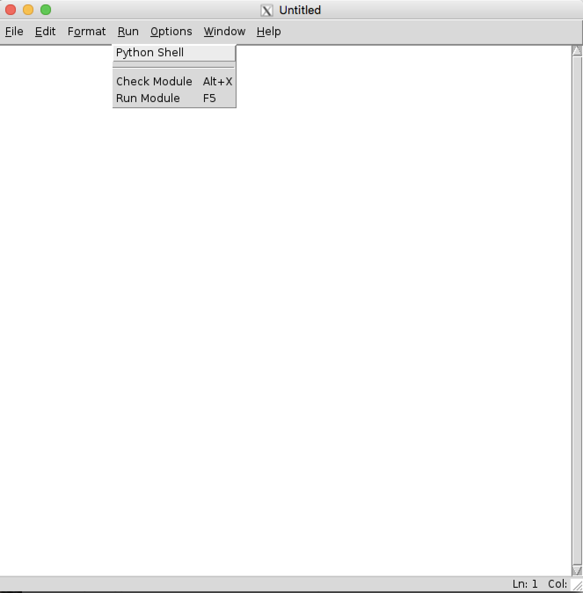
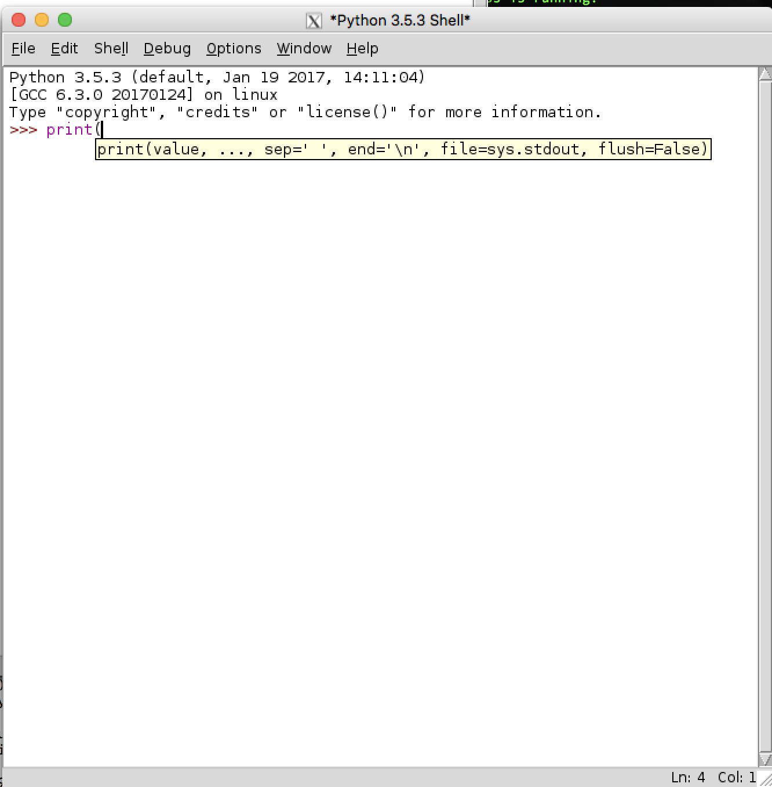

## Introduction: 
There are several ways to approach development of Python code on a Raspberry Pi (RPi). These approaches [range from simple and free to complex and expensive](https://wiki.python.org/moin/IntegratedDevelopmentEnvironments). Assuming that you are running your RPi in "headless" mode, you can simply launch `nano` from the command line and begin coding, or you can invest in a commercial development environment such as [PyCharm](https://www.jetbrains.com/pycharm/), or [Wing](https://wingware.com/). This "recipe" discusses only one approach; an intermediate approach that utilizes the "native" [IDLE](https://docs.python.org/3/library/idle.html) running on the RPi, and displayed in an **[X Window](https://en.wikipedia.org/wiki/X_Window_System) on a Mac**. 

## Installation and Setup:

Installation and setup is easy:

### 1. Download & install [XQuartz](https://www.xquartz.org/). 

   The current version as of this writing is 2.8.5. It runs on Mac OS 10.9 and higher. 

### 2. Start XQuartz 
   From the Launchpad, or `open -a XQuartz` from `bash`. This will verify that XQuartz has been installed properly. You should see an Xterm window on your desktop as shown below: 


   Dismiss this window before proceeding (enter `exit` at the command prompt in the Xterm window)
    
### 3. Open SSH connection to RPi: 
   From the Mac's `terminal` app, initiate a Secure Shell connection to the RPi with the X11 forwarding option: `-Y` as follows:

```
ssh -Y pi@raspberrypi.local 
  -- OR -- 
ssh -Y pi@192.168.1.101
```

   NOTE: the `-Y` option enables X11 forwarding over SSH, and is **ESSENTIAL**

### 4. Verify that `idle3` is installed (or install it) on RPi

```
pi@raspberrypi3b:~ $ apt-mark showmanual | grep idle 
idle3

  -- If idle3 isn't listed, install it as follows: 

pi@raspberrypi3b:~ $ sudo apt-get update
   ... (status of update)
pi@raspberrypi3b:~ $ sudo apt-get upgrade
   ... (status of upgrade)
pi@raspberrypi3b:~ $ sudo apt-get install idle3

```

### 5. Start `idle3` on RPi:
   Note that this may not be ["silky smooth"](https://www.raspberrypi.org/forums/viewtopic.php?t=161412); that is, it may not work the first time you start `idle3`. If it doesn't, simply exit or `Control-C` if things are hung in the shell. Then, verify that the file `~/.Xauthority` is now present in your RPi home directory: 

```
pi@raspberrypi3b:~ $ ls -la | grep Xauthority
-rw-------  1 pi   pi        177 Jun 19 11:11 .Xauthority
```
   You may wish to run `idle3` in the background to keep your terminal window available for other chores: 
```   
pi@raspberrypi3b:~ $ idle3 &   
```
   Once the `XWindows` preliminaries are satisfied, you should be rewarded with the IDLE Editor window as follows: 

 

   And if you select `Run, Python Shell` from the editor menu, another window containing the Python shell will open. Note the syntax coloring and help text displayed during command entry: 



### 6. C'est finis 
So - that's all for now. You should have a working Python IDE that you can use remotely for a Raspberry Pi target environment. And since the code and the IDE execute on the RPi, you'll need not worry about surprises when you relocate your code from a foreign development environment. 

<!--- 

## TO BE CONTINUED

[A Q&A explaining "what is X-Windows"](https://unix.stackexchange.com/questions/518835/x-window-system-in-linux) 

sudo raspi-config [enable camera]

sudo apt-get install idle3 

sudo apt-get install python3-picamera

idle3 &  (see screenshot)

FROM THE RPI DOCS: "Note that the camera preview only works when a monitor is connected to the Pi, so remote access (such as SSH and VNC) will not allow you to see the camera preview"

WTF,O???

How do I see the pics?

verify that the file ~/.Xauthority is present (https://www.raspberrypi.org/forums/viewtopic.php?t=161412) (https://www.raspberrypi.org/documentation/remote-access/ssh/unix.md)

#!/usr/bin/python

http://picamera.readthedocs.io/en/release-1.0/quickstart.html

-or-

raspistill -o image003.jpg

) 
-->
