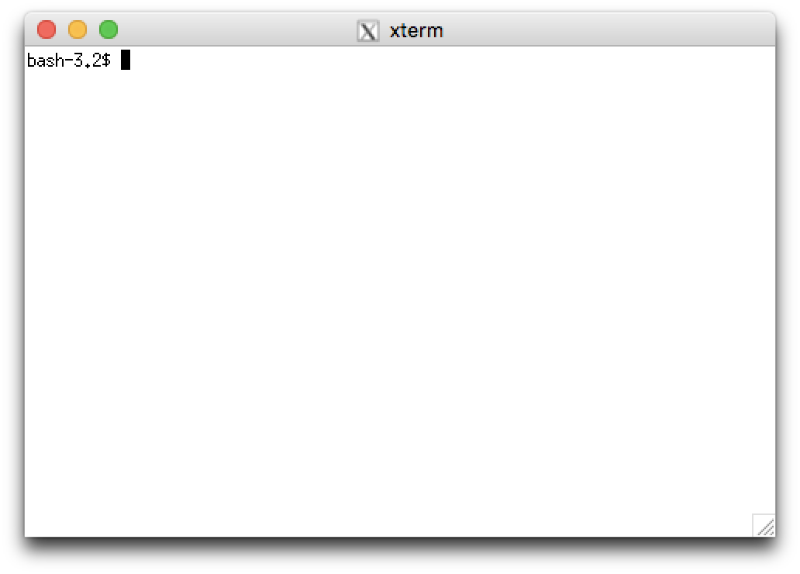

## Introduction: 
There are several ways to approach development of Python code on a Raspberry Pi (RPi). These approaches [range from simple and free to complex and expensive](https://wiki.python.org/moin/IntegratedDevelopmentEnvironments). Assuming that you are running your RPi in "headless" mode, you can simply launch `pico` from the command line and begin coding, or you can invest in a commercial development environment such as [PyCharm](https://www.jetbrains.com/pycharm/), or [Wing](https://wingware.com/). This "recipe" discusses only one approach; an intermediate approach that utilizes the "native" [IDLE](https://docs.python.org/3/library/idle.html) running on the RPi, and displayed in an XWindow on a Mac (OS X). 

## Installation and Setup:
Installation and setup is easy:

### 1. Download & install [XQuartz](https://www.xquartz.org/). 

   The current version as of this writing is 2.7.11, and it does run on Mac OS High Sierra (10.13.5). 

### 2. Start XQuartz 
   From the Launchpad, or `open -a XQuartz` from `bash`. This will verify that XQuartz has been installed properly. You should see an Xterm window on your desktop as shown below: 


   Dismiss this window before proceeding (enter `exit` at the command prompt in the Xterm window)
    
### 3. Open SSH connection to RPi: 
   From the Mac's `terminal` app, initiate a Secure Shell connection to the RPi with the X11 forwarding option: `-Y` as follows:

```
ssh -Y pi@raspberrypi.local 
  -- OR -- 
ssh -Y pi@192.168.1.101
```

   NOTE: the `-Y` option enables X11 forwarding over SSH, and is **ESSENTIAL**

### 4. Verify that `idle3` is installed (or install it) 

```
pi@raspberrypi3b:~ $ apt-mark showmanual | grep idle 
**idle3**

  -- If idle3 isn't listed, install it as follows: 

pi@raspberrypi3b:~ $ sudo apt-get update
   ... (status of update)
pi@raspberrypi3b:~ $ sudo apt-get upgrade
   ... (status of upgrade)
pi@raspberrypi3b:~ $ sudo apt-get install idle3

```

verify that the file ~/.Xauthority is present (https://www.raspberrypi.org/forums/viewtopic.php?t=161412) (https://www.raspberrypi.org/documentation/remote-access/ssh/unix.md)

sudo raspi-config [enable camera]

sudo apt-get install idle3 

sudo apt-get install python3-picamera

idle3 &  (see screenshot)

FROM THE RPI DOCS: "Note that the camera preview only works when a monitor is connected to the Pi, so remote access (such as SSH and VNC) will not allow you to see the camera preview"

WTF,O???

How do I see the pics?

#!/usr/bin/python

http://picamera.readthedocs.io/en/release-1.0/quickstart.html

-or-

raspistill -o image003.jpg

